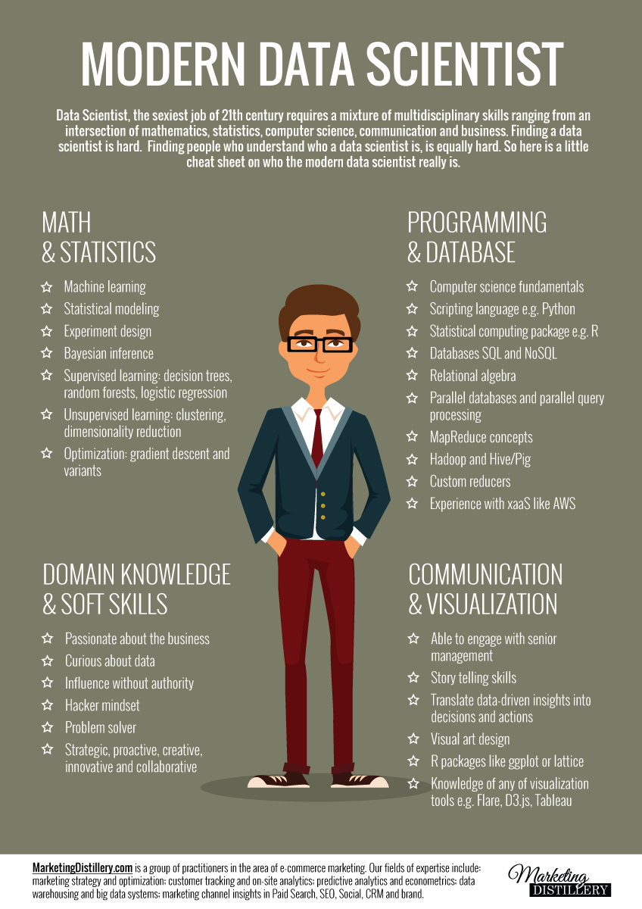
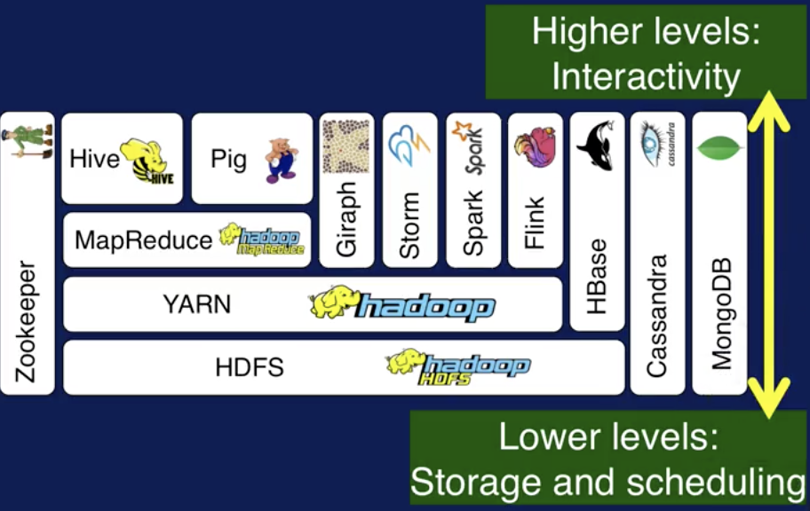
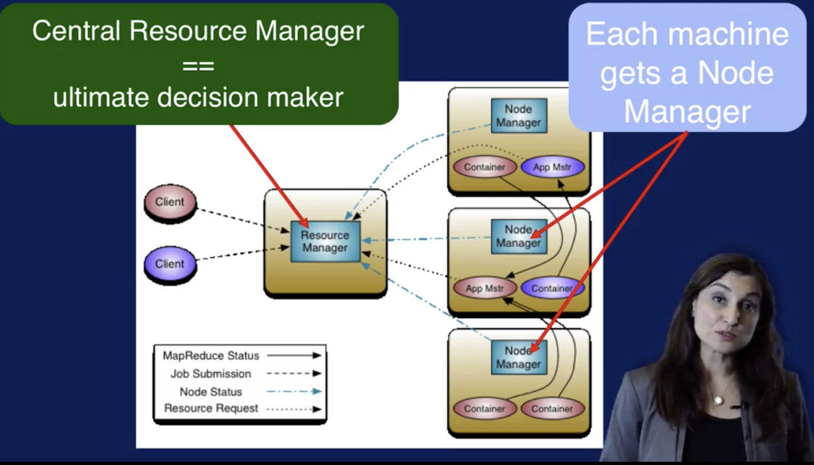
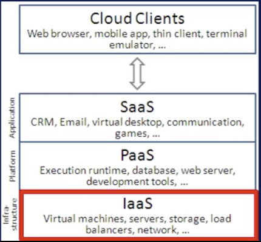
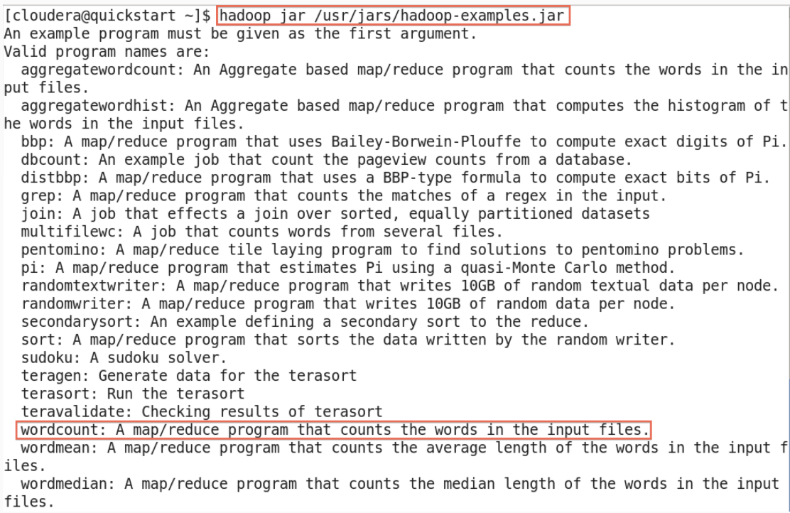

ApproachesFraction# Coursera_Intor_to_Big_Data

By the end of this course you will be able to...

- Describe the Big Data landscape including examples of real world big data problems and approaches.
- Identify the high level components in the data science lifecycle and associated data flow.
- Explain the V’s of Big Data and why each impacts the collection, monitoring, storage, analysis and reporting, including their impact in the presence of multiple V’s.
- Identify big data problems and be able to recast problems as data science questions.
- Summarize the features and significance of the HDFS file system and the MapReduce programming model and how they relate to working with Big Data.

## TOC

- [Why_Big_Data](#why_big_data)
- [Big_Data_Where_Does_it_Come_From](#big_data_where_does_it_come_from)
- [Characteristics_of_Big_Data](#characteristics_of_big_data)
- [Defining_the_Question](#defining_the_question)
- [The_Process_of_Data_Science](#the_process_of_data_science)
- [Basic_scalable_computing_concepts](#basic_scalable_computing_concepts)
- [Getting_Started_with_Hadoop](#getting_started_with_hadoop)
- [Downloading_and_Installing_Hadoop](#downloading_and_installing_hadoop)
- [Running_you_First_Application_on_Hadoop](#running_you_first_application_on_hadoop)
- [Optional_Materials](#optional_materials)

## Why_Big_Data

### What launched the big data era

[Slides](lecture_slides/what_launched_the_big_data_era_slides.pdf)

The combination of a growing torrent of data and on-demand (e.g. cloud) computing has launched the data science field.

The amount of data collected is growing exponentially.  40% growth in data collected vs 5% growth in IT spending.  

Cloud (on demand) computing allows us to scale without the hardware.  

### Big Data Applications: What makes big data valuable

[Slides](lecture_slides/what_makes_big_data_valuable.pdf)

Big data has enabled better models which allows for higher precision recommendations or solutions to make the world a better place.  

Big data allows us to build better models trained on more data.  For example, Amazon can leverage all its customer data to train its recommender systems.

Applications:

- Recommendation Engines
- Sentiment Analysis (often referred to as Opinion Mining, NLP)
- Mobile Advertising
- Consumer behavior for produce growth
  - e.g. Airline Flight scheduling,
- Biomedical Applications
  - Genomic data is one of the largest growing data types
  - Personalized Medicine
- Smart Cities
  - Sensors spread across cities to monitor: energy costs, pollution
  - improve services, traffic, safety

### Saving Lives with Big Data

[Slides](lecture_slides/wildfire_prediciton_slides.pdf)

Wild fire disaster management.  We can use big data to monitor, predict, and hopefully prevent wildfires.

Big data van help because we can integrate diverse data streams.

Data Sources:
- sensor data, images from mountaintops and satellites
- organizational data
  - vegetation in fires path
  - slower to update but verified and reliable
- people
  - social media, etc.
  - sentiment from people around perimeter of fire

### Using Big Data to Help Patients

[Slides](lecture_slides/precision_medicine.pdf)

Cost to sequence a genome was less than a tenth in 2015 than in 2008.

Need 200GB to sequence genome.

All doctors use digital health records to store all patient data.

The health car industry has started recoding much more data in recent years.  

To personalize health care practices we need to integrate data from multiple data sources: sensors, organizations and people.

Sensor data:
- digital hospital equipment
  - data kept instead of discarded
- fitness trackers
  - record data from what happens in normal life, not just when going to the doctor.

Organizational Data:
- public databases
  - National Center for Biotechnology Information
  - Gene-ontology
  - Unified Medical Language System
  - etc.

People Data:
- Mobile health apps
- social media
  - people are commenting on their reactions to medicine that they might not recall when speaking to doctor.

### Sentiment Analysis Success Story: Meltwater helping Danone

Meltwater is a company that helps other companies understand what people are saying about them and manage their online reputation. They helped Danone baby nutrition by monitoring one of their marketing campaigns.  Danone was confident that there was no issue with their products but there was a rumor about horse DNA being in baby products.  Danone was able to get in front of this and ensure its customers that their products were safe.  

### 25 interesting Facts about big data

1. Every 2 days we create as much data as we did from the beginning of time until 2003.
2. Over 90% of all data in the world was created in the past 2 years.
3. It is expected that by 2020 the amount of digital information in existence will have grown from 3.2 zettabytes today (Sept. 2014) to 40.
4. The total amount of data being stores by industry doubles every 1.2 years.
5. Every minute we send 204 million emails, generate 1.8 million Facebook likes, send 278,000 tweets and up-load 200,000 photos to Facebook.
6. Google alone processes on average over 40,000 search queries per second, adding up to over 3.5 billion per day.
7. Around 100 hours of video are uploaded to YouTube every minute and it would take you around 15 years to watch every video uploaded in a single day.
8. Duplicate!
9. If you burned all of the data created in just one day onto DVDs, you could stack them to reach the moon twice.
10. AT&T is thought to hold the world's largest volume of data in one unique database -- its phone records database is 312 terabytes, and contains almost 2 trillion rows.
11. 570 new websites are created every minute of every day.
12. 1.9 million IT jobs will be created in the US by 2015 to carry out bg data projects.  Each of those will be supported by 3 new jobs created outside of IT -- meaning a total of 6 million jobs thanks to big data.
13. Today's data centers occupy al area of land equal to almost 6,000 football fields.
14. Between them, companies monitoring Twitter to measure sentiment analyze 12 terabytes of tweets every day.
15. The amount of data transferred over mobile networks increased by 81% to 1.5 exabytes (1.5 billion gigabytes) per month between 2012 and 2014. Video accounts for 53% of that.
16. The NSA is thought to analyze 1.6% of all global internet traffic -- around 30 petabytes (30 million gigabytes) every day.
17. The value of the Hadoop market is expected to soar form $2 billion in 2013 to $50 billion by 2020, according to market research form Allied Market Research.
18. The number of Bits of information stored in the digital universe is thought to have exceeded the number of stars i the physical universe in 2007.
19. In 2014, there will be over 1.2 billion smart phones in the world (which are full of sensors and data collection features). and growth is predicted to continue.
20. The boom of the Internet of Things will mean that the amount of devices connected to the Internet will rise from about 13 billion in 2014 to 50 billion in 2020.
21. 12 million RFID tags - used to capture data and track movement of objects in the physical world - had been sold by 2011. By 2021, it is estimated that number will have risen to 2019 billion.
22. Big data has been used to predict crimes before they happen - a "predictive policing" trial in California was able to identify area where crime will occur 3x more accurately than existing methods of forecasting.
23. By better integrating big data analytics into healthcare, the industry could save $300 billion per year - this is equivalent to reducing the healthcare costs of every person by $1,000 per year.
24. Retailers could increase their profit margins by more than 60% through the full exploitation of big data analytics.
25. The big data industry is expected to grow from US$10.2 billion in 2013 to about US$54.3 billion by 2017.

## Big_Data_Where_Does_it_Come_From

### Where does big data come from?

Big data but not new but the scale for witch we can analyze is growing with computational power.

### Machine Generated Data

[Slides](lecture_slides/machine_data.pdf)

- A Boeing 787 produces half a terabyte of data every time it flies.
  - The plane updates both the flight and the ground team about its status constantly.
- In general, we call machines that provide some type of sensing capability smart.

- 3 main properties of a smart device:
  1. Can connect to other devices and networks
  2. execute services
  3. collect data autonomously

- Machine generated data is the largest of all big data sources.

### Advantages of Machine Generated Data

[Slides](lecture_slides/machine_data_advantages.pdf)

In-situ data computation - the concept that we can bring analytical capabilities and its benefits to where the data is being collected.  This helps take advantage of the benefits of predictive analytics in real-time.

SCADA - Supervisory Control and Data Acquisition
- monitoring and control
- to define actions for reduced waste and improved efficiency in industrial processes,
  - including those of manufacturing and power generation, public or private infrastructure processes, including water treatment, oil, and gas pipelines, and electrical power transmission, and facility processes including buildings, airports, ships, and space stations.
- Monitor and control heating, ventilation, air conditioning systems like HVAC, access, and energy consumption in smart buildings.

In summary, as the largest and fastest type of Big Data, machine generated data can uniquely enable real-time actions in many systems and processes.

### Big data Generated by People: The Unstructured Challenge

[Slides](lecture_slides/people_data.pdf)

People are generating massive amounts of data on social media, image and video sharing, blogging, commenting, internet searches, email.  Most of this data is ### unstructured### .

Challenges of unstructured data:
- data that does not conform to a predefined data model.
  - No relational database and no SQL
- 80 - 90% of all data is unstructured
- Multiple data formats
- time consuming and costly to analyze

As a summary, although there is an enormous amount of data generated by people, most of this data is unstructured.

### Big data Generated by People: How is it being used

[Slides](lecture_slides/people_data_application.pdf)

Tools:
- Hadoop - open source big data framework
  - Designed to support the processing of large data sets in a distributed computing environment.
- Apache Storm and Spark
  - 2 other open source frameworks that handle such real time data generated at a fast rate.
  - Both can integrate data with any database or data storage technology.
- NoSQL Data Storage Solutions
  - Graph Databases - Connections between data
    - Neo4j
  - Key-value pair database
    - Cassandra

Data Warehouses are central repositories of integrated data from one or more sources. The data that gets stored in warehouses, gets extracted from multiple sources. It gets transformed into a common structured form and it can slow that into the central database for use by workers creating analytical reports throughout an enterprise. Unfortunately, this is fairly static and does not fit well with today's dynamic big data world.

Big data must pass through a series of steps before it generates value. Namely:
1. data access,
2. storage,
3. cleaning, and
4. analysis
  - these are all layers


### Organization Generated Data: Structured but often siloed

[Slides](lecture_slides/organization_data.pdf)

Structured data is usually stored in a Relations Database Management System (RDMS)

A Data Model defines all the tables and fields within an RDBS. They can be queried with SQL.  

Many organizations have traditionally captured data at the department level, without proper infrastructure and policy to share and integrate this data. This has hindered the growth of scalable pattern recognition to the benefits of the entire organization. Because no one system has access to all data that the organization owns.

Each data set is compartmentalized. If such silos are left untouched, organizations risk having outdated, unsynchronized, and even invisible data sets.

Organizations are realizing the flaws of this rigid structure and are changing policies and infrastructure to enable integrated processing of all data to the entire organization's benefit. Cloud-based solutions are seen as agile and low capital intensive solutions in this area.

As a summary, while highly structured organizational data is very useful and trustworthy, and thus a valuable source of information, organizations must pay special attention to breaking up the silos of information to make full use of its potential.

### Organization-Generated Data: Benefits from Combining with Other Data Types

[Slides](lecture_slides/organization_data_benefits.pdf)

UPS:

- UPS delivers 16 million shipments per day and around 40 million tracking requests.
- UPS has on its operations is, an estimated, 16 petabytes.
- UPS can save a whopping $50 million U.S. per year if they reduce the distance traveled by each truck by one mile.
- With big data, utilizing complex optimization over large datasets can lead to route optimizations that were previously not visible to the company.

Walmart:
- 250 million customers in 10,000 stores
- They collect 2.5 petabytes of data per hour
- data collected:
  - Twitter, local events, local weather, in-store purchases, online clicks and many other sales, customer and product related data.
- Data used to find patterns such as:
  - Products frequently bought together
  - Best new product is to introduce in stores
  - Customize customer recommendations
- Walmart has leveraged big data to remain a top retailer.

As a summary, organizations are gaining significant benefit from integrating big data practices into their culture and breaking their silos. Some major benefits to organizations are operational efficiency, improved marketing outcomes, higher profits, and improved customer satisfaction.

### The Key: Integrating diverse data

[Slides](lecture_slides/integrating_diverse_data.pdf)

The real value will come from integrating different types of data sources, and analyzing them at scale.

Data Integration means bringing dat in from diverse sources and turning them in to coherent sources that can be made use of programmatically.

### Extra Resources
[McKinsey Report](https://www.mckinsey.com/business-functions/digital-mckinsey/our-insights/big-data-the-next-frontier-for-innovation)

[WIFIRE Project](https://www.youtube.com/watch?v=0ohwGggaXZM)

## Characteristics_of_Big_Data

### Getting Started
[Slides](lecture_slides/characteristics_of_big_data.pdf)

1. Volume - Size
  - the vast amount of data that is created.
2. Variety - Complexity
  - different forms of data such as text, images, voice and geospatial data.
3. Velocity - Speed
  - Speed at which data is generated and which it is transferred.
4. Veracity - Quality
  - biases, noise, and abnormality in data (i.e. often unmeasurable uncertainties and truthfulness and trustworthiness of data).
5. Valence - connectedness
  - connectedness of big data in the form of graphs.
6. Value - how will big data benefit you and your organization?

The first 3 are the main descriptors of big data.  We have huge amounts of data, in different formats which must be processed quickly.

### Volume
[Slides](lecture_slides/volume.pdf)

[Astronomical_Scale](https://www.youtube.com/watch?v=0fKBhvDjuy0)

Volume is growing a an exponential scale.

It's not just about size. More volume means more accurate models and better business insights.

Most existing analytical methods won't scale to such sums of data in terms of memory, processing, or IO needs. So, as volume increases performance and cost become a problem.  

The challenges with working with volumes of big data include cost, scalability, and performance related to their storage, access, and processing.

### Variety
[Slides](lecture_slides/variety.pdf)

Objectives:
- Different aspects of data variety
- challenges form variety

Variety --> Complexity

Structural Variety - formats and models
Media Variety - medium in which data gets delivered
Semantic Variety - how to interpret and operate on data
Availability Variety - real-time? intermittent

Variety within a type:
- Table like: sender, receiver, subject date, etc.
- Unstructured Text: body
- Media: attachments
- Communication Network: Connections from senders and receivers

### Velocity
[Slides](lecture_slides/velocity.pdf)

Objectives:
- Describe velocity
- "Real-time streaming"
- Why velocity is ore relevant today

The speed in which data is created, stored and analyzed.
- Goal is real time action.
- If a business cannot take advantage of the data as it gets generated, or at the speed analysis of it is needed, they often miss opportunities.

It makes sense to use the latest information to influence current decisions.  

Real-time processing - Streaming analysis with streaming data

`instant capture streaming data -> feed real time to machines -> process in real time -> Act`

Batch Processing - Large amounts of data would be processed for days at a time.

`Collect Data -> Clean Data -> Feed in Chunks -> Wait -> Act`

Decisions based on information that is even few days old can be catastrophic to some businesses.

Organizations which make decisions on latest data are more likely to hit the target.

As a summary, we need to pay attention to the velocity of big data. Streaming data gives information on what's going on right now. Streaming data has velocity, meaning it gets generated at various rates. And analysis of such data in real time gives agility and adaptability to maximize benefits you want to extract.

### Veracity
[Slides](lecture_slides/varacity.pdf)

Objectives:
- Describe veracity and why we care about it
- Summarize what went wrong with Google Flu predictor and Amazon's Banana Slicer Reviews
- Explain 2 methods to overcome the Big Data quality challenges

Veracity refers to the quality of the data.
- noisy and uncertain, biases, abnormalities, imprecise.
Data is of no value if it's not accurate, the results of big data analysis are only as good as the data being analyzed.

garbage in = garbage out

Amazon Banana Slicer - fake or joke reviews could skew the sentient analysis of the product.

Google Flu Trends - Did not account for uncertainty in flu data which resulted in an overestimation of flu levels.  This could have resulted in health care preparing much more flu vaccinations than necessary.   

As a summary, the growing torrents of big data pushes for fast solutions to utilize it in analytical solutions.

This creates challenges on keeping track of data quality. What has been collected, where it came from, and how it was analyzed prior to its use.

This is akin to an art artifact having providence of everything it has gone through.

But even more complicated to achieve with large volumes of data coming in varieties and velocities.

### Valence
[Slides](lecture_slides/valence.pdf)

Valence refers to the connectedness of data.  The higher the connectedness the higher the valence.

Data Connectivity
  - Two data items are connected when they are related to one another
Valence
  - Fraction of data items that are connected out of total number of possible connections.

Valence Challenges
- More complex data exploration
- Modeling and prediction of valence changes (w/ time and volume)
- Group event detection
- Emergent behavior analysis

### Value
[Slides](lecture_slides/value.pdf)

The heart of the big data challenge is turning all of the other dimensions in to truly useful business value.

### A “Small” Definition of Big Data

The term ‘big data’ seems to be popping up everywhere these days. And there seems to be as many uses of this term as there are contexts in which you find it: ‘big data’ is often used to refer to any dataset that is difficult to manage using traditional database systems; it is also used as a catch-all term for any collection of data that is too large to process on a single server; yet others use the term to simply mean “a lot of data”; sometimes it turns out it doesn’t even have to be large. So what exactly is big data?

A precise specification of ‘big’ is elusive. What is considered big for one organization may be small for another. What is large-scale today will likely seem small-scale in the near future; petabyte is the new terabyte. Thus, size alone cannot specify big data. The complexity of the data is an important factor that must also be considered.

Most now agree with the characterization of big data using the 3 V’s coined by Doug Laney of Gartner:

· Volume: This refers to the vast amounts of data that is generated every second/minute/hour/day in our digitized world.

· Velocity: This refers to the speed at which data is being generated and the pace at which data moves from one point to the next.

· Variety: This refers to the ever-increasing different forms that data can come in, e.g., text, images, voice, geospatial.

A fourth V is now also sometimes added:

· Veracity: This refers to the quality of the data, which can vary greatly.

There are many other V's that gets added to these depending on the context. For our specialization, we will add:

· Valence: This refers to how big data can bond with each other, forming connections between otherwise disparate datasets.

The above V’s are the dimensions that characterize big data, and also embody its challenges: We have huge amounts of data, in different formats and varying quality, that must be processed quickly.

It is important to note that the goal of processing big data is to gain insight to support decision-making. It is not sufficient to just be able to capture and store the data. The point of collecting and processing volumes of complex data is to understand trends, uncover hidden patterns, detect anomalies, etc. so that you have a better understanding of the problem being analyzed and can make more informed, data-driven decisions. In fact, many consider value as the sixth V of big data:

· Value: Processing big data must bring about value from insights gained.

To address the challenges of big data, innovative technologies are needed. Parallel, distributed computing paradigms, scalable machine learning algorithms, and real-time querying are key to analysis of big data. Distributed file systems, computing clusters, cloud computing, and data stores supporting data variety and agility are also necessary to provide the infrastructure for processing of big data. Workflows provide an intuitive, reusable, scalable and reproducible way to process big data to gain verifiable value from it in and enable application of same methods to different datasets.

With all the data generated from social media, smart sensors, satellites, surveillance cameras, the Internet, and countless other devices, big data is all around us. The endeavor to make sense out of that data brings about exciting opportunities indeed!

[Source](http://words.sdsc.edu/words-data-science/big-data)

## Defining_the_Question

### Getting Value out of Big Data
[Slides](lecture_slides/getting_value.pdf)

Objectives:
- Describe modern data science and its connection to big data
- Explain why data science is the key to getting value out of big data
- List the right skills for a data scientist to fit your organization

Data science can be thought of as a basis for empirical research where data is used to induce information for observations.

Data science is not static. It is not one time analysis. It involves a process where models generated to lead to insights are constantly improved through further empirical evidence, or simply, data.

Business leaders and decision makers take action based on the evidence provided by their data science teams.

Data science happens at the intersection of computer science, mathematics and business expertise.



There are very few people that actually possess all of these skills.  So teams of Data Scientist come together to encompass all.

As a summary, a data science team often comes together to analyze situations, business or scientific cases, which none of the individuals can solve on their own. There are lots of moving parts to the solution. But in the end, all these parts should come together to provide actionable insight based on big data.

Being able to use evidence-based insight in business decisions is more important now than ever. Data scientists have a combination of technical, business and soft skills to make this happen.


### Building a Big Data Strategy
[Slides](lecture_slides/building_strategy.pdf)

Objectives:
- Main steps if iteratively define a big data strategy.
- Three questions related to big data policy.

Strategy - A plan of action or policy designed to achieve an overall aim.
  - Four terms to focus: Aim, policy, plan, action

- Start with business objectives - first define what the teams goals are.  It is important to focus on short and long-term goals.  
- Provide organizational buy in - create a culture to embrace data science.
- Build Diverse Data Science Team
  - Diverse expertise
  - Deliver as a Team
- Build in-house expertise:
  - Data science requires a multi-disciplinary team
  - constant training on new tools and analytics

Many organizations may benefit form having a small data science team whose main role is to do data experiments and test new ideas before they get deployed at scale.

- Share Data
  - Remove barriers to data access
  - No data silos
  - Cultivate a data sharing mindset
- Define big data policies
  - privacy and lifetime
  - curation and quality
  - interoperability and regulation
- Cultivating and analytics-driven culture
  - Analytics is essential to business and not an afterthought
- Adapt strategy to your use case
  - one size does not fit all

As a summary, when building a big data strategy, it is important to integrate big data analytics with business objectives.

Communicate goals and provide organizational buy-in for analytics projects. Build teams with diverse talents, and establish a teamwork mindset.

Remove barriers to data access and integration. Finally, these activities need to be iterated to respond to new business goals and technological advances.

### Five Components (P's) of Data Science
[Slides](lecture_slides/five_ps.pdf)

Objectives:
- list the five P's as dimensions of modern data science
- Explain how big data influenced these five P's
- Identify why these p's are important to you

1. People
2. Purpose
3. Process
  - Big Data Engineering and Big Data Analytics (Computational Big Data Science)
  - Data Science process: Aquire, prepare, analyze, report, act
  - Build, Explore, Scale, Report, Act
4. Platforms - Hadoop, etc
5. Programability

Process: Build metrics for accountability
- Cost
- Timeline
- Planning of deliverables
- Expectations
- Purpose

As a summary, data science can be defined as a craft of using the five P's identified in this lecture, leading to a sixth P, the data product.

Having a process within the more business-driven Ps, like people and purpose, and the more technically driven P's, like platforms and programmability, leads to a streamlined approach that starts and ends with the product, team accountability, and collaboration in mind.

Data science process provides guidelines for implementing big data solution, as it helps to organize efforts and ensures all critical steps taken conforms to pre-define and agreed upon metrics.

Data Science is about extracting knowledge from data. At the WorDS Center (words.sdsc.edu), we define data science as a multidisciplinary craft that combines people, process, computational and Big Data platforms, application-specific purpose and programmability. Publications and provenance of the data products leading to these publications are also important for data science, but we start by defining 5 P's that take significant part in the data science activities.

- Purpose: The purpose refers to the challenge or set of challenges defined by your big data strategy. The purpose can be related to a scientific analysis with a hypothesis or a business metric that needs to be analyzed based often on Big Data.
- People: The data scientists are often seen as people who possess skills on a variety of topics including: science or business domain knowledge; analysis using statistics, machine learning and mathematical knowledge; data management, programming and computing. In practice, this is generally a group of researchers comprised of people with complementary skills.
- Process: Since there is a predefined team with a purpose, a great place for this team to start with is a process they could iterate on. We can simply say, People with Purpose will define a Process to collaborate and communicate around! The process of data science includes techniques for statistics, machine learning, programming, computing and data management. A process is conceptual in the beginning and defines the course set of steps and how everyone can contribute to it. Note that similar reusable processes can be applicable to many applications with different purposes when employed within different workflows. Data science workflows combine such steps in executable graphs. We believe that process-oriented thinking is a transformative way of conducting data science to connect people and techniques to applications. Execution of such a data science process requires access to many datasets, Big and small, bringing new opportunities and challenges to Data Science. There are many Data Science steps or tasks, such as Data Collection, Data Cleaning, Data Processing/Analysis, Result Visualization, resulting in a Data Science Workflow. Data Science Processes may need user interaction and other manual operations, or be fully automated.Challenges for the data science process include 1) how to easily integrate all needed tasks to build such a process; 2) how to find the best computing resources and efficiently schedule process executions to the resources based on process definition, parameter settings, and user preferences.
- Platforms: Based on the needs of an application-driven purpose and the amount of data and computing required to perform this application, different computing and data platforms can be used as a part of the data science process. This scalability should be made part of any data science solution architecture.
- Programmability: Capturing a scalable data science process requires aid from programming languages, e.g., R, and patterns, e.g., MapReduce. Tools that provide access to such programming techniques are key to making the data science process programmable on a variety of platforms.
To summarize, data science can be defined as a craft of using the five pieces identified above. Having a process between the more business driven P’s people and purpose and the more technical driven P’s platforms and programmability leads to a streamlined approach that starts and ends with a defined business value, team accountability and collaboration in mind.

[Source](http://words.sdsc.edu/words-data-science/data-science)

### Asking the right questions
[Slides](lecture_slides/asking_the_right_questions.pdf)

Objectives:
- Ingredients to for a data science problem.
- List some questions others asked to get value form big data.
- Formulate the right questions to guide your data science process.

The first step in any process is to define the problem.
Examples:
1. How can sales figures and call center logs be combined to evaluate a new product?
2. How can data from multiple sensors be used to detect instrument failure?
3. How can we understand our customers and market better to achieve effective target marketing?

Assess the Situation wrt the problem
- Risks
- Costs
- benefits
- Constraints
- Contingencies
- Regulations
- Resources - What are the resources available (personnel, computational power, capital, etc.)
- Requirements - What are the requirements of the problem?

Answers to these questions will help you get a better overview of the situation. And better understanding of what the project involves.

Define Goals
  - Objective based on answers to previous questions
  - Criteria - What do you hope to achieve by the end of this project?

As a summary, defining the questions you're looking to find answers for is a huge factor contributing to the success of a data science project.

By following the explained set of steps, you can formulate better questions to solve using analytical skills and link them to business value.

## The_Process_of_Data_Science

### Steps in the Data Science Process
[Slides](lecture_slides/data_science_process.pdf)

1. Acquire
  - Identify data sets
  - Retrieve data
  - Query data
2. Prepare
  2A. Explore (EDA)
    - Understand Nature of Data
    - Preliminary analysis
  2B. Pre-process
    - Clean
    - Integrate
    - Package
3. Analyze
  - Select analytical techniques
  - Build model
4. Report
  - Communicate results
5. Act
  - Apply Results
  - Act on Purpose

### 1. Acquiring Data
[Slides](lecture_slides/acquiring_data.pdf)

- Identify suitable data
- Acquire all available data
- Query data (SQL)

Data comes from:
- Databases
- files: text files, excel spreadsheets, etc
- websites and web services (SOAP, REST, WebSocket)
- NoSQL storage (API, WebServices)

As a summary, big data comes from many places. Finding and evaluating data useful to your big data analytics is important before you start acquiring data. Depending on the source and structure of data, there are alternative ways to access it.

### 2A. Exploring Data
[Slides](lecture_slides/exploring_data.pdf)

- Understand Nature of Data
- Preliminary analysis

- look for correlations, general trends or outliers
  - Correlation graphs can be used to explore the dependencies between different variables in the data.
  - Graphing the general trends of variables will show you if there is a consistent direction in which the values of these variables are moving towards, like sales prices going up or down.
  - In statistics, an outlier is a data point that's distant from other data points. Plotting outliers will help you double check for errors in the data due to measurements. In some cases, outliers that are not errors might make you find a rare event.
- Describe your data
  - Mean, median, mode, range, standard dev
  - Make sure these all make sense
- visualize data
  - Histograms (show distribution)
  - box plots
  - line graphs (time series)
  - scatter plots (correlation)
  - Heat maps (geospatial)

### 2B. Pre-processing Data
[Slides](lecture_slides/pre-processing_data.pdf)

- Clean
- Transform

Data Quality Issues
  - Inconsistent values
  - Duplicate records
  - Missing values
  - Invalid data
  - Outliers

Clean:

Approaches to address quality issues:
- remove observations with missing values
- merge duplicates
- Infer invalid values
- Remove outliers
- Decide which is best with Domain knowledge

Transform:

Transforming Data is referred to as a few different names:
- Data munging
- Data wrangling
- Data preprocessing

Approaches:
- Dimensionality reduction
  - finds smaller dimensional representation of data set that captures most of its variation
- Data Manipulation
- Transformation
  - Smoothing, reducing noise and variability
  - Ex. transform daily to weekly or monthly
- Feature Selection
  - remove redundant (correlated) or irrelevant features
  - creating new features (feature engineering)
- Scaling (standard scaler)
  - avoid values with large values form dominating the results

In summary, data preparation is a very important part of the data science process. In fact, this is where you will spend most of your time on any data science effort. It can be a tedious process, but it is a crucial step. Always remember, garbage in, garbage out. If you don't spend the time and effort to create good data for the analysis, you will not get good results no matter how sophisticated the analysis technique you're using is.

### 3. Analyzing Data
[Slides](lecture_slides/analyze_data.pdf)

Select analytical technique:

Categories of analysis techniques:
- Classification
  - predict category
- Regression
  - predict numeric value
- Clustering
  - Organize similar items into groups
- Graph Analysis
  - Use graph structures to find connections between entities
- Association Analysis
  - Find rules to capture associations between items

Modeling:

- Select technique
- Build model
- Validate Model
- Determined next steps
  - Repeat analysis?
  - Take deeper dive?
  - Act on results?

As a summary, data analysis involves selecting the appropriate technique for your problem, building the model, then evaluating the results. As there are different types of problems, there are also different types of analysis techniques.

### 4. Communicating Data
[Slides](lecture_slides/communicating_data.pdf)

- Look at results and decide what to present:
  - What are the main results?
  - What added value do these results provide?
  - How will the model add to the application?
  - How to the results compare to the results criteria determined at the beginning of the project?

Don't leave out unfavorable results because they could still contain useful information.

Have tables so people can take a deep dive.

Create visualizations with tools like: R, python, D3, tableau, Google charts, Timeline

In summary, you want to report your findings by presenting your results and value add with graphs using visualization tools.

### 5. Turning Insights into Action
[Slides](lecture_slides/insights_to_action.pdf)

- Decide what action to take
- Determine how to implement that action
- Identify stakeholders
- Additional analysis or opportunities?

## Basic_Scalable_Computing_Concepts

### Why worry about foundations
[Slides](lecture_slides/why_foundations.pdf)

### What is a Distributed File System
[Slides](lecture_slides/distributed_file_system.pdf)

Long-term information storage
  - Access results of a process later
  - Store large amounts of information
  - Enable access of multiple processes

A computer hard drive is a file system

A distributed file system allows to store and access data distributed across many computers.

Data sets or parts of data sets can be replicated across nodes of a distributed system.  If one computer or rack of computers goes down, the redundancy will prevent loss of data and makes the system more fault tolerant.  Data redundancy also helps when scaling for access by many users.

As a summary, a file system is responsible from the organization of the long term information storage in a computer. When many storage computers are connected through the network, we call it a distributed file system. Distributed file systems provide data scalability, fault tolerance, and high concurrency through partitioning and replication of data on many nodes.

### Scalable Computing over the Internet
[Slides](lecture_slides/scalable_computing.pdf)

Commodity Cluster

Parallel computer is a very large number of single computing nodes with specialized capabilities connected to other network.

Commodity clusters are affordable parallel computers.  They aren't as powerful as normal parallel computers (Super Computers) and don't have as specifically specialized nodes but have been utilized to bring cloud access to users as a service.

Cloud Computing = Distributed computing over the internet.

In commodity clusters, the computing nodes are clustered in racks and connected to each other via a fast network. Computing in one or more of these clusters across a local area network or the internet is called distributed computing. Such architectures enable what we call data-parallelism. In data-parallelism many jobs that share nothing can work on different data sets or parts of a data set.

Failures can occur anywhere in the network.  At a node, rack or connection to the network. The ability to recover from these failures is known as fault tolerance.  Two solutions utilized in fault-tolerant systems are redundant storage and the restart of individual parallel jobs.

As a summary the commodity clusters are a cost effective way of achieving data parallel scalability for big data applications. These type of systems have a higher potential for partial failures. It is this type of distributed computing that pushed for a change towards cost effective reliable and Fault-tolerant systems for management and analysis of big data.

### Programming Models for Big Data
[Slides](lecture_slides/programming_models_for_big_data.pdf)

A programming model is able to be written to work effectively on top of distributed file systems using big data.  

Requirements for big data programming models
1. Support Big Data operations
  - Split volumes of data
    - Partitioning and placement of data in and out of computer memory along with a model to synchronize the datasets later on.
  - Access data fast
  - Distribute computations to nodes
    - Scheduling of many parallel tasks at once
2. Handle Fault Tolerance
  - Replicate data partitions
  - Recover files when needed
3. Enable Adding More Racks
  - This is referred to as "scaling out"
4. Optimized for specific data types
  - Documents, tables, graphs, key-value pairs, multimedia, streams

MapReduce is a big data programming model that supports all the requirements of big data modeling.
- It can model processing large data,
- split complications into different parallel tasks and
- make efficient use of large commodity clusters and distributed file systems.
- In addition, it abstracts out the details of parallelization, full tolerance, data distribution, monitoring and load balancing.

To summarize, programming models for big data are abstractions over distributed file systems. The desired programming models for big data should handle large volumes and varieties of data. Support full tolerance and provide scale out functionality. MapReduce is one of these models, implemented in a variety of frameworks including Hadoop.

## Getting_Started_with_Hadoop

### Hadoop: Why, Where, Who?
[Slides](lecture_slides/why_hadoop.pdf)

1. Enable scalability
2. Handle fault tolerance
3. Optimized for a variety of data types
4. Facilitate a shared environment
5. Provide value
  - Community supported
  - For a wide range of environments

### The Hadoop Ecosystem
[Slides](lecture_slides/hadoop_ecosystem.pdf)

Differentiate the major layers in the Hadoop ecosystem

Recognize key tools of the Hadoop ecosystem including HDFS, YARN, and MapReduce

One possible layer diagram for Hadoop:



The Hadoop distributed file system, or HDFS, is the foundation for many big data frameworks, since it provides scaleable and reliable storage.

Hadoop YARN provides flexible scheduling and resource management over the HDFS storage.

MapReduce is a programming model that simplifies parallel computing.

Pig = dataflow scripting

Hive = SQL-like queries

Giraph was built for processing large-scale graphs efficiently.

Spark, Storm, and Flink were built for real time and in memory processing of big data on top of the YARN resource schedules and HDFS.  In-memory processing is very efficient for running big data applications.

All of these tools are open source!

### The Hadoop Distributed File System: A Storage System for Big Data
[Slides](lecture_slides/hadoop_hdfs.pdf)

HDFS is the foundation for most tools in the Hadoop ecosystems.  
It provides two essential capabilities:
- scalability to large datasets
- reliability to handle hardware failures

Allows storage of massively large datasets.  It achieves scalability by partitioning or splitting large data files across multiple computers.  This allows parallel access to very large files since computations run in parallel on each node that stores data.  

Spreading data across multiple nodes will increase the chance that at least one node containing data will fail.  HDFS is designed for full tolerance in this case by replicating file blocks on multiple nodes--three copies by default.  

To read a file in HDFS you must specify the input file format. Similarly to write the file you must provide the output file format.

HDFS is comprised of two components:
1. NameNode for metadata
  - Usually, one per cluster
  - Maps what parts of data are stored where and in what order
2. DataNode for block storage
  - Usually, one per node (machine)
  - Listens to NameNode for block creation, deletion and replication

These operate using a master slave relationship. Where the NameNode issues comments to DataNodes across the cluster. In some sense the NameNode is the administrator or the coordinator of the HDFS cluster.

As a summary HDFS provides scalable big data storage by partitioning files over multiple nodes. This helps to scale big data analytics to large data volumes. The replication protects against hardware failures and provides data locality when we move analytical complications to data.

### YARN: The Resource Manager for Hadoop
[Slides](lecture_slides/yarn.pdf)

YARN (Yet Another Resource Negotiator) is a resource manage layer that sits just above the storage layer HDFS. It enables running multiple applications over HDFS, increases resource efficiency and let's you go beyond MapReduce or even beyond the data parallel programming model.

The addition of YARN between HDFS and the applications enabled new systems to be built focusing on different types of data such as Giraph for graph data, Storm for streaming analysis, and Spark for in-memory analysis.



YARN Architecture:
Resource Manager
  - Controls all the resources and decides what gets what.
Node Manager
  - Operates at the node (machine) level and is in charge of a single node.

Together the resource manager and the node manager form the data computation framework.

Application Master
  - Each application has an Application Master which negotiates resources from the resource manager and talks to node managers to get tasks completed.

A container is an abstract notion that represents a resource.  A resource is a collection of CPU, memory, etc. Easier to think of a container as a machine.

In summary, Yarn gives you many ways for applications to extract value from data. It lets you run many distributed applications over the same Hadoop cluster. In addition, YARN reduces the need to move data around and supports higher resource utilization resulting in lower costs. It's a scalable platform that has enabled growth of several applications over the HDFS, enriching the Hadoop ecosystem.

### MapReduce: Simple Programming for Big Results
[Slides](lecture_slides/mapreduce.pdf)

MapReduce is a programming model for the Hadoop ecosystem. It relies on YARN to schedule and execute parallel processing over the distributed file blocks in HD

Tools that use MapReduce model to provide higher level interface to other programing models:
Hive
- Pig is a SQL-like interface that adds capabilities that help with relational data modeling.
Pig
- Hive is a High level data flow language that adds capabilities that help with process map modeling.

With MapReduce you only need to create and map and reduce tasks, and you don't have to worry about multiple threads, synchronization, or concurrency issues.

Map and Reduce:

- Map and reduce are two concepts based on functional programming where the output the function is based solely on the input.

- Map = apply operation to all data elements.
- Reduce = summarize operation on elements.

Three key steps:
1. Map
2. Shuffle and sort
3. Reduce

WordCount Example:

WordCount reads one or more text files, and counts the number of occurrences of each word in these files. The output will be a text file with a list of words and their occurrence frequencies in the input data.

Steps:
- Input file stored in HDFS on partitions labeled A, B, C, D
- map operation occurs on each node
- As input partitions are read from HDFS, map is called for each line in the input.
- Map creates a key, value for each word on each line for each partition. The key is each word and value is the count of that word.
  - Note that map goes to each node containing a data block for the file, instead of the data moving to map. This is moving computation to data.
- Key, values that were output from map are shuffled and sorted on their key and the values are moved to the same node.
- The reduce operation executes to add values for matching keys.

Parallelization at each step:
- Map
  - Each partition get processed one line at a time.
  - Depends on data granularity
- Shuffle
  - The intermediate products
  - key, value pairs in the WordCount example
- Reduce
  - constructs one output file

Data gets reduced to a smaller set at each step.

MapReduce Limitations:
- Data that is frequently changing
  - MapReduce is slow since it reads the entire input dataset each time.
- Dependent tasks
  - Requires that maps and reduces execute independently of each other
- Interactive analysis
  - Does not return a result until the entire process is finished.  
  - This makes it unsuitable for interactive applications

As a summary, MapReduce hides complexities of parallel programming and greatly simplifies building parallel applications. Many types of tasks suitable for MapReduce include search engine page ranking and topic mapping.  

### MapReduce in the Pasta Sauce Example

[Pasta Sauce Example](http://words.sdsc.edu/words-data-science/mapreduce)

Map-Reduce is a scalable programming model that simplifies distributed processing of data. Map-Reduce consists of three main steps: Mapping, Shuffling and Reducing. An easy way to think about a Map-Reduce job is to compare it with act of ‘delegating’ a large task to a group of people, and then combining the result of each person’s effort, to produce the final outcome.

Let’s take an example to bring the point across. You just heard about this great news at your office, and are throwing a party for all your colleagues! You decide to cook Pasta for the dinner. Four of your friends, who like cooking, also volunteer to join you in preparation. The task of preparing Pasta broadly involves chopping the vegetables, cooking, and garnishing.

Let’s take the job of chopping the vegetables and see how it is analogous to a map-reduce task. Here the raw vegetables are symbolic of the input data, your friends are equivalent to compute nodes, and final chopped vegetables are analogous to desired outcome. Each friend is allotted onions, tomatoes and peppers to chop and weigh.

You would also like to know how much of each vegetable types you have in the kitchen. You would also like to chop these vegetables while this calculation is occurring. In the end, the onions should be in one large bowl with a label that displays its weight in pounds, tomatoes in a separate one, and so on.

MAP
To start with, you assign each of your four friends a random mix of different types of vegetables.


They are required to use their ‘compute’ powers to chop them and measure the weight of each type of veggie. They need to ensure not to mix different types of veggies. So each friend will generate a mapping of <key, value> pairs that looks like:

Friend X:

<tomatoes, 5 lbs>
<onions, 10 lbs>
<garlic, 2 lbs>

Friend Y:

<onions, 22 lbs>
<green peppers, 3 lbs>
…

Seems like you are having a really big party! Now that your friends have chopped the vegetables, and labeled each bowl with the weight and type of vegetable, we move to the next stage: Shuffling.

SHUFFLE: This stage is also called Grouping. Here you want to group the veggies by their types. You assign different parts of your kitchen to each type of veggie, and your friends are supposed to group the bowls, so that like items are placed together:

North End of Kitchen:

<tomatoes, 5 lbs>
<tomatoes, 11 lbs>

West End of Kitchen:

<onions, 10 lbs>
<onions, 22 lbs>
<onions, 1.4 lbs>

East End of Kitchen:

<green peppers, 3 lbs>
<green peppers, 10 lbs>

The party starts in a couple of hours, but you are impressed by what your friends have accomplished by Mapping and Grouping so far! The kitchen looks much more organized now and the raw material is chopped. The final stage of this task is to measure how much of each veggie you actually have. This brings us to the Reduce stage.

REDUCE
In this stage, you ask each of your friend to collect items of same type, put them in a large bowl, and label this large bowl with sum of individual bowl weights. Your friends cannot wait for the party to start, and immediately start ‘reducing’ small bowls. In the end, you have nice large bowls, with total weight of each vegetable labeled on it.


<tomatoes, 16 lbs>
<green peppers, 13lbs>
<onions, 33.4 lbs>

The number represents total weight of that vegetable after reducing from smaller bowls

Your friends (‘compute nodes’) just performed a Map-Reduce task to help you get started with cooking the Pasta. Since you were coordinating the entire exercise, you are “The Master” node of this Map-Reduce task. Each of your friends took roles of Mappers, Groupers and Reducers at different times. This example demonstrates the power of this technique.

This simple and powerful technique can be scaled very easily if more of your friends decide to join you. In future, we will continue to add more articles on different open source tools that will help you easily implement Map-Reduce to solve your computational problems.

### When to Reconsider Hadoop?
[Slides](lecture_slides/hadoop_use_or_not.pdf)

Key features that make project Hadoop friendly:
- Future large scale data growth
- Need quick access to old data that would otherwise go in long-term archive storage
- Multiple applications over same data
- High volume or high variety

When Hadoop is to ideal:
- Small datasets
- Task level parallelism
  - the simultaneous execution of many different functions on multiple nodes across the same or different data sets.
- Advanced algorithms
  - Not all algorithms are scalable in Hadoop, or reducible to one of the programming models supported by YARN.
- Permanent data storage solution
  - Good for processing of diverse data sets to transform to add back into database.

Hadoop needs for future:
- Advanced analytical queries
- latency sensitive tasks
- cyber security of sensitive data
- apache is creating new tools to address some of these issues

As a summary, although Hadoop is good with scalability of many algorithms, it is just one model and does not solve all issues in managing and processing big data.

Although it would be possible to find counterexamples, we can generally say that the Hadoop framework is not the best for working with small data sets, advanced algorithms that require a specific hardware type, task level parallelism, infrastructure replacement, or random data access.

### Cloud Computing: An important Big Data Enabler
[Slides](lecture_slides/cloud_computing.pdf)

How cloud computing is deployed to benefit our big data applications.

The main idea of cloud computing is to transform computing infrastructure into a commodity. In other words, cloud computing is a rental service for computing.

Building your own data center or computing power house can be expensive and time consuming then maintaining it is a whole other story. This requires high initial capital investments and efficient operation of several departments in your business, which you might not have if you are a startup company

Cloud computing does the heavy lifting, so your team can extract value from data with getting bogged down with the infrastructure. Cloud provides convenient and viable solutions for scaling your prototype to a full fledged application. You can leverage the experts to handle security, robustness, and let them handle the technical issues. Your team can work on utilizing your strengths to solve your domain specific problem.

### Cloud Service Models: An Exploration of Choices
[Slides](lecture_slides/cloud_service_levels.pdf)

Cloud computing levels of service:
- Infrastructure as a Service, IaaS
  - User installs and maintains operating system and applications
  - Example: AWS EC2
- Platform as a Service, PaaS
  - User is provided with an entire computing platform and could include operating system, programming language, database of coice, or even a web server.
  - Application software can be developed on top of these layers.
  - Example: Google All Engine and Microsoft Azure
- Software (Application) as a Service, SaaS
  - Cloud service providers take the responsibility for the hardware and the software environment such as the operating system and the application software.
  - So, you can use their application to solve your business problem.
  - Example: Dropbox
- Anything as a Service, XaaS
  - An umbrella term that signifies even finer-grain control over computing resources that you want to rent.
  - For example, storage as a service, communication as a service, marketing as a service, and so on.



As a summary, infrastructure as a service, platform as a service, and software as a service are three main class service models that are being used with success. Picking one will depend on the number of variables which are company's goals. These three models have inspired many similar models to emerge around cloud computing.

### Value From Hadoop and Pre-built Hadoop Images
[Slides](lecture_slides/hadoop_prebuilt_images.pdf)

Using pre-built software packages have a number of benefits and can significantly accelerate your big data projects. Even small teams can quickly prototype, deploy and validate their project ideas. The developed analytical solutions can be scaled to larger volumes and increase velocities of data in a matter of hours. These companies also provide Enterprise level solutions for large, full-fledged applications. An added benefit is that there are plenty of companies which provide ready-made solutions. That means lots of choices for you to pick the one most suited to your project.

Examples: Cloudera and HortonWorks

### Peer Graded Assignment


## Downloading_and_Installing_Hadoop

### Downloading and Installing the Cloudera VM Instructions (Mac)

**Learning Goals**

In this activity, you will:

- Download and Install VirtualBox.
- Download and Install Cloudera Virtual Machine (VM) Image.
- Launch the Cloudera VM.

Hardware Requirements: (A) Quad Core Processor (VT-x or AMD-V support recommended), 64-bit; (B) 8 GB RAM; (C) 20 GB disk free. How to find your hardware information: Open Overview by clicking on the Apple menu and clicking “About This Mac.” Most computers with 8 GB RAM purchased in the last 3 years will meet the minimum requirements. You will need a high speed internet connection because you will be downloading files up to 4 Gb in size.

**Instructions**

Please use the following instructions to download and install the Cloudera Quickstart VM with VirutalBox before proceeding to the Getting Started with the Cloudera VM Environment video. The screenshots are from a Mac but the instructions should be the same for Windows. Please see the discussion boards if you have any issues.

1. Install VirtualBox. Go to [VirtualBox Link](https://www.virtualbox.org/wiki/Downloads) to download and install VirtualBox for your computer. The course uses Virtualbox 5.1.X, so we recommend clicking [VirtualBox 5.1 builds](https://www.virtualbox.org/wiki/Download_Old_Builds_5_1) on that page and downloading the older package for ease of following instructions and screenshots. However, it shouldn't be too different if you choose to use or upgrade to VirtualBox 5.2.X.
  - If VirtualBox fails to install it is likely a Mac OS issue.  Go to System Preferences/Security & Privacy/General and allow software from Oracle to be installed.  
2. Download the Cloudera VM. Download the Cloudera VM from [Cloudera VM Link](https://downloads.cloudera.com/demo_vm/virtualbox/cloudera-quickstart-vm-5.4.2-0-virtualbox.zip). The VM is over 4GB, so will take some time to download.
3. Unzip the Cloudera VM:
```
On Mac: Double click cloudera-quickstart-vm-5.4.2-0-virtualbox.zip

On Windows: Right-click cloudera-quickstart-vm-5.4.2-0-virtualbox.zip and select “Extract All…”
```
4. Start VirtualBox.
5. Begin importing. Import the VM by going to File -> Import Appliance
6. Click the Folder icon.
7. Select the `cloudera-quickstart-vm-5.4.2-0-virtualbox.ovf` from the Folder where you unzipped the VirtualBox VM and click Open.
8. Click Continue to proceed.
9. Click Import.
10. The virtual machine image will be imported. This can take several minutes.
11. Launch Cloudera VM. When the importing is finished, the `quickstart-vm-5.4.2-0` VM will appear on the left in the VirtualBox window. Select it and click the Start button to launch the VM.
12. Cloudera VM booting. It will take several minutes for the Virtual Machine to start. The booting process takes a long time since many Hadoop tools are started.
13. The Cloudera VM desktop. Once the booting process is complete, the desktop will appear with a browser.

### FAQ

- I am getting a failed to import error when I try to import Cloudera into Virtual Box?

The PC BIOS needs to be set to allow virtual technology.

- My screen keeps freezing even though virtual machine is in 'running state'?

Often times the virtual machine takes time to finish booting. If it takes more than five minutes try restarting the virtual machine.

- A message keeps saying that name mode is in safe mode so the file cannot be created?

After opening the Virtual Box, right click on the VM and look for "Normal Start."

## Running_you_First_Application_on_Hadoop

### Copy your data into the Hadoop Distributed File System (HDFS)

Learning Goals
By the end of this activity, you will be able to:

Interact with Hadoop using the command-line application.
Copy files into and out of the Hadoop Distributed File System (HDFS).

**Instructions**

1. Open a browser. Open the browser by click on the browser icon on the top left of the screen.
2. Download the Shakespeare. We are going to download a text file to copy into HDFS. Enter the following [link](http://ocw.mit.edu/ans7870/6/6.006/s08/lecturenotes/files/t8.shakespeare.txt) in the browser.
  - Once the page is loaded, click on the Open menu button.
  - Click on Save Page
  - Change the output to words.txt and click Save.
2. Open a terminal shell. Open a terminal shell by clicking on the square black box on the top left of the screen.
  - Run `cd Downloads` to change to the Downloads directory.
  - Run `ls` to see that words.txt was saved.
3. Copy file to HDFS. Run `hadoop fs –copyFromLocal words.txt` to copy the text file to HDFS.
4. Verify file was copied to HDFS. Run `hadoop fs –ls` to verify the file was copied to HDFS.
5. Copy a file within HDFS. You can make a copy of a file in HDFS. Run `hadoop fs -cp words.txt words2.txt` to make a copy of words.txt called words2.txt
  - We can see the new file by running `hadoop fs -ls`
6. Copy a file from HDFS. We can also copy a file from HDFS to the local file system. Run `hadoop fs -copyToLocal words2.txt`. to copy words2.txt to the local directory.
  - Let's run `ls` to see that the file was copied to see that words2.txt is there.
7. Delete a file in HDFS. Let's the delete words2.txt in HDFS. Run `hadoop fs -rm words2.txt`
  - Run `hadoop fs -ls` to see that the file is gone.


### Run the WordCount program Instructions

By the end of this activity, you will be able to:

Execute the WordCount application.
Copy the results from WordCount out of HDFS.

1. Open a terminal shell. Start the Cloudera VM in VirtualBox, if not already running, and open a terminal shell. Detailed instructions for these steps can be found in the previous Readings.
2. See example MapReduce programs. Hadoop comes with several example MapReduce applications. You can see a list of them by running `hadoop jar /usr/jars/hadoop-examples.jar`. We are interested in running WordCount.
  - The output says that WordCount takes the name of one or more input files and the name of the output directory. Note that these files are in HDFS, not the local file system.  
3. Verify input file exists. In the previous Reading, we downloaded the complete works of Shakespeare and copied them into HDFS. Let's make sure this file is still in HDFS so we can run WordCount on it. Run `hadoop fs -ls`.
4. See WordCount command line arguments. We can learn how to run WordCount by examining its command-line arguments. Run `hadoop jar /usr/jars/hadoop-examples.jar wordcount`.
5. Run WordCount. Run WordCount for words.txt: `hadoop jar /usr/jars/hadoop-examples.jar wordcount words.txt out`.
  - As WordCount executes, the Hadoop prints the progress in terms of Map and Reduce. When the WordCount is complete, both will say 100%.
6. See WordCount output directory. Once WordCount is finished, let's verify the output was created. First, let's see that the output directory, out, was created in HDFS by running `hadoop fs –ls`.
  - We can see there are now two items in HDFS: words.txt is the text file that we previously created, and out is the directory created by WordCount.
7. Look inside output directory. The directory created by WordCount contains several files. Look inside the directory by running `hadoop –fs ls out`.
  - The file part-r-00000 contains the results from WordCount. The file `_SUCCESS` means WordCount executed successfully.
8. Copy WordCount results to local file system. Copy part-r-00000 to the local file system by running `hadoop fs –copyToLocal out/part-r-00000 local.txt`.
9. View the WordCount results. View the contents of the results: `more local.txt`.
  - Each line of the results file shows the number of occurrences for a word in the input file. For example, Accuse appears four times in the input, but Accusing appears only once.

### How do I figure out how to run Hadoop MapReduce programs?

Hadoop comes with several MapReduce applications. In the Cloudera VM, these applications are in `/usr/jars/hadoop-examples.jar`. You can see a list of all the applications by running `hadoop jar /usr/jars/hadoop-examples.jar`.



Each of these MapReduce applications can be run in the terminal. To see how to run a specific application, append the application name to the end of the command line. For example, to see how to run wordcount, run `hadoop jar /usr/jars/hadoop-examples.jar wordcount`.


The output tells you how to run wordcount:
```
Usage: wordcount <in> [<in>...] <out>
```
The <in> and <out> denote the names of the input and output, respectively. The square brackets around the second <in> mean that the second input is optional, and the ... means that more than one input can be used.

This usage says that wordcount is run with one or more inputs and one output, the input(s) are specified first, and the output is specified last.
