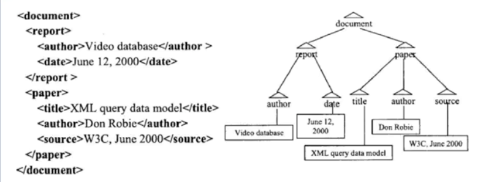
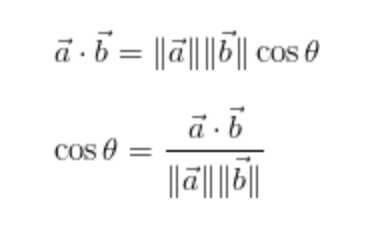
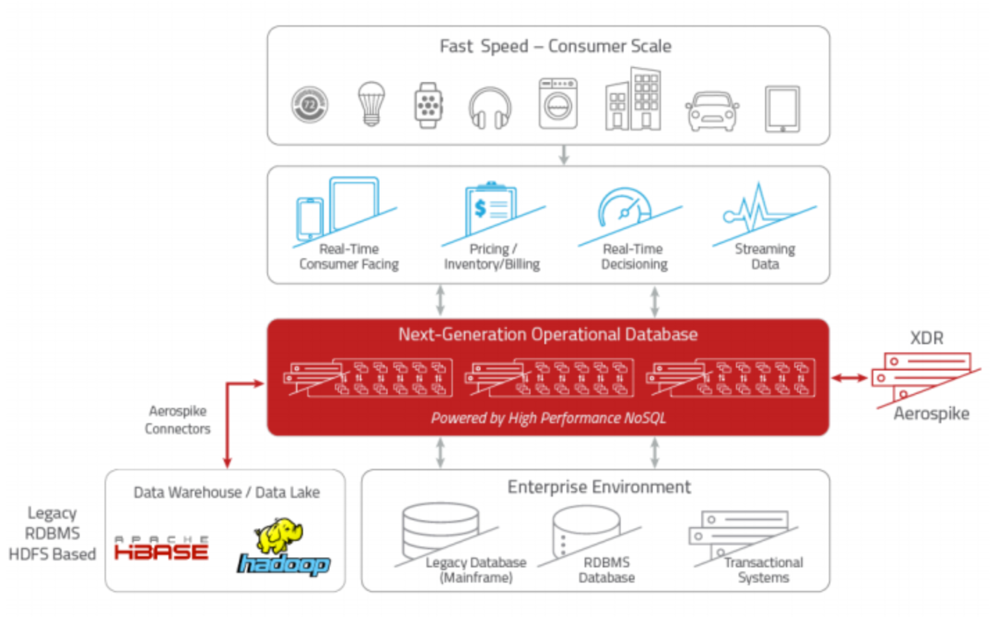
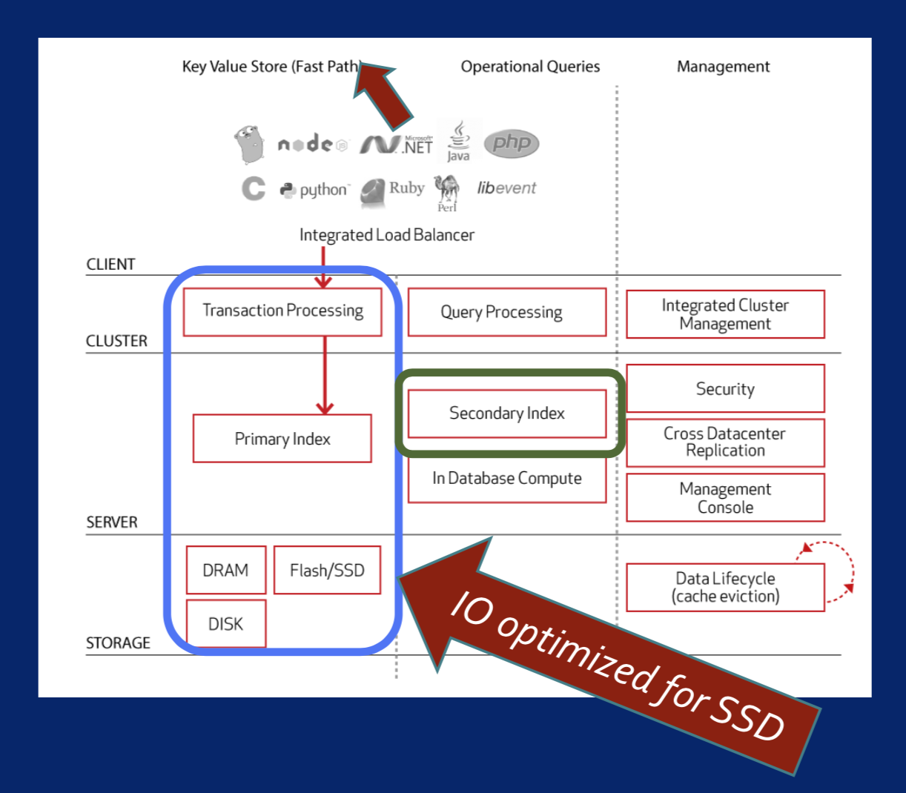
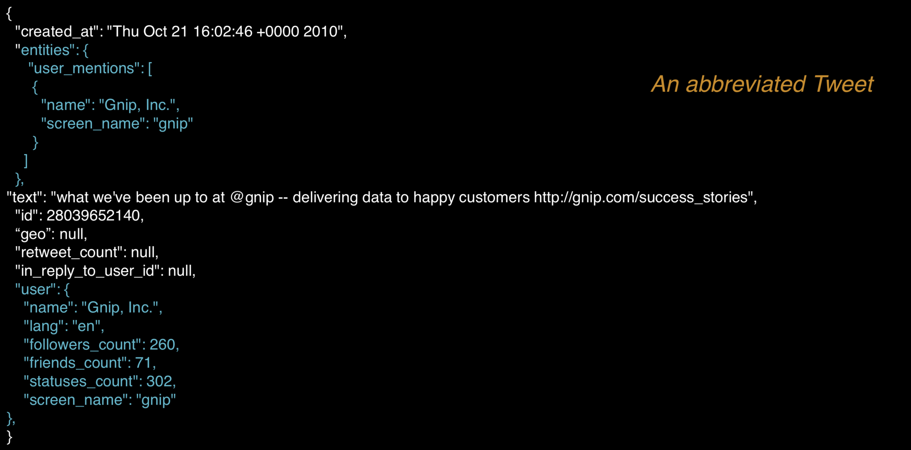
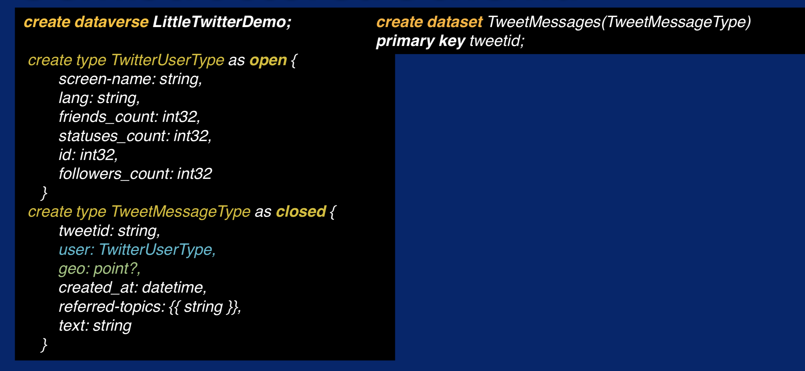
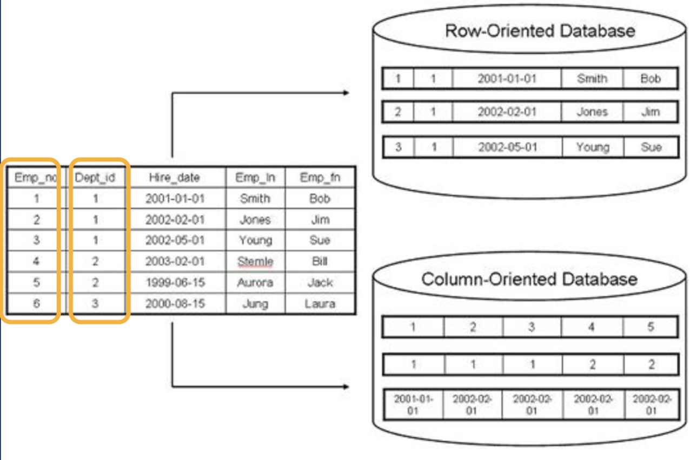
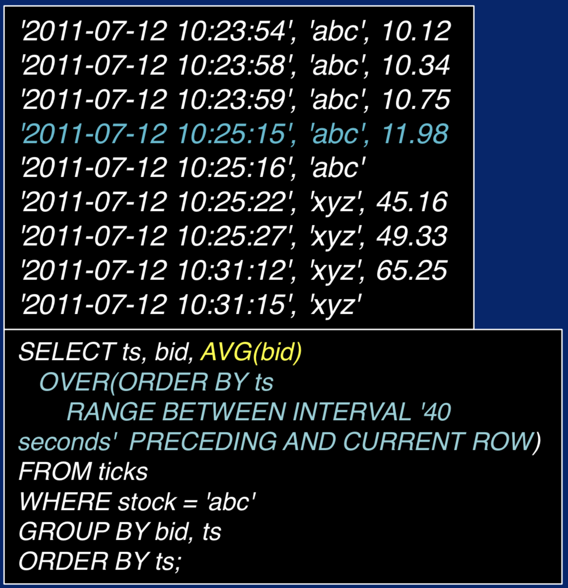
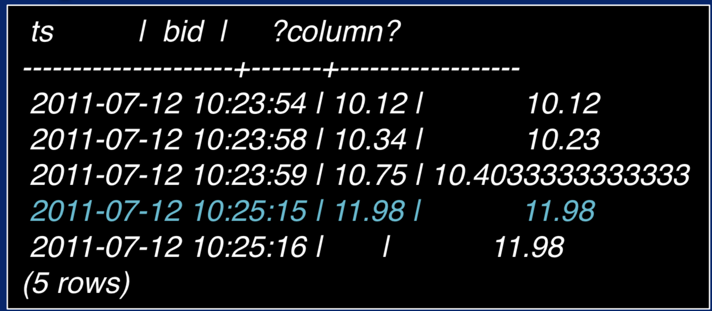

Relatively# Big_Data_Modeling_and_Management_Systems

The goal of data modeling is to formally explore the nature of data, so that you can figure out what kind of storage you need, and what kind of processing you can do on it.

The goal of data management is to figure out what kind of infrastructure support you would need for the data.

## TOC

- [Why_Big_Data_Modeling_and_Management](#why_big_data_modeling_and_management)
- [Real_Big_Data_Management_Applicaitons](#real_big_data_management_applicaitons)
- [What_is_a_Data_Model](#what_is_a_data_model)
- [Different_Kinds_of_Data_Models](#different_kinds_of_data_models)
- [Data_Models_vs_Data_Formats](#data_models_vs_data_formats)
- [Working_with_Streaming_Data](#working_with_streaming_data)
- [Hands_On_Handling_Data_Streams](#hands_on_handling_data_streams)
- [Why_Data_Management](#why_data_management)
- [From_DBMS_to_BDMS](#from_dbms_to_bdms)
- [What_is_an_Information_System](#what_is_an_information_system)


## Why_Big_Data_Modeling_and_Management

### Summary_of_Intro_to_Big_Data
[Slides](lecture_slides/summary_of_intro_to_big_data.pdf)

### Big_Data_Management_Must_Ask_Questions

- How do we ingest the data?
- Where and how do we store it?
- How can we ensure data quality?
- What operations do we perform on the data?
- How can these operations be efficient?
- How do we scale up data volume, velocity, variety, and access?
- How to keep data secure?

### Data_Ingestion

Ingestion means the process of getting the data into the data system that we are building or using.

Questions you might want to ask when you automate data ingestion:
- How many data sources?
- How large are the data items?
- Will the number of data sources grow?
- Rate of data ingestion?
- What to do with bad data?
- What to do when data is too little or too much?

### Data_Storage

Storage Infrastructure
- How much data to store?
- How fast to we need to read/write?

### Data_Quality

Why worry about data quality?
- Better quality mean better analytics and decision making.
- Quality assurance means needed for regulatory compliance
- Quality leads to better engagement and integration with external entities.

Approaches to meeting the data quality requirements in the industry:
- Data profiling and data quality measurement
- Parsing and standardization
- Generalized cleansing
- Matching
- Monitoring
- Issue resolution and workflow
- Enrichment

### Data_Operations

In general, there are two broad divisions of operations:
1. Operations on a singular object.
2. Operations on collections of data objects.
  - Operations that select a part of a collection
  - Operations that combine two collections
  - Operations that compute a function on a collection

Efficiency of Data operations
  - Measured by time and space
  - should use parallelism

### Data_Scalability_and_Security

**Achieving Scalability**
- Scaling up and scaling out

**Vertical Scaling (Scale-up)**: Adding more processors and RAM, buying a more expensive and robust server.
- Many operations perform better with more memory and cores
- Maintenance can be difficult and expensive

**Horizontal Scaling (Scaling-out)**: Adding more, possibly less powerful, machines that interconnect over a network.
- Parallel operations will possible be slower
- Easier in practice to add more machines

Most big data management systems are taking the scale out route utilizing cluster computing.

**Keeping Data Secure**
- Data Security - a must for sensitive data
- Increase the number of machines leads to more security risks
- Data in transit must be secure
- Encryption and decryption increase security but make data operations expensive.

[Slides](lecture_slides/big_data_management.pdf)

[Reading on Storage Systems](https://vanillavideo.com/blog/2014/started-storage-understanding-san-nas-das)

## Real_Big_Data_Management_Applications


### ConEd Energy Data Management Challenges
[Slides](lecture_slides/coned.pdf)

ConEd adds 4.7 million smart meters around NYC.  The system collects 10.4 million data points per 15 minutes.

Smart Meter Analytics
- Consumption patters
  - Histogram of hourly usage
- Thermal sensitivity
  - Effect of outdoor temperature
- Consumption prediction
  - Daily and weekly usage profile
  - Economic implications
- Customer Grouping
  - Similarity grouping
  - Energy saving campaigns for customer groups

The Big Data Issue
- Not only big but fast
- Life-Cycle deadline
- Estimating the need for parallel and distributed computing

### Flight Data Management
[Slides](lecture_slides/flightstats.pdf)

### Instructions_for_Downloading_Datasets

1. Start Cloudera VM. Most of the Hands On exercises in this course use the Cloudera Virtual Machine, so we will download the datasets onto the VM. Start the VM in VirtualBox and perform the remaining steps in the VM.
2. Open web browser. Open a web browser by clicking on the web browser icon in the top toolbar.
  - In the web browser, enter the following for the URL: `http://github.com/words-sdsc/coursera`
3. Download datasets.
  - Click on `big-data-2.zip`:
  - Click on the Download button:
  - In the dialog, select Save File:
  - Click OK, and the file big-data-2.zip file will be downloaded to the Downloads directory.
4. Uncompress datasets. Open a terminal shell by clicking on the terminal shell icon in the top toolbar.
  - In the terminal, run: `cd Downloads` then `unzip -o big-data-2.zip`
5. Install tools. Finally, change directories to big-data-2 (`cd big-data-2`) and run `./setup.sh` to install tools and libraries.

## What_is_a_Data_Model
[Slides](lecture_slides/intro_to_data_models.pdf)

### Intro_to_Data_Models

Three Components of a Data Model:
1. Structure
2. Operations
3. Constraints

Structured vs. Unstructured Data

Four Basic Data Operations:
1. Selection
2. Projection
3. Union
4. Join

Types of Data Constraints
- Type
- Value
- Structural

### Data_Model_Structures

A repeatable of data organization.

### Data_Model_Operations

Operations specified the methods to manipulate the data.

Four Basic Data Operations:
1. Subsetting (AKA Selection or Filtering)
  - Example: Given a collection of data and a condition, find a subset from the collection so that each element in the subset satisfies the condition.
2. Substructure Extraction (AKA Projections or Feature Selection)
  - Given a data collection with some structure, extract form each data item a part of the structure as specified by a condition.
3. Union (AKA Set Union)
  - Given two (or more) data collections, create a new one with elements of the two input collections.
  - Duplicate elimination between rows in datasets.
4. Join
  - Given two (or more) data collections, create a new one with elements of the two input collections.
  - Duplicate elimination by combining data form duplicates to complete all fields from matching collections.  

### Data_Model_Constraints

A logical test resulting in True or False. (Seems similar to masking in Numpy)

Types of Data Constraints:
- Value
  - x >= y, x > 0, etc.
- Uniqueness
  - Field must have unique or only one value
- Cardinality
  - limitation based on count of values in a field
- Type
  - Restrict type of data in a field (String, Integer, etc.)
- Domain
  - Possible set of values that are allowed for an attribute.
  - Month (1, ... , 12) or ('Jan', ... , 'Dec')
- Structural
  - Puts restrictions on the structure of the data rather than the data values themselves.

### Hands_On

#### Intro_to_CSV_Data

By the end of this activity, you will be able to:
- Identify the key features in CSV data
- Import CSV data to a spreadsheet and plot values

1. Open a terminal shell. Open a terminal shell by clicking on the square black box on the top left of the screen.
  - Run `cd Downloads/big-data-2/csv` to change into the directory containing the csv file. (This was downloaded in Week 1 [Link](https://www.coursera.org/learn/big-data-management/supplement/YVDPj/instructions-for-downloading-hands-on-datasets))
2. Look at CSV file. The CSV file contains census data for the United States. Run `ls` to see the name of the CSV file.
  - Run `more census.csv` to look at the contents of the CSV file.
  - The first line of the file is the head and the remaining lines are the data. Each entry in the file is separated by a comma.
  - Hit the spacebar to scroll down, and `q` to quit more.
3. Open spreadsheet application. Run `oocalc census.csv` to start the spreadsheet application.
4. Import CSV to spreadsheet. Let's import the CSV file to the spreadsheet by clicking on File:
  - Next, click Open:
  - Next, click Downloads in the Places pane:
  - Next, double-click big-data-2 in the file pane:
  - Next, double-click csv:
  - Next, double-click census.csv:
  - In the Text Import dialog, click OK.
  - The CSV data is now loaded into the spreadsheet.
5. See size of CSV. Scroll to the bottom of the spreadsheet to see the size of the CSV file.
  - There are 3194 rows. If the CSV file had millions or more rows, then we could not import it into a spreadsheet. In this case, we would need a Big Data system such as Hadoop to analyze the data.
  - Scroll back to the top.
6. Create chart. Let's create a chart of the estimated population of the state of Alabama. Row 2 contains the data for Alabama. Select cells in row 2 and columns J through O to get the estimated population for 2010 through 2015.
  - Click on the chart button.
  - Click Finish to display the chart.
  - The chart should be displayed in the spreadsheet.

## Different_Kinds_of_Data_Models

### What_is_a_Relational_Data_Model
[Slides](lecture_slides/relational_data_models.pdf)

The relational data model is one of the simplest and most frequently used data models today, and forms the basis of many other traditional database management systems, like MySQL, Oracle, Teradata, etc.

Structural Components of a relational data model
  - the Primary data structure for a relational model is the table
  - Actually represents a *set* of *tuples* (AKA rows)
    - set -> tuples are distinct

Data model 'Schema'
  - Details allowed data type and constraints for field that each record must satisfy.
  - Since primary key has to be unique there can be no duplicates

Purpose of primary and foreign keys:
  - act as unique identifiers to perform operations between collections or tables.
  - A foreign key refers to the primary key of another table (parent table).

Operations:
- Natural Join
  - Joins are one of the most expensive operations (time and space consuming)

### What_is_a_Semistructured_Data_Model
[Slides](lecture_slides/semistructured_data_models.pdf)

Formats: Extensible Markup Language (XML), Java Script Object Notation (JSON)

Most semistructured data models are tree-structured. Modeling a document as a tree has significant advantages.  A tree is a well known data structure that allows *navigational access* to data.



Tree-structured navigation operations:
- Imagine we are at the node Paper
  - getParent -> document
  - getChildren -> title, author, source
  - getSibling -> report
- "Video Database"
  - Root-to-Node path -> document/report/author/"video database"
- Queries need tree navigation
  - Author of "XML query data model"

### Hands_On

#### Exploring_the_Relational_Data_Model_of_CSV

[Instructions](lecture_slides/relational_data_model_with_csv.pdf)

#### Exploring_the_Semistructured_Data_Model_of_JSON_data

[Instructions](lecture_slides/semistructured_data_model_with_json.pdf)

#### Exploring_the_Array_Data_Model_of_an_Image

[Instructions](lecture_slides/array_data_of_an_image.pdf)

#### Exploring_Sensor_Data

[Instructions](lecture_slides/sensor_data.pdf)

### Vector_Space_Model
[Slides](lecture_slides/vector_data_models.pdf)

Widely used for large datasets of text (document) and images.

Vector model

Similarity function and similarity search

Document Vector
- Term Frequency (TF)
  - count of word occurrence in document
- Inverse Document Frequency (IDF)
  - log2(# of Docs / word occurrence count in doc)
  - Gives unique words higher value as they can be used to distinguish between documents better than words that are ubiquitous across all documents.
  - Log base 2 is arbitrary but used in convention.  As long as the base is consistent across an analysis it will still work as the relative score will be the same for all words.
  - IDF is a penalty in essence for super common words.
- Combined to TF-IDF Matrix = TF * IDF
- Stop words are words that appear so frequently that their presence is meaningless so are just removed.
- One row in TF-IDF matrix shows the relative importance of each word in that doc in respect to the entire corpus.
- Document length is the pythagorean theorem for all document dimensions (features or words in this case).
  - length(d) = sqrt(sum(i**2+...+k**2))


Similarity Functions:
Similarity function between vectors is a measurement of how far they are apart.

Cosine Similarity
  - Measures the angle between two vectors.
  - if the vectors are identical then the angle between them is 0
  - if the vectors are opposite then the angle is 1 (1*pi radians = 180 degrees).
  - Since it ignores magnitude it tends to ignore the length of documents. So a 2,000 word doc and a 200 word doc could be very similar despite their different lengths.  



[Cosine Similarity Blog](http://blog.christianperone.com/2013/09/machine-learning-cosine-similarity-for-vector-space-models-part-iii/)

Similarity Search:

Image Search:


### Graph_Data_Model
[Slides](lecture_slides/graph_data_models.pdf)

Most common example is a social network.  

Data and Connectivity
A DAG is represented by 2 tables:
1. Vertex (Node) table
  - Gives IDs to nodes and lists their properties
2. Edge table
  - start and end node of edges along with property of the edge

"Optimal Path" Operations
- Find the shortest path between two nodes
- Fins an optimal round-trip path that must include some specific nodes.
- Find best possible path in a network given two or more optimization criteria. I.e. Find the "best compromise" path between two nodes.
  - Pareto-optimality
  - Ex. Best path avoiding highways and tolls

Neighborhoods
Communities
- A subgraph of a graph that has many more edges within the subgraph compared to edges to nodes outside the subgraph.
- Operations
  - Dense subgraph finding
  - Optimizations of clusteredness

Connectivity Operations
- Connectedness
  - Every node is reachable from each node in the undirected version of the graph

### Other_Data_Models
[Slides](lecture_slides/other_data_models.pdf)

Array of vectors:
- images are a great example. Each pixel will have a (R,G,B) vector as a value.  

Operations on Array of Vectors:
- Dimension
- Size
- element (cell) value
- value of the kth element of a cell
- length
- distance

### Hands_On

#### Exploring_the_Vector_Data_Models_with_Lucene

[Instructions](lecture_slides/vector_data_model_with_lucene.pdf)

#### Exploring_the_Graph_Data_Model_with_Gephi

[Instructions](lecture_slides/graph_data_model_with_gephi.pdf)

## Data_Models_vs_Data_Formats
[Slides](lecture_slides/data_model_vs_data_format.pdf)

## Working_with_Streaming_Data

### What_is_a_Data_Stream
[Slides](lecture_slides/what_is_a_data_stream.pdf)

Key characteristics of a data stream

Requirements of streaming data systems

Data streams used in life

Streaming data processing applications
- process data as it is created

Social Media
- Sales trends
- Sales distributions
- Social media analysis

Industrial or farming machinery
- monitoring of potential system failures

A stream is defined as a possibly unbounded sequence of data items or records. That may or may not be related to, or correlated with each other. Each data is generally timestamped and in some cases geo-tagged. Streaming data sometimes get referred to as event data as each data item is treated as an individual event in a synchronized sequence.

Managing and processing data in motion is a typical capability of streaming data systems.

Streaming data systems
- manage one record or small set form a time window at a time
- Perform relatively simple *independent* calculations
- Operate in near-real-time (sometimes in memory)
- Non-interactive
  - Send no feedback to source

Dynamic Steering
- dynamically changing the next steps or direction of an application through a continuous computational process using streaming.

As a summary, dynamic near-real-time streaming data management, processing, and steering is an important part of today's big data applications.

### Why_is_Streaming_Data_different
[Slides](lecture_slides/why_streaming_data_is_different.pdf)

**Data-in-Motion vs Data-at-Rest**

Data-at-Rest
- Mostly static data from one or more sources
- Collected prior to analysis

Data-in-Motion
- Analyzed as it is generated
  - Ex. Sensor data from self-driving car
- Stream processing

**Streaming vs Batch data processing**

Data Processing Algorithms

Static / Batch processing
- The run time and memory usage of most algorithms that process static data, is usually dependent on the data size, and this size can easily be calculated from files or databases.

Streaming processing
- Streaming data processing is the size of the data is unbounded and this changes the types of algorithms that can be used.
- Algorithms that require iterating or looping over the whole data set are not possible since with stream data, you never get to the end.

Streaming Data Management and Processing
- Compute one data element or a small window of data elements at a time.
- Relatively fast and simple computations, since computations need to be completed in real-time.
- In most systems the management and processing system subscribe to the data source but do not provide feedback or interactions to the source.

Batch Processing
- Analytical steps have access to often all the data and can take time to complete complex tasks.

Hybrid (Lambda) Systems
- Most companies use a hybrid (lambda) architecture for processing streaming and batch jobs at the same time.
- Streaming data is kept until available in batch systems.
- A *stream storage* layer is used to enable fast trees of streams and ensure data ordering and consistency.
- A *processing layer* for data is used to retrieve data from the storage layer to analyze it and most probably little bit to a batch data stream and notify the streaming storage that the data set does no longer need to be in streaming storage.

**Management and processing challenges for streaming data**

2 main challenges to avoid data loss:
1. Streaming data changes over time
  - Size and frequency
2. Changes can be periodic or sporadic
  - Periodic: Social media can be more active on weekends or evenings
  - Sporadic: Major events

To summarize, streaming data must be handled differently than static data. Unlike static data, where you can determine the size, streaming data is continually generated, and you can not process it all at once. Streaming data can unpredictably change in both size and frequency. This can be due to human behavior. Finally, algorithms for processing streaming data must be relatively fast and simple. Since you don't know when the next data arrives.

### Understanding_Data_Lakes
[Slides](lecture_slides/understanding_data_lakes.pdf)

With big data streaming from different sources in varying formats, models, and speeds it is no surprise that we need to be able to ingest this data into a fast and scalable storage system that is flexible enough to serve many current and future analytical processes.

This is when traditional data warehouses with strict data models and data formats don't fit the big data challenges for streaming and batch applications.

**Data Lakes**

The concept of a data lake was created in response of these data big storage and processing challenges.

Data lakes enable batch processing of streaming data.

A **data lake** is a part of a big data infrastructure where many streams can flow into and get stored for processing in their original form. We can think of it as a massive storage repository with huge processing power and ability to handle a very large number of concurrence, data management and analytical tasks.

In 2010, the Pentaho Corporation's CTO James Dixon defined a data link as follows:
"If you think of a datamart as a store of bottled water, cleansed and packaged and structured for easy consumption, the data lake is a large body of water in a more natural state. The contents of the data lake stream in from a source to fill the lake, and various users of the lake can come to examine it, dive in, or take samples."

How a data Lake Works:
1. Data loaded from source
2. Stored in its native format (as raw data) until needed
3. Applications can freely read it and add structure to it (schema-on-read)

**Difference between "schema-on-write" and "schema-on-read"**

"Schema-on-Read" - Applications add structure to raw data as it is read for analysis.

"Schema-on-Write" - In a traditional data warehouse, the data is loaded into the warehouse after transforming it into a well defined and structured format.

Data Lake vs. Data Warehouse
Data Warehouse
- Stores data in a hierarchical file system with a well-defined structure.
Data Lake
- Stores data as flat files with a unique identifier. This often gets referred to as object storage in big data systems.
- Each data is stored as a binary large object (BLOB), is assigned a unique identifier and tagged with metadata tags which the data can be searched on.

To summarize, a data lake is
- A storage architecture for big data collection and processing.
- Enables collection of all data suitable for analysis today and potentially in the future.
- Regardless of the data source, structure, and format it supports storage of data and transforms it only when it is needed.
- They support all parts of the user base to benefit from this architecture, including business, storage, analytics and computing experts.
- An infrastructure component within a big data architecture that can evolve over time based on application-specific needs.


## Hands_On_Handling_Data_Streams

### Exploring_Streaming_Sensor_Data
[Instructions](lecture_slides/streaming_sensor_data.pdf)

### Exploring_Streaming_Twitter_Data
[Instructions](lecture_slides/twitter_app_instructions.pdf)

[Instructions](lecture_slides/streaming_twitter_data_instructions.pdf)

## Why_Data_Management

### DBMS-based_and_non-DBMS-based_Approached_to_Big_Data
[Slides](lecture_slides/dbms_and_non_dbms_big_data.pdf)

When should we use Hadoop or Yarn style system? And when should we use a database system that can perform parallel operations?

**Storing Data - Files vs. DBMS**
- In the old times, database operations were applications in files systems.
- Programs were written to handle data the resided in files.
- Problems
  - Data:
    - redundancy (multiple file formats, duplicate files or just files that contain duplicate information)
    - inconsistency (inconsistent data across redundant files)
    - isolation
  - Each task a program
    - No uniform way to access data
    - People writing ad-hoc programs to access data
  - Data Integrity (Integrity Constraints)
    - A constraint given in a random program that if needed change that program would have to be tracked down.
  - Atomicity of updates
    - All changes to data happen together at one moment across the system.  So no two users could see different data.
    - Very hard to handle with data redundancy and inconsistency issues.

**Advantages of using a DBMS (over a file system)**
- Declarative query languages
  - No more task-based programs
- Data independence
  - Applications don't worry about data storage formats and locations
- Efficient data access through optimization
  - The system automatically finds an efficient way to access data
- Data integrity and security
  - Methods to keep accuracy and consistency of data despite failure (i.e. Four properties of a transaction)
    - ACID (Atomicity, Consistency, Isolation and Durability) properties of transactions
    -  For example, a transfer of funds from one bank account to another, even involving multiple changes like debiting one account and crediting another is a single transaction.
    - Failure Recovery
- Concurrent access
  - Many users can simultaneously access data without conflict

Terms:
*Declarative* - State what we want to retrieve without telling the DBMS how exactly to retrieve it.
*Data Independence* - Isolate the users from the record layout so long as the logical definition of the data, which means the tables and their attributes are clearly specified.
*Transaction* - A single logical operation on the data.
*Atomicity* - All changes to data happen together at one moment across the system.  So no two users could see different data.  
*Consistency* - Many data written to the database must be valid according to all defined rules including constrains.
*Isolation* - Multiple users updating a database simultaneously.
  - The DBMS must be sure that a ticket should no be sold twice. Or if one person is in the middle of buying the last ticket, another person does not see that ticket as available.
*Durability* - Once a transaction has been committed, it will remain so, even in the event of power loss, crashes or errors.

**Parallel and Distributed DBMS**
- Parallel database system
  - Improve performance though parallel implementation
  - Often allows data replication
    - Data redundancy against table corruption
    - More concurrent queries
- Distributed database system: (Not covered in this course)
  - Data is stored across several sites, each site managed by a DBMS capable of running independently.

**DBMS and MapReduce-style Systems**
- Started with a different problem focus
  - DBMSs:
    - efficient storage, transactions and retrieval
    - Do not take into account machine failure
  - MapReduce-style systems:
    - complex data processing over a cluster of machines
    - originally developed for processing large amounts of dat not storage and retrieval.
    - Since, MR implementations we done over Hadoop filesystems, issues like node failure were automatically accounted for.

The mixture of data management requirement today create tension between data management systems.

**Shifting Requirements**
- Data loading - a new bottleneck
  - Does the application need data sooner than the loading time?
- Too much functionality
  - Does the application use only a few data management features?
- Combined Transactional and Analytical Capabilities

**No Single solution**
- Mixed solutions
  - DBMS on HDFS
  - Relational operations in MapReduce systems like Spark
  - Streaming input to DBMS
  - New parallel programming models for analytical computations within DBMS

## From_DBMS_to_BDMS
[Slides](lecture_slides/from_dbms_to_bdms.pdf)

### From_DBMS_to_BDMS

There is no single ubiquitous solution for big data problems.

**Desired Characteristics of BDMS**
- A flexible, semistructured data model
  - Should support applications that require a schema and those that do not
- Support for today's common "Big Data" data types
  - Textual. temporal, and spatial data  values
- A full query language
  - Expectedly at least the power of SQL
- An efficient parallel query runtime
- Wide range of query sizes
- Continuous data ingestion
  - Stream ingestion
- Scale gracefully to manage and query large volumes of data
  - Use large clusters
- Full data management capabilities
  - Ease of operational simplicity

**ACID vs. BASE**
- ACID properties hard to maintain in a BDMS
- BASE relaxes ACID
  - BA: Basic Availability
    - Data may be unavailable as it is being updated
  - S: Soft State
    - Even during times without input, there may be changes going on through the system due to eventual consistency. Thus, the state of the system is always soft.
  - E: Eventual Consistency
    - The system will eventually become consistent once it stops receiving input.
    - When it stops receiving input, the data will propagate to everywhere that it should, sooner or later, go to but in reality the system will continue to receive input. And it's not checking the consistency of every transaction at every moment because there's still lots of transactions to process.

**CAP Theorem**
- A distributed computer system cannot simultaneously achieve:
  - Consistency
    - All nodes see the same data at any time.
  - Availability
    - a guarantee that every request receives a response about whether it succeeded or failed.
  - Partition Tolerance
    - The system continues to operate despite arbitrary partitioning due to network failures.

There are MANY Big data systems in the market today.

### Redis-An_Enhanced_Key-Value_Store

**Redis and Data Look-up**
- In-memory data structure store
  - strings, hashes, lists, sets, sorted sets
- Look-up Problem
  - Case 1: (key:string, value:string)
  - Keys may have internal structure and expiry
    - Redis is used in streaming data as data is only needed in memory for a specific time period.
    - `comment:1234:reply.to`
    - Hierarchical keys: user.commercial,
      user.commercial.entertainment,
      user.commercial.entertainment.movie-industry
  - Case 2: (key:string, value:list)
    - userID:[tweetID_1, tweetID_2,...]
    - Zipists compress lists (without reducing content)
      - great for retrieval but not as good for insertion and deletion
    - Twitter innovation: list of ziplists
      - Two Twitter Presentations:
        - [Real Time Delivery Twitter](http://www.infoq.com/presentations/Real-Time-Delivery-Twitter)
        - [Pres 2](https://www.youtube.com/watch?v=rPgEKvWtozo)
  - Case 3: (key:string, value:attribute-value pairs)
    - REDIS Hashes
      - std:101 name:"John Smith" bob:01-01-2000 gender:M active0 cgpa:2.9

**Redis and Scalability**
- Partitioning and Replication
  - Range partitioning
    - Example: User record number 1-10000 goes to machine 1, 10001-20000 goes to machine 2, ...
  - Hash partitioning
    - Pick a key of a record, e.g. "abcde"
    - Using a has function, turn it into a number, e.g. 152
    - If we have 10 machines, 152 % 10 = 2, so the record goes to machine 2
  - Master-Slave mode replication
    - Clients write to master, master replicates slave
    - Clients read form slaves to scale up read performance


### Aerospike-A_New_Generation_KV_Store

A distributed NOSQL database and key: value store with an architected for the performance needs of today's web scale applications.



The diagram above shows how Aerospike relates to the ecosystem for which it is designed.

The top layer shows several applications for real time consumer facing systems, such as travel recommendation systems, pricing engines used for stock market applications, real time decision systems that analyze data to figure out whether an investment should be done and so forth.

All of these systems need large amounts of data to be accessible at any point in time.

The Aerospike system can interoperate with Hadoop-based systems (ex. Spark), or a Legacy database, or even a real time data source. It can exchange large volumes of data with any such source and serve fast lookups and queries to the applications above. Now that translates to a very high availability robust and strong consistency needs.


**Aerospike Architecture**


Key Value Store (Fast Path)
- Client System
  - processes transactions
- Cluster System
  - Data that are primarily managed in primary index the is the key: value store.
- Server System
  - This index stays in memory for operational purposes.
- Storage System
  - Three kinds of storage used:
    1. Dynamic RAM (DRAM)
    2. Regular spinning disk
    3. SSD
      - Aerospike system optimized for SSD.
      - More data can be stored on disk (vs memory) without compromising system performance.

The second point of uniqueness is a secondary index there. Aerospike built secondary index fields that are non-primary keys. A non-primary key is a key attribute that makes a tuple unique, but it has not been chosen as a primary key. In Aerospike, secondary indices are stored in main memory. They are built on every node in a cluster and co-located with the primary index. Each secondary index entry contains references to records, which are local to the node

**Querying Aerospike**
- Data types
  - Standard scalar, lists, maps, geospatial, large objects
- KV Store Operations
  - Geospatial queries like point-in-polygon
_ AQL: A SQL-like language
  - SELECT name, age FROM  users.profiles

**Transactions in Aerospike**
- Aerospike ensures ACID
  - Consistency - all copies of a data item in a cluster are in sync
    - Uses synchronous write to replicas
    - Mechanisms to relax immediate consistency
  - Durability
    - Flask Storage
    - Replication management
  - Network partitioning reduced
    - Tighter cluster control

### Semistructured_Data-AsterixDB



**Semistructured Schema**



**Options for Querying in AsterixDB**
- AsterixDB has its own query language - Asterix Query Language (AQL)
- AQL is a natively-supported query language
  - query ex.:
  ```
  for $user in dataset TwitterUsers
  order by $user.followers_count desc, $user.lang asc
  return $user
  ```
  - This particular query asks for all user objects from the dataset TwitterUsers in descending order of their follower count and in alphabetical order of the user's preferred language.
- What is more interesting and distinctive is that AsterixDB has a creative processing engine that can process queries in multiple languages.
  - They've developed a way to transfer the query into a set of low level operations like select and join which their query exchange can support.
    - Hive Queries (HiveQL)
      - Ex.: `SELECT a.val, b.val FROM a LEFT OUTPER JOIN b ON (a.key=b.key)`
    - Xquery
    - Hadoop MR jobs
    - SQL++ - extends SQL to JSON

**Operating Over a Cluster**

Like a typical BDMS, AsterixDB is designed to operate on a cluster of machines. The basic idea, not surprisingly, is to use partition data parallelism.

- Hyracks
  - Query executions engine for partitioned parallel execution of queries
- Examples:
  - `CUSTEMER (C_CUSTKEY, C_MKTSEGMENT, ...)``
  - `ORDERS (O_ORDERKEY, O_CUSTKEY, ...)``

**Accessing External Data**
Usually people acquire tweets by accessing data through an api that twitter provides. Very typically a certain volume of tweets, lets say for every 5 minutes, is accumulated into a .json file in a specific directory. The next 5 minutes, in another .json file, and so forth.

- Real-time data file *from files in a directory path*
  - Ex:
  ```
  create sataset Tweets (Tweet)
    primary key id;

  create feed TestFileFeed using localfs
    (("path"="127.0.01://Users/sdc/text/"),
    ("format"="adm"), ("type-name"="Tweet"),
    ("expression"=".*\\.adm"));
  ```
  - The way to get this data into asterisks DB, is to first create an empty data set called Tweets. The next task is to create a feed. That is an external resource. One has to specify that it's coming from the local file system called `localfs` and the location of the directory, the format and the data type it's going to copy it. Next, the feed is connected to the data set and the system starts reading unread files from the directory.

- real-time data *from an external API*
  - Ex.:
  ```
  use dataverse feeds;

  create dataset Tweets (Tweet)
    primary key id;

  create feed TwitterFeed if not exists using "push_twitter"
    (("type-name"="Tweet"),
    ("consumer.key"="some-key"),
    ("consumer.secret"="some-secret"),
    ("access.token"="some-token"),
    "access.token.secret"="some-token-secret"));
  ```
  - Another way for AsteriskDB to access external data is directly from an API, such as the Twitter API. To do this, one would create a dataset as before. But this time the data feed is not on the local file system.  Instead it uses the push Twitter method which invokes the Twitter client with the four authentication parameters required by the API. Once the feed is defined it is connected to the data set as before.

### Solr_Managing_Text

Another Apache product for large scale text data searching.

Systems like Solr, and its underlying text indexing engine, are typically designed for search problems. So they would typically be part of a search engine.


**Solr-Managing Text**
- Basic challenges with text
  - Defining a match
    - Lexical difference, capitalization
      - Analyze = Analyze = ANALYZE ?
    - Structural punctuations
      - abc:def-230-39 = abcdef23039 ?
    - Nominal Variations
      - "Barak Hussein Obama" = "Barak Obama" = "Barak H. Obama" = "B. H. Obama" ?
    - Synonyms
      - Mom = monther ?
    - Abbreviations
      - Dr. = Doctor ?
    - Initialism
      - USA = "United States of America"
    - Period sign
      - "The tradition is completely American. Students should ..."
        - Should this match the query "American students" ?
        - No! Period sign designates split of sentences
      - "Mrs. Clinton also said ..."
        - Should this match the query "mrs Clinton" ?
        - Yes!, the period here does not designate and separation fo statements

**Inverted Index**
Lucene, the engine on which Solr is built is effectively not a database, but a modern inverted index.

An inverted index is essentially an index which for every term stores at least the ID of the document where the term occurs. Practically, other computed numbers or properties associated with the terms will also be included in the index.

- Vocabulary
  - All terms in a collection (corpus) of documents
    - Multi-word terms, synonym sets
- Occurrence
  - For each term in the collection
    - List of doc ID
    - List of doc ID, [position of occurrence]
    - Other statistics like tf, idf, ...

**Solr Functionality**
- Enterprise Search Platform
- inverted Index
  - For every field in a structured text document
    - indexes text, numbers, geographic information, ...
- Faceted Search
- Term Highlighting
- Index-time Analyzers
  - Tokenizers
  - Filters
    - Ex.
    Tokenizer: Standard Tokenizer - Removes white space, filter out punctuation, then get the stem or root fo each word getting down to the pure word (i.e. running -> run)
    Filter 1: Standard Filter - removes the punctuations.
    Filter 2: Lower Case Filter - turns everything into lowercase.
    Filter 3: Synonym Filter - uses a synonym file to ensure that all the synonyms get the same token after ignoring the case.
    Filter 4: English Porter Filter - removes common English words like a and the (stop words).
  - Query Time Analyzers
    - Query Search Ex.
    Tokenizer: Pattern Tokenizer - Removes white space, filter out punctuation
    Filter 1: Standard Filter - removes the punctuations.
    Filter 2: Lower Case Filter - turns everything into lowercase.
    Filter 3: Common Grams Filter - creates tokens out of pairs of terms, and in doing so, makes sure that words in the stop word file are used. So if we have the string, the cat, the term the should not be ignored in this filter.
    Filter 4: Stop Filter - removes stop words
    Filter 5: HTML Strip Char Filter - makes sure that if the queries coming from a web form, all the HTML characters are stripped off.
    Filter 6: Porter Stem Filter - get the stem or root fo each word getting down to the pure word (i.e. running -> run)

Note: Filters are executed in order

**Solr Queries**

We issue queries against the system by posing a web query.

- All books
  - `http://localhost:8983/solr/query? q=*.*`
- All books with "black" in the title field, return author, title
  - `http://localhost:8983/solr/query? q=title.black &fl=author,title`
- All books sort by pubyear_i in descending order
  - `http://localhost:8983/solr/query? q=*.*&sort=pubyear_i desc`
- Above query but facet by all values in the cat field
  - `http://localhost:8983/solr/query? q=*.*&sort=pubyear_i desc&facet=true&facet.field=cat`

Notice that the `q=` to is a query and the `fl` is what you want to back.

### Relational_Data-Vertica

**Vertica - A Columnar DBMS**

Which is the relational DBMS designed to operate on top of HDFS.

Belongs to a family of DBMS architectures called column stores.
  - Other products in this family are UCDV, Carrot Cell Xvelocity from Microsoft and so forth.

Primary difference between a row store and a column store is shown in the diagram below.



In a row oriented design the database internally organizes the record tuple by tuple. In a column store, the data is organized column wise. So, each column is stored separately.

- Columns Store
  - Store data column-wise
  - A query only uses columns needed
  - Usually much faster (and uses less memory) for queries even for large data

**Space Efficiency**
- Column stores keep columns in sorted order
- Values in columns can be compressed
  - Run-length encoding
    - 1/1/2007 - 16 records
  - Frame-of-reference encoding
    - Fix a number and only record the difference
- Compression saves storage space

**Working with Vertica**
- Column-Groups
  - Frequently co-accessed columns behave as mini row-stores within the column store
- Update performance slower
  - Interal conversion from row-representation to column-representation
- Enhanced suite of analytical operations
  - Window statistics
    - Ticks (ts TIMESTAMP, Stock varchar(10), Bid float)
    - Ex.:
    

    Without going into the details of the query just consider the blue part. It says the average bid must be over the range that is computed on the timestamp column over a 40 second time interval. So, the computation of the average advances for the stock abc and for each computation, the system only considers the rows whose timestamp is within 40 seconds before the current row.

      - This is a rolling average.

    

The takeaway from this example is that analytical computations like this are happening inside the database and not in an external application.

**Vertica and Distributed R**

R is a well known free statistics package that's used by statisticians, data minors, predictive analytics experts. Today, R can not only read data from files, but it can go to an SQL database and grab data to perform statistical analysis. Over time, R has evolved and given rights to distributed R which is a high performance platform for R.

- Distributed R
  - High performance statistical analysis
  - Master node: schedules tasks and sends code
    - coordinates computations by sending commands to the workers
  - Worker nodes: maintain data partitions and apply the computation functions to the data
  - Uses a data structure called dArray or distributed array

A simple work flow of constructing and deploying a predictive model.


The role of Vertica, is that it's a data supplier to the worker nodes of R, and a model consumer. The data to be analyzed is the output of the Vertica query, which is transferred in memory through a protocol called Vertica fast transfer through distributed R as a dArray.

When the model is created in R, it should come back as a code that goes through Vertica as a function. This function can be called from inside Vertica as if it was a user defined function.

Now in sophisticated applications, the features of the data needed for predictive modeling will also be computed inside the DBMS possibly using the new analytical operations of Vertica that we've just shown. This will make feature computation much faster and improve the efficiency of the entire analytics process.

Going forward, we believe that most DBMS's who want to play in the analytics field, will support similar functions.

## What_is_an_Information_System

### Catch_the_Pink_Flamingo_Game
Let’s imagine now that you are part of a company called, **Eglence Inc.** (If you took the Intro Course before this course, you might remember our imaginary company Eglence Inc.)

One of the products of Eglence Inc. is a highly popular mobile game called “**Catch The Pink Flamingo**”. The objective of the game is to catch as many Pink Flamingos as possible by following the missions provided by real-time prompts in the game and cover the map provided for each level. The levels get more complicated in mission speed and map complexity as the users move from level to level.

It’s a **multi-user game** where the players have to catch Pink Flamingos that randomly pop up on a gridded world map based on missions that change in real-time. For the player or team to move to the next complexity level, they need to have at least one point in every map grid cell, i.e., cover the whole world map. An example mission would be “Catch the Flamingos on land with stars on their belly” in which the player should only click on flamingos that match the mission criteria, in this case, stars and being on land. If the player tags any other flamingo on the map, he/she or his/her team gets a negative point (-1) on that map location.

After the initial **sign up**, a player (user) is asked to play the Level 1 individually without joining any team. This is where the user gets trained as a player and starts building a game history. Level 1 is an easy entry to the game composed of only 64 (8x8) grid cells and longer, more obvious, fun missions. Upon completion of Level 1, the player gets asked if she/he wants to join any team or form a team and will continue the rest of the time as a team player even if that means the user is a 1-person team of her/his own.

At the beginning of each level, the game creates a brand new map with more cells than the level before. The complexity of the missions also increases. The missions change more frequently as the levels increase.

The players keep in touch via **chat boards** assigned to the teams and also via social media, e.g., Twitter.

There are some things to consider while designing an information system for this game:

- **Ranking of Users:** Each user will be ranked individually by the speed and accuracy of their click to completion. The rankings get tracked in real-time and can be viewed both via the mobile app and the website for the game. In addition to score, speed and accuracy based ranking, the other players can see what parts of the map the user has the most points for. The players are also categorized based on their history as “rising star”, “veteran”, “coach”, “social butterfly” and “hot flamingo”. These refer to the qualities of players in addition to the game statistics.
- **Ranking of Teams:** The teams are ranked publicly. There is a maximum of 30 members in a team and a minimum of 1 member. The players “ask” to join a team and get voted in when 80% of the team members allow. A team may choose to “recruit” if they think a player can contribute or “outvote” a player if a player is not contributing. The players are also allowed to change their teams and bring all their points along. The competition is built on “point-based economy” and it is encouraged by the game providers. When all players leave a team, the team automatically gets removed from public and archived by Eglence Inc.
- **In-game Purchases:** Users are allowed in game purchases including binoculars to spot the mission specific flamingos, special flamingos that count for more than one grid point, ice blocks to freeze a mission for 20 seconds when needed, and trading cards to transfer the extra points from some grid cells to the ones without any points.
- **Game Completion:** The game never ends, meaning that there will always be a more complicated next level. A challenge for Eglence Inc. is to keep the game interesting and engaging for players who have been around for a long time. They make use of big data analytics to make sure the veteran players are still around.
