entity# Big_Data_Intgration_and_Processing

## TOC

- [Why_Big_Data_Integration_and_Processing](#why_big_data_integration_and_processing)
- [Setting_Up_Software_Environment](#setting_up_software_environment)
- [Querying_Data](#querying_data)
- [Hands_On_Querying_Data](#hands_on_querying_data)
- [Information_Integration](#information_integration)
- [Industry_Examples_for_Big_Data_Integration_and_Processing](#industry_examples_for_big_data_integration_and_processing)
- [Hands_On_Big_Data_Management_and_Processing_Using_Splunk](#hands_on_big_data_management_and_processing_using_splunk)
- [Big_Data_Pipelines_and_High-level_Operations_for_Big_Data_Processing](#big_data_pipelines_and_high-level_operations_for_big_data_processing)
- [Big_Data_Processing_Tools_and_Systems](#big_data_processing_tools_and_systems)
- [Hands-On_Spark](#hands-on_spark)

## Why_Big_Data_Integration_and_Processing

### Summary_of_Big_Data_Modeling_and_Management

[Slides](lecture_slides/Summary_of_Big_Data_Modeling_and_Management.pdf)

**Big Data Modeling and Management**
- Data modeling tells you
  - How you data is structured
  - What operations can be done on the data
  - What constraints apply to the data
- Database Management Systems
  - Typically handle many low-level details of data storage, manipulation, retrieval, transactional updates, failure and security.
  - Relives a user to focus on higher level operations like querying and analysis.  (Provides programmable access to data)

**Different Data Models**
- Relational Data
  - Where data looks like tables
- Semi-structured Data
  - Document data, XML and JSON
- Graph Data
  - Social Network, email networks
- Text Data
  - Articles and reports

**Streaming Data**
- An infinite flow of data coming from a data source
  - Sensor data form instruments
  - Stock price data
- Data rates vary - can be too fast and too large to store
- often Processed in memory
- May need to be processed immediately
  - Notifications: Ex. Inform whenever 3 tech stocks go up by 3% within a 30 second span
  - Used for event detection and prediction

**DBMS and BDMS**
- BDMS
  - Designed for parallel and distributed processing
    - Data-partitioned parallelism
  - May not always guarantee consistency for every update
    - More likely to guarantee eventual consistency
  - Often built-on Hadoop
    - Offer Map-reduce style computation
    - Utilizes replication natively offered by HDFS


### Why_is_Big_Data_Processing_Different

[Slides](lecture_slides/Why_is_Big_Data_Processing_Different.pdf)

Challenges of ingesting and processing big data.

**Requirements for Big Data**
1. Support Big Data Operations
  - Split volumes of data
  - Access data fast
  - Distribute computations to nodes
2. Handle Fault Tolerance
  - Replicate data partitions
  - recover files when needed
3. Enable Adding More Racks (Scaling Out)
4. Optimized and extensible for many data types
5. Enable both streaming and batch processing
  - Low latency processing of streaming data
  - Accurate processing of all available data

*Latency* - How fast the data is being processed, or the difference between production (or event) time and processing time of a data entry.
  - i.e. The delay in the processing of the streaming data in the system.  

**Challenges related to its variety, volume, and velocity**

Big data has varying volume and velocity requiring the dynamic and scalable batch and stream processing. Big data has a variety requiring management of data in many different data systems and integration of it all at scale.

Volume -> Scalable batch processing
Velocity -> Stream processing
Variety -> Extensible data storage, access and integration

## Setting_Up_Software_Environment

### Downloading_and_Installingthe_Cloudera_VM_Instructions_Mac

[Instructions](Downloading_and_Installingthe_Cloudera_VM_Instructions_Mac.pdf)

### Software_Installation_FAQ

[FAQ](lecture_slides/Software_Installation_FAQ.pdf)

### Instructions_for_Downloading_Hands_On_Datasets

[Instructions](lecture_slides/Instructions_for_Downloading_Hands_On_Datasets.pdf)

### Instructions_for_Starting_Jupyter

[Instructions](lecture_slides/Instructions_for_Starting_Jupyter.pdf)

## Querying_Data
[Querying Structured Data](lecture_slides/Querying_Data.pdf)
[Querying Unstructured Data](lecture_slides/querying_data_pt2.pdf)
[Retrieving Big Data](lecture_slides/retrieving_big_data.pdf)

### What_is_Data_Retrieval

define a query language

Write simple SQL queries

Express simple queries using MongoDB

Write simple queries using Aerospike

Explain how large-scale data can be processed by data-partitioned parallelism

- Data retrieval
  - The way in which the desired data is specified and retrieved form a data store
- Our focus
  - How to specify a data request
    - for static and streaming data
  - The internal mechanism of data retrieval
    - For large and streaming data

**What is a Query language**
- A language to specify the data items you need
- A query language is declarative
  - specify what you need rather than how to obtain it
  - SQL (Structured Query Language)
- Database programming language
  - Procedural programming languages
  - Embed query operations

**SQL**
- The standard for structured data
  - Oracle's SQL and Spark SQL
- Example Database Schema:
```
Bars(name, addr, license)
Beers(name, manf)
Sells(bar, beer, price)
Drinkers(name, addr, phone)
Frequents(drinker, beer)
Likes(drinker, beer)
```

**SELECT-FROM-WHERE**
- Which beers are made by Heineken?
```
SELET name
FROM Beers
WHERE manf = 'Heineken';
```

**More Example Queries**
- Find expensive beer
  - DISTINCT ensures no duplicates
```
SELECT DISTINCT beer, price
FROM Sells
WHERE price > 15;
```
- Which businesses have Temporary License (starts with 32) in San Diego?
```
Select name
Form Bars
WHERE add LIKE '%SD' AND license LIKE '32%' LIMIT 5;
```
*Note: % = wildcard*

**Select-Project Queries in the Large**
- Large Tables can be partitioned
  - Many partitioning schemes
    - Range partitioning on primary key
- Two queries
  - Find records for beers whose name starts with 'Am'
```
SELECT *
FROM Beers
WHERE name LIKE 'Am%';
```
  - Which beers are made by Heineken?
```
SELECT name
FROM Beers
WHERE manf = 'Heineken';
```

**Evaluating SP Queries for Large Data**
- A query processing trick
  - Use the partitioning information
    - Just use partition 1!!

Single table query across multiple machines:
- The query needs to be broadcast from the primary machine to all machines.
- Next, this broadcast query will independently, and in parallel, execute the query on the local machine.
- Then, these results need to be brought back into the primary machine.
- And then, they need to be unioned together.
- And only then, the results can be formed and returned to the client.


The highlighted part of the query is executed in parallel.

**Local and Global Indexing**
- What if a machine does not have any data for the query attributes?
- Index structures
  - Given value, return records
  - Several solutions
    - Use local index on each machine
    - Use a machine index for each value
    - Use a combined index in a global index server

### Querying_Two_Relations

- Often we need to combine two relations for queries
  - Find the beers liked by drinkers who frequent The Great American Bar
```
SELECT DISTINCT beer
FROM Likes L, Frequents F
WHERE bar = 'The Great American Bar' AND F.drinker = L.drinker;
```

**Select-Project-Join (SPJ) Queries**
- Query above rewritten
```
Selection bar='The Great American Bar'(Frequents)
Join F.drinker = L.drinker(_, Likes)
Project beer (_)
Deduplicate(_)
Output
```
  - The Selection operator reduces the number of tuples (rows) to consider.
  - Underscores `"_"` are placeholders for the part of the input that comes from the precious steps in the pipeline. In this case, it is the result of the Selection piped in to the Join operation. We DO NOT create an intermediary table from the result of the Selection.
  - The result of the Join operator is an intermediate structure with columns beer from Likes relation and the drinker from the Frequents relation that we've processed.
  - This intermediate set of tuples is piped to the Project operation that picks up the beer column.
  -  the DISTINCT clause is processed using the Deduplicate operation, which then goes to the Output.

**Join in a Distributed Setting**

Two-table query across multiple machines:

Tables:
- Frequents(drinker, bar) *machine 1*
- Likes(drinker, beer) *machine 2*

Selection on machine that hold Frequents table

Semijoin
  - The goal of the Semijoin operation is to reduce the cost of data movement.
  - That is to move data from the machine which has the Frequents data to the machine with the Likes data. The cost is reduced if we ship less data.
  - A semijoin from R to S on attribute is used to reduce the data transmission cost
  - Computing steps:
    - *Project* R on attribute A and call it (R[A]) - only the Drinkers column
      - only this column is transmitted to the second machine
    - *Ship* this projection (a semijoin projection) from the site of R to the site of S
    - *Reduce* S to S' by eliminating tuples where attribute A are not matching any value in R[A]
      - Finally, the join is performed by looking at the values in the Likes column that only matches the values in the shipped data. That means only the data from Likes that matches the drinkers that are chosen. These are then the join results which would go to the output of the operation.


If we have a system like DB2 or Spark SQL that implements multi-site joins, it will perform this kind of operation under the hood, you don't have to know them.

However, if we were to implement a similar operation and all that you have is Hadoop, you may end up implementing this kind of algorithm yourself.

### Subqueries

Queries in real life are a little more complicated... so lets look at some.

**Subqueries**
- A slightly complex query
- Find the bars the serve Miller for the same price or less that what TGBA charges for Bud.
- We can break up the query into two queries:
  1. Find the price TGAB charges for Bud
  2. Find the bars that serve Miller at the same price or less

**Subqueries in SQL**
```
SELECT bar
FROM Sells
WHERE beer = 'Miller'
  AND price <= (SELECT price
                FROM Sells
                WHERE bar = 'TGAB'
                AND beer = 'Bud');
```
- inner query is evaluated first and the outer query uses its output.
- The inner query is independent of the outer query. I.e if we did not have the outer query we could still evaluate the inner query.
  - We could say that the subquery in uncorrelated.

**Subqueries with IN**
- Find the name and manufacturer of each beer that Fred does not like
Tables:
```
Beers(name, manf)
Likes(drinker, beer)
```
Query;
```
SELECT *
FROM Beers
WHERE name
NOT IN (SELECT beer
        FROM Lieks
        WHERE drinker = 'Fred');
```

**Correlated Subqueries**
- Find the name and price of each beer that is more expensive than the average price of beers sold in the bar.

```
SELECT beer, price
FROM Sells S1
WHERE price > (SELECT AVG(price)
               FROM Sells S2
               WHERE S1.bar = S2.bar);
```
Inner query gets the average price for each bar.

**Aggregate Query**
- Find the average price of Bud:
```
SELECT AVG(price)
FROM Sells
WHERE beer = 'Bud';
```
  - if we wanted to take each unique number only once:
```
SELECT AVG(DISTINCT price)
FROM Sells
WHERE beer = 'Bud';
```
- Other aggregate functions:
  - SUM, MIN, MAX, COUNT, ...

**Group BY Queries**
- Find for each drinker the average price of Bud at the bars they frequent
```
SELECT drinker, AVG(price)
FROM Frequents, Sells
WHERE beer = 'Bud'
  AND Frequents.bar = Sells.bar
GROUP BY drinker;
```

**Grouping Aggregates over Partitioned Data**

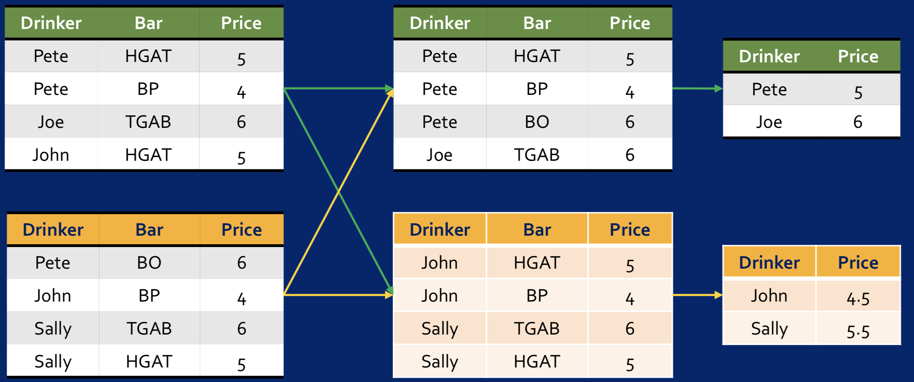

Now with the GROUP BY operation the data will get repartitioned by the grouping attribute, that's drinker. And then the aggregate function is computed locally. To accomplish this repartitioning task, each machine groups its own data locally, determines which portions of data should be transmitted to a different machine, and accordingly ships it to that machine.

Now there are several variants of this general scheme which are even more efficient. Now if this reminds you of the map operation you saw in your previous course, you are exactly right.

This fundamental process of grouping, partitioning, and redistribution of data is inherent in data-parallel computing and implemented inside database systems.

### Hands_On_Querying_Relational_Data_with_Postgres

[Instructions](lecture_slides/Querying_Relational_Data_with_Postgres.pdf)

### Querying_JSON_Data_with_MongoDB

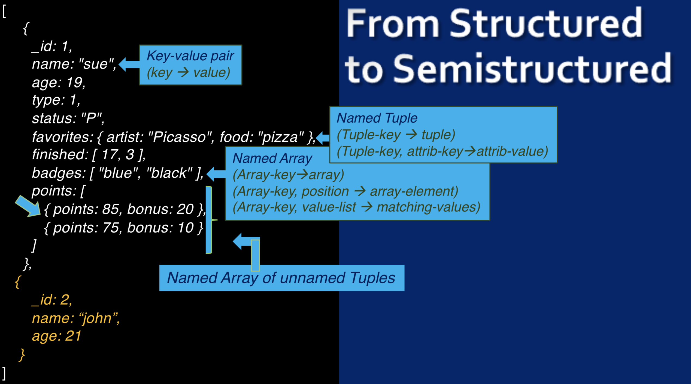

Just like a basic SQL query states, which parts of which records from one or more people should be reported, a MongoDB query states which parts of which documents from a document collection should be returned.

**SQL SELECT and MongoDB find()**
- MongoDB is a collection of documents
- The basic query primitive

`db.collection.find(<query filter>, <projection>).<cursor modifier>`

`collection` - Tells system which document to use.  Analogous to the `FROM` clause.
`<query filter> ` - Specifies which documents to return. Like `WHERE` clause or a conditional filter.
`<projection>` - Specifies which fields to retirieve. Essentially, a list of variables we would like to see in the output.  Like `SELECT` clause.
`<cursor modifier>` - How many results to return. The word cursor relates back to SQL where cursor is defined as a block of results that is returned to the user in one chunk. This becomes important when the set of results is too large to be returned all together, and the user may need to specify how much, or what portion of results they actually want.

**Some Simple Queries**
- Query 1
  - SQL:
    `SELECT * FROM Beers;`
  - MongoDB
    `db.Beers.find()`
- Query 2
  - SQL
    `SELECT Beers, price FROM Sells;`
  - MongoDB
    `db.Sells.find(
      {},
      {beer: 1, price: 1}
      )`

*Note:*
  - The query filter can be left blank to return all records.
  - The projection filter has a 1 if the attribute is an output and a 0 if it is not.  Only attributes with 1's are required.  
    - You may use a 0 when you do not want to return the ID of a document.  Every query return the document id by default.  is you wan tot override this add `_id: 0` to the projection clause.

**Adding Query Conditions**
- Query 3
  - SQL
    `SELECT manf FROM Beers WHERE name = 'Heineken';`
  - MongoDB
    `db.Beers.find({name: 'Heineken'}, {manf: 1, _id: 0})`
- Query 4
  - SQL
    `SELECT DISTINCT beer, price FROM Sells WHERE price > 15;`
  - MongoDB
    `db.Sells.distinct({price: {$gt: 15}}, {beer: 1, price: 1, _id: 0})`
*Note:*
  - The primary query function is now `distinct` instead of `find`.
  - Notice the syntax for the non equality condition.

**Some Operations of MongoDB**

|  Symbol  |  Description                                                          |
|----------|-----------------------------------------------------------------------|
|  $eq     |  Matches values that are equal to a specified value.                  |
|  $gt     |  Matches values that are greater than a specified value.              |
|  $gte    |  Matches values that are greater than or equal to a specified value.  |
|  $lt     |  Matches values that are less than a specified value.                 |
|  $lte    |  Matches values that are less than or equal to a specified value.     |
|  $ne     |  Matches values that are not equal to a specified value.              |
|  $in     |  Matches any of the values specified in an array.                     |
|  $nin    |  Matches none of the values specified in an array.                    |
|  $or     |  Joins query clauses with a logical OR.                               |
|  $and    |  Joins query clauses with a logical AND.                              |
|  $not    |  Inverts the effect of a query expression.                            |
|  $nor    |  Joins query clauses with a logical NOR.                              |

[MongoDB Operations](https://docs.mongodb.com/manual/reference/operator/query/)

**Regular Expressions (REGEX)**
- Query 5
  - Count the umber of manufacturers whose names have the partial string "am" in it - must be case insensitive
    `db.Beers.find(name: {$regex:/am/i}).count()`
- Query 6
  - Same, but name starts with "Am"
    `db.Beers.find(name:{$regex:/^Am/}).count()`
  - Starts with "Am" ends with "corp"
    `db.beers.count(name:{regex:/^Am.*corps$})`

*Note:*
  - `/am/i` - am is a partial string, that can appear anywhere in a string, and the trailing i indicates that it should be case insensitive.
  - `^` - Indicates that the partial string should be at the beginning of a string.
  - `.` - Indicates a wildcard character.
  - `*` - Indicates any number of characters until the next partial string is found.
  - `.*` - indicates that any number of wildcards can be found until the next partial string is found.
  - `$` - The trailing $ indicates that the preceding partial string should be at the end of a string.

**Array Operations**
- Find items which are tagged as "popular" or "organic"
  `db.inventory.find({tags:{$in:["popular", "organic"]}})``
- Find items which are *not* tagged as "popular" *nor* "organic"
  `db.inventory.find({tags:{$nin:["popular", "organic"]}})`
- Find the 2nd and 3rd elements of tags
  `db.inventory.find({}, {tags:{$slice:[1,2]}})`
  `db.inventory.find({}, tags:{$slice: -2})`
- Find a document whose 2nd element in tags is "summer"
  `db.inventory.find(tags.1:"summer")`

*Note:*
  - `slice: [skip count, how many to return]`

**Compound Statements**
- Queries with multiple query conditions that are combined using logical operations.

```
db.inventory.find({
  $and:[
    {$or:[{price: 3.99}, {price: 4.99}]},
    {$or:[{rating: good}, {qty: {$lt: 20}}]}
    {item: {$ne: "Coors"}}
  ]
})
```

- Same query in postgresSQL
```
SELECT * FORM inventory
WHERE ((price = 3.99) OR (price = 4.99)) AND
      ((rating = "good") OR (qty < 20)) AND
      item != "Coors";
```

**Queries over Nested Elements**
An important feature of semi-structured data is that it allows nesting.

3 documents in a collection:
```
_id: 1,
  points: [
    {points: 96, bonus: 20},
    {points: 25, bonus: 10}
  ]
_id: 2,
  points: [
    {points: 53, bonus: 20},
    {points: 64, bonus: 12}
  ]
_id: 3,
  points: [
    {points: 81, bonus: 8},
    {points: 95, bonus: 20}
  ]
```

Queries:
`db.users.find({'points.0.points': {$lte: 80}})`
  - Finds the documents which the 1st tuple (0th index) of points has a value of less than or equal to 80.
  - Will return doc 2
`db.users.find({'points.points': {$lte: 80}})`
  - Finds the documents which any tuple in points has a value of less than or equal to 80.  
  - Will return docs 1 and 2
`db.users.find({"points.points": {$lte: 81}, "points.bonus": 20})`
  - Finds the documents which any tuple in points has a value of less than or equal to 81 and any tuple in bonus has a value of 20.
  - Will return docs 1, 2 and 3

### Aggregate_Functions

**On Counting and Distinct**
- Count the number of Drinkers
  `SELECT COUNT(*) FORM Drinkers;`
- Count the number os unique addresses of Drinkers
  `SELECT COUNT(DISTINCT addr) FROM Drinkers;`
  `db.Drinkers.count(addr:{$exists: true})`
- Get the distinct values of an array
  `Data: {_id: 1, places: [USA, France, USA, Spain, UK, Spain]}`
  `db.countryDB.distinct(places)`
    - [USA, France, Spain, UK]
  `db.countryDB.distinct(places).length`
    - 4

**Aggregation Framework**
MongoDB uses an internal machinery called the aggregation framework, which is modeled on the concept of data processing pipelines. That means documents enter a multi-stage pipeline which transforms the documents at each stage until it becomes an aggregated result.

The most basic pipeline stages provides filters that operate like queries and the document transformations that modify the form of the output document.

The primary filter operation is `$match`, which is followed by a query condition. In this case, status is `A`. The `$match` operation produces a smaller number of documents to be processed at the next stage.

This is usually followed by the `$group` operation. This operation needs to know which attributes should be grouped together.

- Role of aggregation framework
  - Grouping, aggregate functions, sorting, etc.

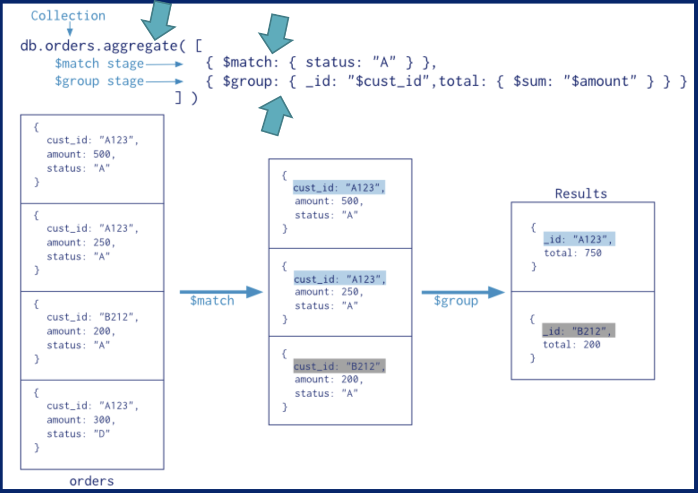

In the example here `cust_id` is the grouping attribute so it is passed as a parameter to the `$group` function. Notice the syntax, `_id:$cust_id` says that the grouped data will have an `_id` attribute, and its value will be picked from the `cust_id` attribute from the previous stage of computation. The `$` before the `cust_id` is telling the system that `cust_id` is a known variable in the system and not a constant. The `$group` operation also needs a reducer, which is an aggregate function. In this case, the reduce function is `$sum`, which operates on the `amount` attribute from the previous stage. Like `$cust_id`, we use `$amount` to indicate that it's a variable.

As we saw in the relational case, data can be partitioned into chunks on the same machine or on different machines. These chunks are called *chards*. The aggregation pipeline of MongoDB can operate on a *charded* collection.

**Multi-attribute Grouping**
```
db.computers.aggregate(
  [
    {
      $group:{
        _id: {brand: "$brand", title: "$title", category: "$category", code: "$code"}, count: {$sum: 1}
      }
    }
    {
      $sort: {count: 1, category: -1}
    }
  ]
  )
```
*Note:*
  - `sort` is a post grouping directive.
  - `1` in sort designates ascending order
  - `-1` in sort designates descending order
  - the 2nd sorting attribute will sort the common values for count.

**Test Search with Aggregation**
```
db.articles.aggregate(
  [
    {$match: {$text: {$search: "Hillary Democrat"}}}
    {$sort: {score: {$mets: "textScore"}}},
    {$project: {title: 1, _id: 0}}
  ]
)
```

**Join in Mongo DB**
Join also happens in the aggregation framework.

Two document collections:
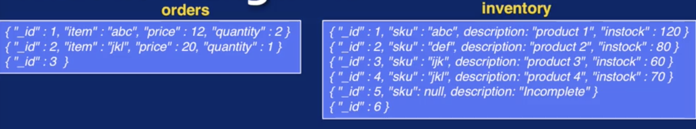

- Notice that the `"items"` key in the `orders` collection and the `"sku"` key in the ` inventory` collection are joinable.

```
db.orders.aggregate( [
  {$lookup: {
    from: "inventory",
    localField: "item",
    foreignField: "sku",
    as: "inventory_docs"
    }
  }
])
```

Result:
```
{
  "_id": 1
  "item: "abc",
  "price": 12,
  "quantity": 2,
  "inventory_docs": [{"_id": 1, "sku" "abc", description: "product 1", "instock": 120}]
}
  "_id": 2
  "item: "jkl",
  "price": 20,
  "quantity": 1,
  "inventory_docs": [{"_id": 4, "sku" "jkl", description: "product 4", "instock": 70}]
}
  "_id": 3
  "inventory_docs": [{"_id": 5, "sku" null, description: "Incomplete"}, {"_id": 6}]
  }
```

### Querying_Aerospike
- A key: value store
- key: value stores typically offer an API
- An API is a way to offer programmatic access and a limited amount of query access to data.

**Querying Aerospike**
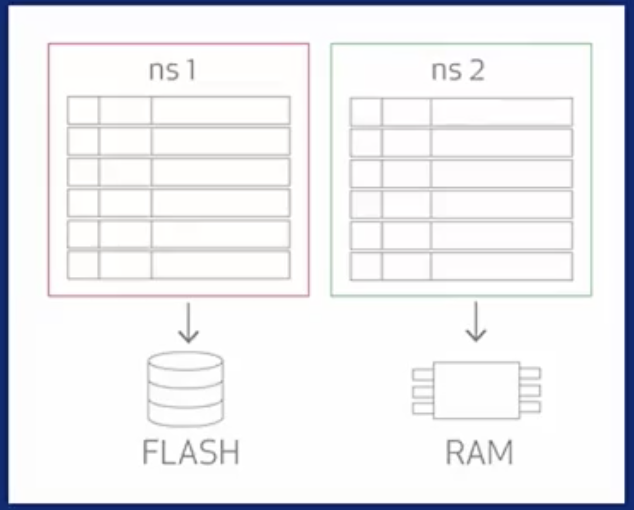

Data are organized in name spaces which can be in memory or on flask disks.

Name spaces are top level containers.  The way you collect data in name spaces relates to how data is stored and managed.

A name space contains records, indices and policies.  Policies dictate name space behavior like how data is stored, whether it's on RAM or disk, or how how many replicas exist for a record, and when records expire.


A name space contains sets which can be thought of as tables.  Sets contain records.  Within a record, data is stored in one or more bins.  Bins consist of a name and a value.

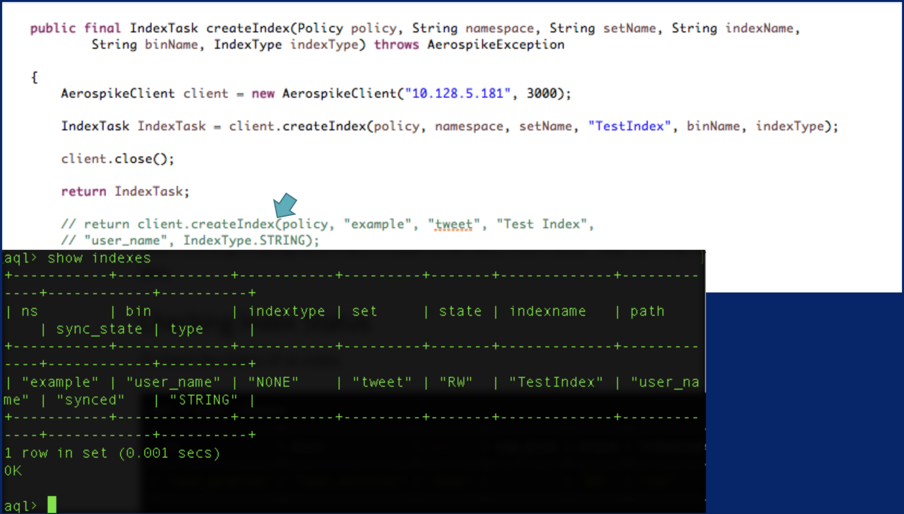

The example above is in Java.

The data is from Twitter. Each field of a tweet is extracted and put into Aerospike as a key value pair. We declare the *namespace* to be `example`, and the record *set* to be `tweet`. The name of the *index* to be `TestIndex`, and the name of the *bin* as `user_name`.

The command `show indexes` in the command line interface shows the content of the index.

The routine below shows how data can be inserted into Aerospike programmatically.

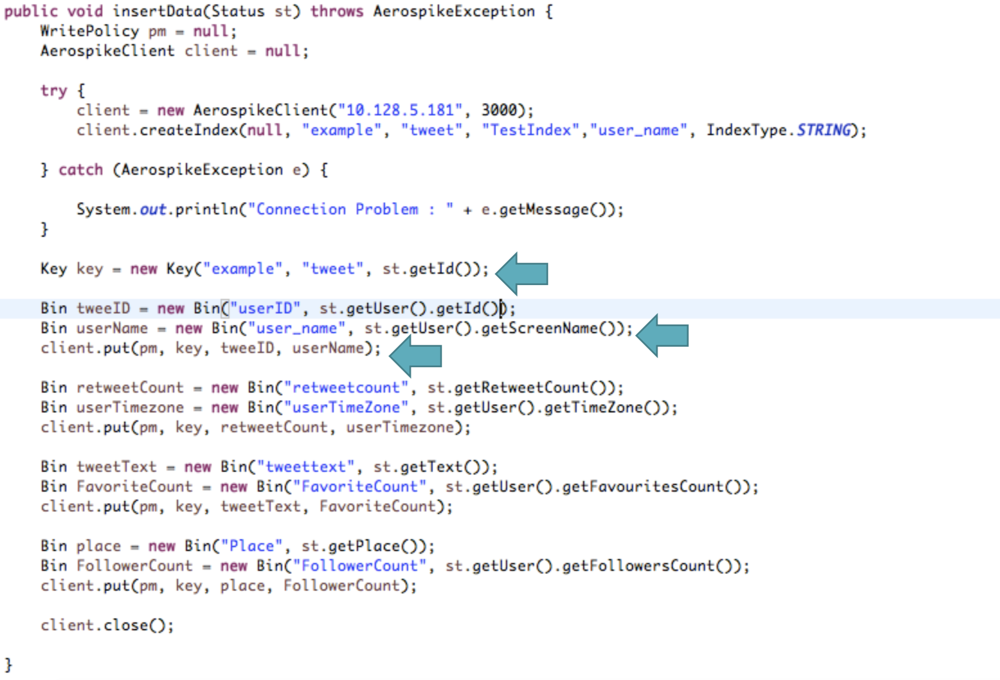

The line by the first arrow says that the key in the *namespace* call `example`, and *set* call `tweet`, is the value of the function getId, which returns the ID of a tweet.

When the data is populated, we are essentially creating bins. In the line by the 2nd arrow, `user_name` is the *attribute* and the `ScreenName` obtained from the tweet is the *value*.

In the line by the 3rd arrow, the data is inserted in the client. The `client.put` statement, where we need to mention the key and the bins we have just created.

AQL Query Example:
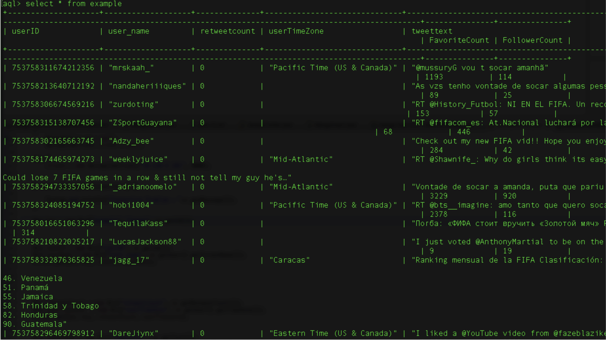

**Aerospike Query Language**
Below is an example showing the basic query syntax of AQL.
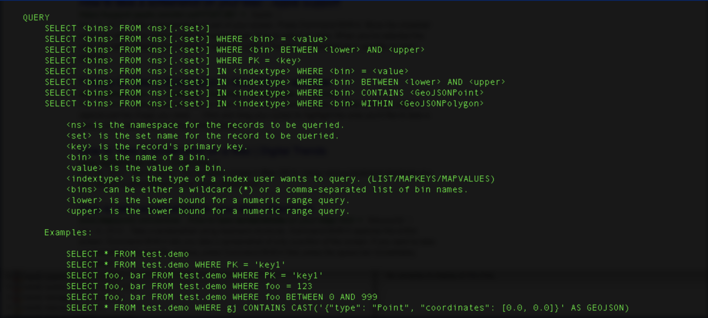

The last two lines show a couple of interesting features of the language.

The operation in the 2nd to last line, `BETWEEN 0 and 99`, is a nicer way of stating a range query, which gives a lower and upper limits on a variable.

The last line shows the operation `CAST`, which transforms one type of data to another type. Here it transforms coordinates, that is *latitude and longitude data*, *to* a JSON format called *GeoJSON* which is designed to represent geographic data in a JSON structure.

**Querying Fast Data**

Streaming data is complex to process because a stream is infinite in nature.

This has an impact on query languages and evaluation.

Pictorial depiction of streaming data wit example SQL query:
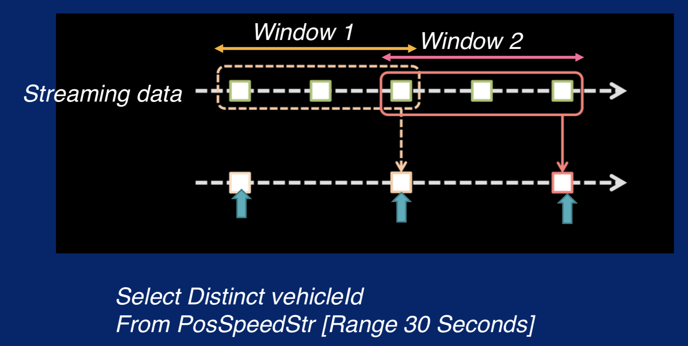

The data is segmented into five pieces, shown in the white boxes in the upper row. These can be gathered, for example every few seconds, or every 200 data objects. The query defines a *window* to select key of these data objects as a unit of processing--in this case three. So three units of data are picked up in a *window unit*. To get the next *window* it is moved by two units, this is called a *slide* of the *window*. Since the *window size* is three and the *slide* is two, one unit of information overlaps between the two consecutive windows. The lower line in this diagram shows the initialized item, let's ignore it, followed by two *window sets* of data records for processing. Thus, the query language therefore, will have to specify a *query*, that's an SQL query, *over a window*, which is also specified in the query. Now, in a traffic data stream example, the SQL statement might look like this. Where the window size is 30 second, and the slide is the same size as window giving output every 30 seconds.
So, streaming data results in changes in both the query language and the way queries are processed.

## Hands_On_Querying_Data

### Hands_On_Querying_with_MongoDB
[Querying_Documents_in_MongoDB](Querying_Documents_in_MongoDB.pdf)

### Hands_On_Pandas
[Exploring_Pandas_DataFrames](Exploring_Pandas_DataFrames.pdf)

## Information_Integration
[Slides](lecture_slides/information_integration.pdf)

- Explain the data integration problem
- Define integrated views and schema mapping
- Describe the impact of increasing the number of data sources
- Appreciate the need to use data compression
- Describe Record Linking, Data Exchange and Data Fusion Tasks

### Overview_of_Information_Integration

A relation derived by querying multiple data sources and combining their results, is called an *integrated view*. It is integrated because the data is retrieved from different data sources, and it's called a view because, in database terminology, it is a relation computed from other relations.

**Schema Mapping**
The term *mapping* means to establish correspondence between the attributes of the view, which is also called a target relation, and that of the source relations.

The schema mapping process is a task of figuring out how elements of the schema from two sources would relate to each other and determining how they would map the target schema.

**Record Linkage**
An obvious goal of an information integration system is to be *complete and accurate*. *Complete* means no eligible record from the source should be absent in the target relation. *Accurate* means all the entries in the integrated relation should be correct.

A *record linkage* problem means we would like to ensure that the set of data records that belong to a single entity are recognized, perhaps by clustering the values of different attributes or by using a set of matching rules so that we know how to deal with it during the integration process.

**The Big Data Problem**
- Many sources
  - Hundreds of tables
  - Schema mapping problem is a combinatorial challenge
- Pay-as-you-go model
  - Only integrate sources that are needed when needed
  - The system should provide some basic integration services at the outset and then evolve the schema mappings between the different sources on an as needed basis.
  - So given a query, the system should generate a best effort or approximate answers from the data sources for a perfect schema mappings do not exist. When it discovers a large number of sophisticated queries or data mining tasks over certain sources, it will guide the users to make additional efforts to integrate these sources more precisely.
- Probabilistic Schema Mapping

**Designing Mediated Schema**
- Customers - an integrated table
- Candidate designs
  - Create the customer table to include the individuals and corporations - use a flag called customer_type to distinguish.  In the mediated schema:
    - Individual.(FN+MI+LN), PolicyHolder.Name, Corporations.Name map to Customer_Name
    - Names of two types of customers become two two different attributes
    - Ind.FullAddress, Corp.RegisteredAddress. PH.(Address+City+State+Zip) map to Customer_Address
  - Issues
    - Should DOB, Nationality, Legal Status be included in this table?
    - Would these fields make sense for corporations?

In Probabilistic Mediated Schema Design, we answer this question by associating probability values with each of these options.

**Attribute Grouping**
- How to evaluate if two attributes should go together?
  - How similar are the attributes? Could two fields be the same thing (redundant)? *Similarity Scores*
    - Individual names vs. policy holder names?
    - Individual names vs. Corporation names?
  - How likely is it that two attributes would occur? *Similarity Co-occurance Scores*
    - Should the DOB put in the dame schema as the individual name?
    - How about DOB and corporation name?

To compute these values, we need to quantify the relationships between attributes by figuring out which attributes should be grouped or clustered together?

**Probabilistic Mediated Schema**
- Find source schemas that are consistent with a mediated schema
  - A source schema is consistent with a mediated schema if two different attributes of the source schema do not occur in a cluster.
- Choose the k best mediated schema.  

We can count the number of consistent sources for each candidate mediated schema and then use this count to come up with a probability estimate. This estimate can then be used to choose the k best schemas. K is usually 1.

### A_Data_Integration_Scenario

**Example Schema mapping**
- Local-as-View (LAV) mapping
  - Mapping source schemas to target schema
  - Easier to add sources

**Data Exchange**
- Given a source database with a finite number of relations, a set of schema mappings, and a set of constraints that the target schema must satisfy, the data exchange problem is to find a finite target database such that both the schema mappings and the target constraints are satisfied.  

**Using Compressed Data**
- Compression
  - Encoded representation of the data so that it uses less space
    - Dictionary Encoding
      - Pretty much mapping values with a key value pair so that the smaller object can be in the data source, containing potentially millions of rows, and then just looked up though in the dictionary--with maybe 500 rows.  

Data compression is an important technology for big data.

**Takeaway Points**
- Integration across multiple data models
  - Global Schema - RIM
  - Data Exchange
    - Format conversions
    - Constraints
    - Compressed Data
    - Model transformation
      - The process of taking data represented in one model in one source system and converting it to an equivalent data in another model the target system.
    - Query transformation
      - The process of taking a query on the target schema and converting it to a query against a different data model.

### Integration_for_Multichannel_Customer_Analytics

- Customer analytics
  - Processes and technologies that give organizations the customer insight necessary to deliver offers that are anticipated, relevant and timely.
- Questions one would like to ask:
  - Is our products launch going well?
  - is there and emerging product issue?
  - Where should the product team focus its development dollars?
  - Are there more effective methods for positioning current products?
  - Which services have the best chance of surviving turbulent markets?

**Data Fusion**
- Data sources
- Data items
  - A product
  - A part of a product
  - A product feature
  - The utility of a product feature
  - etc.
- Using data from a subset of sources find the true value or true values distribution of a data item
- Assemble all such values for the real-world entity represented b the data items.

The goal of Data Fusion is to find the values of Data Items from a source.

**Too Many Sources**
- Too many sources = too many values
- Voting to select the "right" value
  - Simple voting can be problematic - Veracity problem
    - Source reliability (weighted average of value by source trustworthiness)
    - Copy detection
  - Statistical techniques to estimate
    - Trustworthiness of sources
    - Bias introduction by copies
    - True distribution of values for data items

**Source Selection**
- The problem
  - Choose only useful sources
  - Adding sources first improves integration accuracy the reduces it
- The solution
  - Order candidate source based on a measure of "goodness"
  - Add sources until the marginal benefit is less than the marginal cost
  - Current techniques scale well.

## Hands_On_Big_Data_Management_and_Processing_Using_Splunk

**Starting and Stopping Splunk:**
`cd /Applications/splunk/bin`
`./splunk start`
In browser [localhost:8000](https://localhost:8000)
login: admin *****
`./splunk stop`

**Filtering**
- using provided census data in [census csv](census.csv)

Entries where state is California:
`source="census.csv" host="Seans-MBP-2.domain" sourcetype="csv" STNAME="California"`

Entries where state is California or Alaska:
`source="census.csv" host="Seans-MBP-2.domain" sourcetype="csv" STNAME="California" or STNAME="Alaska"`

Entries where state is California and 2010 population is greater than 1,000,000:
`source="census.csv" host="Seans-MBP-2.domain" sourcetype="csv" STNAME="California" CENSUS2010POP > 1000000`

Filter results to only show a single column:
`source="census.csv" host="Seans-MBP-2.domain" sourcetype="csv" STNAME="California" CENSUS2010POP > 1000000 | table CTYNAME`

The `|` (pipe) is the syntax for sending the results from one query to the next, and the table command creates a table using only the specified column name(s).

We can sort the results based on any of the fields, such as population, and order them in either ascending or descending order. The example below shows a search for all items with a population greater than 100,000, sorts the results in descending order, and creates a table containing the population and state name.

To sort:
ascending = "asc" or leave blank for default
descending = "desc" or lead sorted field with `-` (dash)

`source="census.csv" host="Seans-MBP-2.domain" sourcetype="csv" CENSUS2010POP > 100000 | sort CENSUS2010POP desc | table CENSUS2010POP, STNAME`

View plots of search results by clicking on the Visualization tab. For example, if we use our last query and add the 2010 population value to the table:

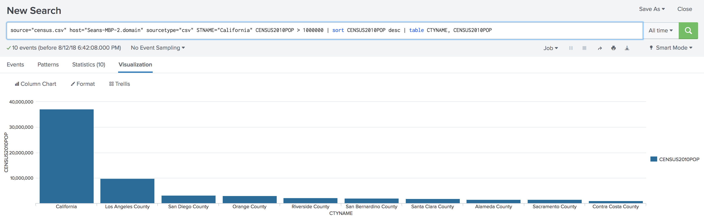

**Statistical Calculations**

The Splunk `stats` command is used to perform statistical calculations on the data.

```
source="census.csv" host="Seans-MBP-2.domain" sourcetype="csv" STNAME="California" | stats COUNT

>>> 59
```
We can sort based on the count by adding "| sort count" to the above query. This would sort in ascending order. if we want to sort in descending order we would use " | sort -count".

Compute the total 2010 population for California:
```
source="census.csv" host="Seans-MBP-2.domain" sourcetype="csv" STNAME="California" | stats SUM(CENSUS2010POP)

>>> 74507912
```

Compute the average 2010 population for California:
```
source="census.csv" host="Seans-MBP-2.domain" sourcetype="csv" STNAME="California" | stats MEAN(CENSUS2010POP)

>>> 1262845.9661016949
```

## Big_Data_Pipelines_and_High-level_Operations_for_Big_Data_Processing

### Big_Data_Processing_Pipelines
[Slides](lecture_slides/big_data_processing_pipelines.pdf)

- Most big data applications are composed of a set of operations executed one after another as a pipeline.
- Data flows through these operations, going through various transformations along the way. We also call this dataflow graphs.

After this section:
- What data flow means and it's role in data science
- Explain split -> do -> merge as a big data pipeline.
- Define data parallel.

**MapReduce WordCount Example**

In this application,
- the files were first *split* into HDFS cluster nodes as partitions of the same file or multiple files.
- Then a *map* operation, in this case, a user defined function to count words was executed on each of these nodes.
- All the key values that were output from map were *sorted* based on the key. And the key values with the same word were moved or *shuffled* to the same node.
- Finally, the *reduce* operation was executed on these nodes to add the values for key-value pairs with the same keys.

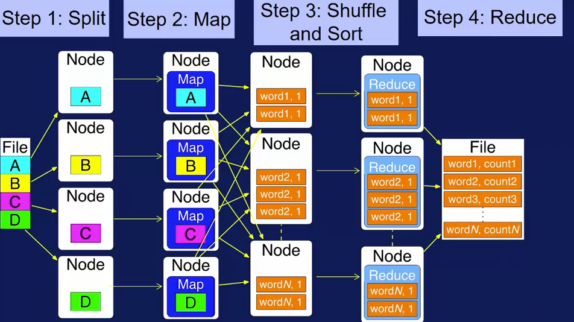

Four distinct steps:
1. Split
2. Map
3. Shuffle and Sort
4. Reduce
    - While the WordCount example is pretty simple it is a good representation, for a large number of applications, that these steps can be applied to achieve parallel scalability.  

**Split-Do-Merge**
We refer to this pattern in general as "split, do, merge"
**Split** - First the data gets partitioned.
**Do** - Then the split data goes through a set of user-defined functions that do something--ranging from statistical operations, to data joins, to machine learning functions.  These *do something* functions can differ and be chained together based on data processing needs.  
**Merge** - In the end the results are combined using a merging algorithm or a higher-order function like reduce.

We call the stitched-together version of these sets of steps for big data processing "**big data pipelines**".

**Big Data Pipelines**
  - The output of one running program gets piped into the next program as an input.
  - Multiple programs can be strung together to make longer pipelines with various scalability needs at each step.
  - For big data processing we need **data parallelism** at each step.

**Data Parallelism**
- Running the same functions simultaneously for the elements or partitions of a dataset on multiple cores.

In our WordCount example:
- Data parallelism occurs at every step in the pipeline.
- The data gets smaller at each step.
*Map* - During map over the input as each partition gets processed as a line at a time. To achieve this type of data parallelism, we must decide on the data granularity of each parallel computation. In this case, it is a line.
*Shuffle Sort* - Parallel grouping of data in the shuffle and sort phase. This time, the parallelization is over the intermediate products, that is, the individual key-value pairs.
*Reduce* - And after the grouping of the intermediate products the reduce step gets parallelized to construct one output file.

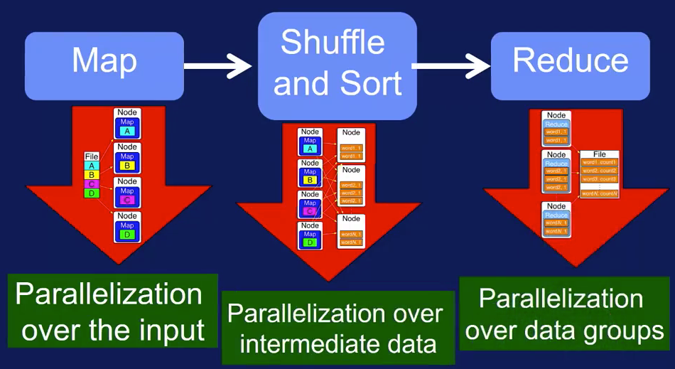

**Streaming Data**
The examples above are for batch processing, similar techniques apply to stream processing.

For example:
- An event gets ingested through a real time big data ingestion engine, like Kafka or Flume.
- Then it get passed into a *Streaming Data Platform* for processing like *Samza*, *Storm* or *Spark streaming*.
- This is a valid choice for processing data one event at a time or chunking the data into Windows or Microbatches of time or other features.
- Any pipeline processing of data can be applied to the streaming data here as we wrote in a batch-processing Big Data engine.
- The process stream data can then be served through a real-time view or a batch-processing view.
  - Real-time view is often subject to change as potentially delayed new data comes in.
- The *storage* of the data can be accomplished using *H-Base*, *Cassandra*, *HDFS*, or many other persistent storage systems.

To summarize, *big data pipelines* get created to process data through an aggregated set of steps that can be represented with the *split-do-merge* pattern with *data parallel scalability*. This pattern can be applied to many batch and streaming data processing applications.

### High-level_Processing_Operations_in_Big_Data_Pipelines
[Slides](lecture_slides/data_transformation_operations.pdf)

In data integration and processing pipelines, data goes through a number of operations (which are generally referred to as transformations), which can apply a specific function to it, can work the data from one format to another, join data with other data sets, or filter some values out of a data set.  

**Section Summary:**
- List common data transformations within big data pipelines.
- Design a conceptual data processing pipeline using the basic data transformations.

**Transformation**
- Tools to convert data from one form to another.  
1. **Map** - apply same operation to each member of a collection.
    - one of the basic building blocks of the big data pipeline.
    - each section of the data set is mapped to a *key*.
2. **Reduce** -  helps you then to collectively apply the same process to objects of similar nature.
    - Collects things that have the same *keys*.
3. **Cross/Cartesian Product** - In a cross or cartesian product operation, each data partition gets paired with all other data partitions, regardless of its key.
    - Sometimes gets referred to as all pairs.
4. **Match/Join** - In a match operation, only the keys with data in both sets get joined, and become a part of the final output of the transformation.
5. **Co-Group** - Groups common items from data in different keys.
6. **Filter** - Picks data based on constraints/conditions.

### Aggregation_Operations_in_Big_Data_Pipelines
[Slides](lecture_slides/aggregation_operations.pdf)
**Section SGoals:**
- Compare and select the aggregation operation that you require to solve you problem
- Explain how you can use aggregations to compact your dataset and reduce volume (in many cases)
- Design complex operations in you pipeline using a series of aggregations

**Aggregation** is any operation on a data set that performs a specific transformation, taking all the related data elements into consideration.

**Aggregation Functions**
- Sum
- Avg
- Max
- Min
- Std Dev
  - These can u used over the entire data set or over groups using *Group By*.

To summarize, by choosing the right aggregation, you can generate compact and meaningful insights that enable faster and effective decision making in business. You will find that in most cases, aggregation results in smaller output data sets.

### Typical_Analytical_Operations_in_Big_Data_Pipelines
[Slides](lecture_slides/analytical_operations.pdf)

**Section Goals:**
- list common analytical operations within big data pipelines.
- Describe sample applications for these analytical operations.

**Analytical Operations**
- Classification
- Clustering
- Path Analysis
- Connectivity Analysis

Classification and cluster analysis are considered machine learning and analytical operations. There are also analytical operations from graph analytics, which is the field of analytics where the underlying data is structured as, or can be modeled as the set of graphs. (path analysis and Connectivity analysis)

#### Classification
- In classification the goal is to predict a categorical target from the input data.

**Classification - Decision Tree** - An analytical technique for classification where decisions are modeled as a tree.

**Classification Examples**
- Predict whether tumor cells are benign or malignant
- Categorize hand written digits.
- Determine whether a credit card transaction is legitimate or fraudulent.
- Classify loan applicant as low-, medium-, or high-risk.

#### Clustering
- In clustering the goal is to organize similar items in to groups of association.

**Clustering - KMeans** - Group data into k clusters. Clusters are determined by putting the data into k groups such that variance is minimized or similarity is maximized within clusters and variance is maximized or similarity is minimized between clusters.
- Minimize inter-cluster distance and maximize intra-cluster distance.
- Similarity is determined by distance metrics (Ex. Euclidean).

**Spark Python code for performing KMeans on data**
```python
# Load and parse the data
data = sc.textFile(filepath)
parsedData = data.map(lambda line:
      array([float(x) for x in line.split(' ')]))

# Cluster the data
clusters - KMeans.train(parsedData, 2, maxIterations=10, runs=10, initializationMode="random")
```

**Cluster Analysis Examples**
- Group customer base into distinct segments
- Find articles or webpages with similar topics for retrieving relevant information
- Identify areas with high incidences of particular crimes
- Determine weather patterns

#### Path_Analysis
- Analyzes sequences of nodes and edges in a graph.
- A common application is finding routes from one location to another.

**Path analysis using Cypher on neo4j**
- Cypher is a query language
- neo4j is a graph database system

This operation finds the shortest path between specific nodes.
```
//Find shortest path between specific nodes:
match p=shortestPath((a)-[:TO*]-(c))
where a.Name='A' and c.Name='P'
return p. length(p) limit 1
```

This operation, finds all the shortest paths in a graph.
```
//Find all shortest paths:
match p = allshortestPaths((source)-[r:TO*]-(destination))
where source.Name='A' and destination.Name - 'P'
return extract(n in nodes (p)| n.Name) as Paths
```

#### Connectivity_Analysis
- Connectivity analysis of graphs has to do with finding and tracking groups to determine interactions between entities.
- Entities in highly interacting groups are more connected to each other than to entities of other groups in a graph.
- These groups, of entities, are called communities, and are interesting to analyze as they give insights into the degree and patterns of the interaction between entities, and also between communities.

**Connectivity Analysis Example**
- Analyzing Tweets
  - Extract conversation threads
    -
  - Find interacting groups
    - Which users are interacting with each other?
  - Find influencers in community
    - Who are the main users leading the conversation on a specific topic?
    - Who do people pay attention to?
    - Can be useful to identify the fewest number of people with the greatest influence. (Ex. for political campaigns or marketing on social media)

**Connectivity Analysis using Cypher on neo4j**
Finds the degree of all the nodes in a graph.
```
//Find the degree of all nodes
match (n:MyNode)-[r]-()
return n.Name, count(distinct r) as degree
order by degree
```
Creates a histogram of degrees for all nodes in a graph.
```
//Find degree histogram of a graph
match (n:MyNode)-[r-]-()
with n as nodes, count(distinct r) as degree
return degree, count(nodes) order by degree asc
```

To determine how connected a node in a graph is, we need to look at its degree. The degree of a node is the number of edges connected to the node.

A degree histogram shows the distribution of node degrees in the graph and is useful in comparing graphs and identifying types of users, for example, those who follow, versus those who are followed in social networks.

**Summary**
To summarize and add to these techniques, the decision tree algorithm for classification and k-means algorithm for cluster analysis that we covered in this lecture are techniques from machine learning.

Machine learning is a field of analytics focused on the study and construction of computer systems that can learn from data without being explicitly programmed.  

As a summary of the Graph Analytics, the Path Analytics technique for finding the shortest path and the connectivity analysis technique for analyzing communities that we discussed earlier, are techniques used in graph analytics. As explained earlier, graph analytics is the field of analytics, where the underlying data is structured or can be modeled as a set of graphs.

## Big_Data_Processing_Tools_and_Systems

### Overview_of_Big_Data_Processing_Systems
[Slides](lecture_slides/overview_of_big_data_processing_systems.pdf)

**Section Goals:**
- Recall the Hadoop Ecosystem
- Draw a layer diagram with three layers for data storage, data processing and workflow management
- Summarize an evalutation criteria for big data processing systems
- Explain the properties of Big Data processing systems: Hadoop, Spark, Flink, Bean and Storm

One Possible layer diagram for Hadoop tools:
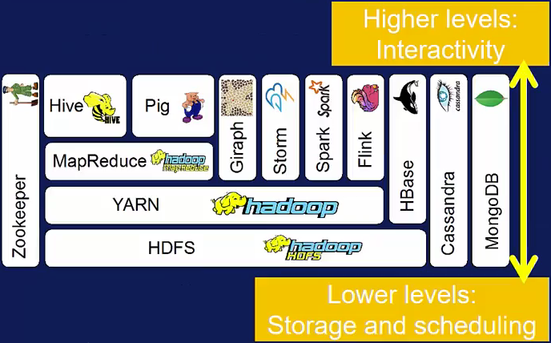

Most of the tools in the Hadoop ecosystem are initially built to complement the capabilities of Hadoop for distributed filesystem management using HDFS.

MapReduce - Data processing
YARN - resource scheduling and negotiation

**Three layers of Hadoop Ecosystem:**
1. Resource Scheduling/Coordination and Workflow Management
2. Data Integration and Processing
    - where the different varieties of data gets retrieved, integrated, and analyzed.
3. Data Management and Storage

**Data Management and Storage Options:**
1. Hadoop HDFS
2. Redis - key: value store
3. Aerospike - key: value store
4. Gephi - Graph Data Store
5. Lucene - Vector data store
6. Vertica - Column store (rather than rows)
7. Cassandra - Column store (rather than rows)
8. HBase - Column store (rather than rows)
9. Solr- unstructured and semi-structured text
10. AsteriskDB - unstructured and semi-structured text
11. MongoDB - Document Store

**Data Integration and Processing Layer**
- Roughly referred to as the tools built on top of YARN and HDFS
- YARN enables batch and stream processing tools such as: Storm, Spark and Flink
- Query interface tools on top of the storage layer: Hive and SparkSQL,
- Big Data Pipeline scripting: Pig.
- Graph processing libraries: Giraph and GraphX of Spark
- Machine Learning: Hadoop Stack and MLib of Spark

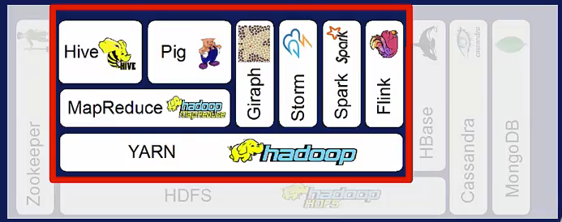

**Coordination and Workflow Management Layer**
This is where integration, scheduling, coordination, and monitoring of applications across many tools in the bottom two layers take place. This layer is also where the results of the big data analysis gets communicated to other programs, websites, visualization tools, and business intelligence tools.

Workflow management systems help to develop automated solutions that can manage and coordinate the process of combining data management and analytical tests in a big data pipeline, as a configurable, structured set of steps.

**Workflow Schedulers:**
1. Zookeeper
    - the resource coordination and monitoring tool and manages and coordinates all these tools and middleware named after animals.
2. Oozie
    - a workflow scheduler that can interact with many of the tools in the integration and processing layer.

**Big Data Workflow Management Supplementary Info**

As the Internet of Things and other data acquisition and generation technologies advance, data being generated is growing at an exponential rate at all scales in many online and scientific platforms. This mostly unstructured and variable data growing and moving between different applications dynamically in vast quantities is often referred to as "Big Data". The amount of potentially valuable information buried in Big Data is of interest to many data science applications ranging from natural sciences to marketing research. In order to analyze and digest such heterogeneous data, challenges for integration and distributed analysis include: scalable data preparation and analysis techniques; new and distributed programming paradigms; repeatable and verifiable process development; and innovative hardware and software systems that can serve applications based on their needs.

An important aspect of Big Data applications is the variability of technical needs and steps based on applications being developed. These applications typically involving data ingestion, preparation (e.g., extract, transform, and load), integration, analysis, visualization and dissemination are referred to as Data Science Workflows. A data science workflow development is the process of combining data and processes into a configurable, structured set of steps that implement automated computational solutions of an application with capabilities including provenance management, execution management and reporting tools, integration of distributed computation and data management technologies, ability to ingest local and remote scripts, and sensor management and data streaming interfaces. Each data science workflow has a set of technological challenges that can potentially employ a number of Big Data tools and middleware. Rapid programmability of applications on a use case basis requires workflow management tools that can interface to and facilitate integration of other tools. New programming techniques are needed for building effective and scalable solutions span across the data science workflows. Flexibility of workflow systems to combine tools and data together makes it an ideal choice for development of data science applications involving common Big Data programming patterns.

Big Data workflows have been an active research area since the introduction of scientific workflows. After the development and general adoption of MapReduce as a Big Data programming pattern, a number of workflow systems were built or extended to enable programmability of MapReduce applications including Oozie, Nova, Azkaban and Cascading. The Kepler Workflow Environment, developed by the WorDS Center of Excellence at SDSC led by Ilkay Altintas, also provide a distributed data-parallel (DDP) programming module on MapReduce and other BigData programing patterns on top of well-known Hadoop and Spark engines to build and execute big data workflows. The actor-oriented approach of Kepler provides flexibility and improves application programmability due to: (i) its heterogeneous nature in which Big Data programming patterns are placed as part of other workflow tasks; (ii) its visual programming approach that does not require scripting of Big Data patterns; (iii) its adaptability for execution of data parallel applications on different execution engines.

### The_Integration_and_Processing_Layer

Depending on the resources we have access to and characteristics of our application, we apply several considerations to evaluate and pick a software stack for big data.

**Categorization of Big Data Processing Systems**
1. Execution Model
    - Batch, streaming or interactive computing.
2. Latency
    - Some applications require low latency processing like online gaming and hazard management.
3. Scalability
4. Programming Language Support
5. Fault Tolerance
    - While all big data tools provide fault tolerance, the mechanics of how the fault tolerance is handled is an important issue to consider.

**5 Big Data Processing Systems**
1. MapReduce
    1. Execution Model - Batch processing using disk storage
    2. Latency - High-latency since the mappers have to write data to disk before reducers can read.
    3. Scalability
    4. Programming Language - Java (other languages have packages but are less efficient)
    5. Fault Tolerance - Replication
2. Spark
    - Spark was built to support iterative and interactive big data processing pipelines efficiently using an *in-memory* structure called Resilient Distributed Datasets, or shortly, RDDs.
    - In addition to map and reduce operations, it provides support for a range of transformation operations like join and filter.
    - Any pipeline of transformations can be applied to these RDD's in-memory, making Spark's performance very high for iterative processing.
    - In addition to HDFS, Spark can read data from many storage platforms and it provides support for streaming data applications using a technique called micro-batching.
    1. Execution Model - Batch and stream processing using disk or memory storage
    2. Latency - Low-latency for small micro-batch size
    3. Scalability
    4. Programming Language - Scala, python, Java, R
    5. Fault Tolerance - The RDD extraction is also designed to handle fault tolerance with less impact on performance.
3. Flink
    - Provides direct support for streaming data, making it a lower-latency framework than Spark.
    - Provides connection interfaces to streaming data ingestion engines like Kafka and Flume.
    - In addition to map and reduce, Flink provides abstractions for other data parallel database patterns like join and group by.
    - One of the biggest advantage of using Flink comes from it's optimizer to pick and apply the best pattern and execution strategy.
    1. Execution Model - Batch and stream processing using disk or memory storage
    2. Latency - Low latency
    3. Scalability
    4. Programming Language - Java and Scala
    5. Fault Tolerance
4. Beam
    - Developed by Google relatively recently.
    - It initially used Google's own Cloud data flow as an execution environment, but Spark and Flink backends for it have been implemented recently.
    - Provides a very strong streaming and windowing framework for streaming data. - Highly scalable and reliable, allowing it to make trade-off decisions between accuracy, speed, and cost of processing.
    1. Execution Model - Batch and Stream Processing
    2. Latency - Low Latency
    3. Scalability
    4. Programming Language - Java and Scala (Python in the works)
    5. Fault Tolerance
5. Storm
    - Designed for stream processing in real time with very low-latency.
    - It defined input stream interface abstractions called spouts, and computation abstractions called bolts.  
    - Spouts and bolts can be pipelined together using a data flow approach. That data gets queued until the computation acknowledges the receipt of it.
    - A master node tracks running jobs and ensures all data is processed by the computations on workers.   
    1. Execution Model - Stream processing
    2. Latency - very low-latency
    3. Scalability
    4. Programming Language - Many programming languages
    5. Fault Tolerance

- Nathan Mars, the lead developer for Storm, built the Lambda Architecture using Storm for stream processing and Hadoop MapReduce for batch processing.
- The Lambda Architecture originally used Storm for speed layer and Hadoop and HBase for batch and serving layers, as seen in this diagram.

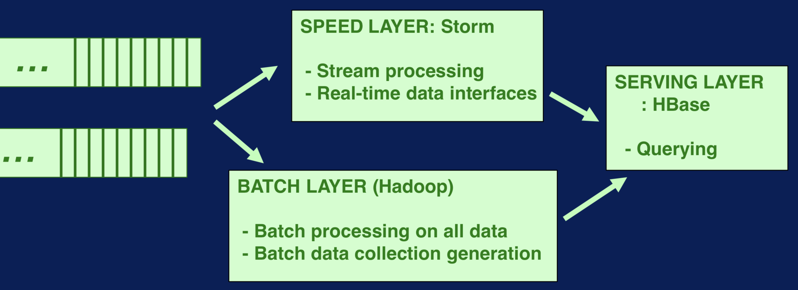

- However, it was later used as a more general framework that can combine the results of stream and batch processing executed in multiple big data systems. This diagram shows a generalized Lambda Architecture containing some of the tools we discussed, including using Spark for both batch and speed layers.

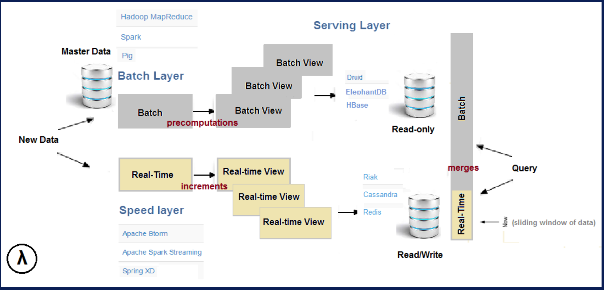

### Intro_to_Spark
[Slides](lecture_slides/intro_to_spark.pdf)

**Section Goals**
- List the main motivations for the development of Spark
- Draw the Spark stack as a layer diagram
- Explain the functionality of the components in the Spark stack

**Why Spark?**
- *Hadoop MapReduce* is great for batch processing but has a number of *shortcomings*.
  - Only for Map and Reduce based transformations
    - Map And Reduce are not always the most efficient ways to represent a big data pipeline.
    - Spark adds additional Functionality such as: Join, filter, group by
  - Relies heavily from data on disk (HDFS).
    - This is a problem for iterative algorithms in machine learning.
  - Only programming language supported is Java
  - No interactive shell scripting support
  - No support for streaming.

Spark came out of the need to extend the MapReduce framework to overcome these shortcomings and provide an expressive cluster computing environment that can provide interactive querying, efficient iterative analytics and streaming data processing.

**Basics of Data Analysis with Spark**
- Expressive programming model
  - `>` 20 highly efficient distributed operations or transformations.
- In-memory processing
  - It's ability to cache and process data in memory, makes it significantly faster for iterative applications. This is proven to provide a factor of ten or even 100 speed-up in the performance of some algorithms, especially using large data sets.
- Support for batch and streaming
- Interactive shell and Python, Scala and Java support.

**Spark Stack**
- AKA Layer Diagram
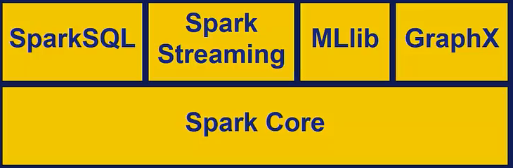

The Spark stack is built on top of the Spark computational engine which distributes and monitors tasks across the nodes of a commodity cluster. The components built on top of this engine are designed to interact and communicate through this common engine.  

- **Spark Core**
  - where the core capability is of the Spark Framework are implemented. This includes support for distributed scheduling, memory management and fault tolerance.
  - Interaction with different schedulers, like YARN and Mesos and various NoSQL storage systems like HBase also happen through Spark Core.
  - A very important part of Spark Core is the APIs for defining resilient distributed data sets, or RDDs for short. RDDs are the main programming abstraction in Spark, which carry data across many computing nodes in parallel, and transform it.
- **SparkSQL**
  - Spark's querying language for structured and unstructured data
  - It can connect to many data sources and provide APIs to convert query results to RDDs in Python, Scala and Java programs. Spark Streaming is where data manipulations take place in Spark.
- **Spark Streaming**
  - Where data manipulations take place in Spark.
  - Although, not a native real-time interface to data streams, Spark streaming enables creating small aggregates of data coming from streaming data ingestion systems.
  - These aggregate datasets are called micro-batches and they can be converted into RDBs in Spark Streaming for processing.
- **MLlib**
  - Spark's machine learning library.
- **GraphX**
  - Spark's graph analysis library.
  - Enables the Vertex edge data model of graphs to be converted into RDDs.

To summarize, through these layers Spark provides diverse, scalable interactive management and analyses of big data. The interactive shell enables data scientists to conduct exploratory analysis and create big data pipelines, while also enabling the big data system integration engineers to scale these analytical pipelines across commodity computing clusters and cloud environments.

### Getting_Started_with_Spark
[Slides](lecture_slides/getting_started_with_spark.pdf)

**Section Goals**
- Describe how Spark does in-memory processing using RDD abstraction.
- Explain the inner workings of the Spark architecture.
- Summarize how Spark manages and executes code on Clusters.

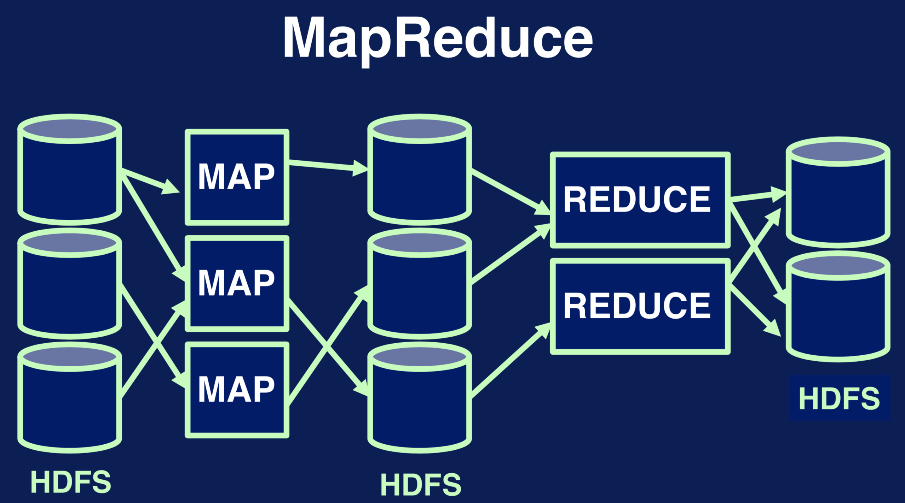
- Each step reads from disk to memory, performs a calculation, the writes back to disk.
- Reading and writing to/from disk is computationally costly.

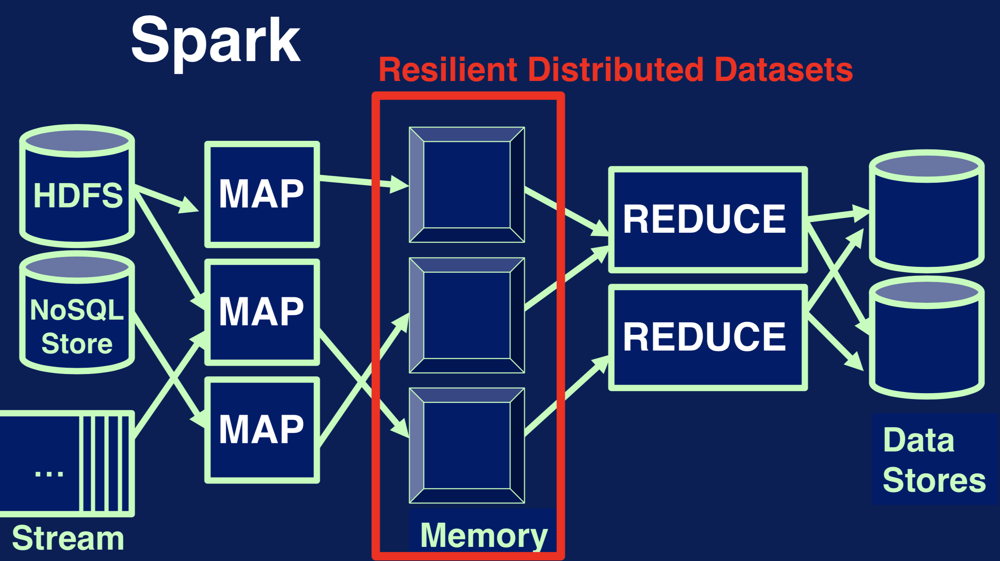
- Memory operations can be up to 100,000x faster than disk operations.
- Spark takes advantage of this and allows for immediate results of transformations in different stages of the pipeline in memory.
- Above we see that the outputs of MAP operations are shared with REDUCE operations without being written to the disk.
- The containers where the data gets stored in memory are called resilient distributed datasets or RDDs for short.

**Resilient Distributed Datasets (RDDs)**
- Dataset
  - Data storage created from: HDFS, S3. HBase, JSON, text, Local folder hierarchy or streaming data ingestion systems (like Cafco).
  - When Spark reads data from these sources, it generates RDDs for them. The Spark operations can transform RDDs into other RDDs like any other data.
- Distributed
  - RDDs distribute partitioned data collections and computations on clusters across a number of machines.
  - The partitioning of data can be changed dynamically to optimize Spark's performance.
- Resilient
  - Recover from errors (node failures, slow processes, etc.)
  - Spark tracks the history of each partition, keeping a lineage of RDDs over time, so every point in your calculations, Spark knows which partitions are needed to recreate the partition in case it gets lost.
  - If that happens, then Spark automatically figures out where it can start the recompute from and optimizes the amount of processing needed to recover from the failure.

RDDs are immutable. This means that you cannot change them but you can transform them into new ones.

**Spark Architecture**
2 main components:
1. Driver Program
    - Where your application starts.
    - Distributes RDDs on your computational cluster and makes sure the transformations and actions on these RDDs are performed.
    - Create a connection to a Spark cluster or your local Spark through a `Spark context` object.
    - Manages a large number of nodes called worker nodes.
2. Worker Nodes
     - A worker node in Spark keeps a running Java virtual machine, called JVM commonly, called the executor.
     - Executor can execute tasks related to mapping stages or reducing stages or other Spark specific pipelines.
     - The JVM is the core where computations are executed, is the interface to the rest of the Big Data storage systems and tools.

The cluster manager manages the provisioning and restarting of the nodes. Currently, Spark supports three main interfaces for cluster managements: Spak's standalone cluster manager, Apache Mesos and Hadoop YARN. Picking the right one can be confusing, here is a link to an [article](http://www.agildata.com/apache-spark-cluster-managers-yarn-mesos-or-standalone/) to help clear up the pros and cons of each.

To summarize, the **Spark architecture** includes a **driver program** that **communicates** with the **cluster manager** for **monitoring** and provisioning of resources and communicates directly with **worker nodes** to submit and **execute tasks**. RDDs get created and passed within transformations running in the executable.

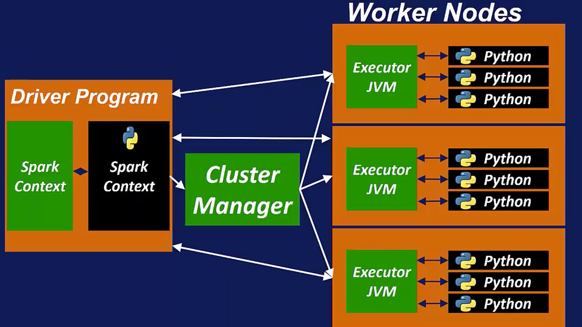

## Hands-On_Spark
[WordCount in Spark Instructions](lecture_slides/WordCount_in_Spark.pdf)

**Missing from instructions**
- navigate to `big-data-3`
- run `./setup.sh` to install spark and go through the process
- start jupyter notebook with `pyspark` in terminal instead of `jupyter notebook`

[Jupyter Notebook](https://github.com/words-sdsc/coursera/blob/master/big-data-3/notebooks/Spark%20WordCount.ipynb)

## Programming_in_Spark

### RDDs_and_Pipelines
[Slides](lecture_slides/programming_in_spark.pdf)

**Refresher**
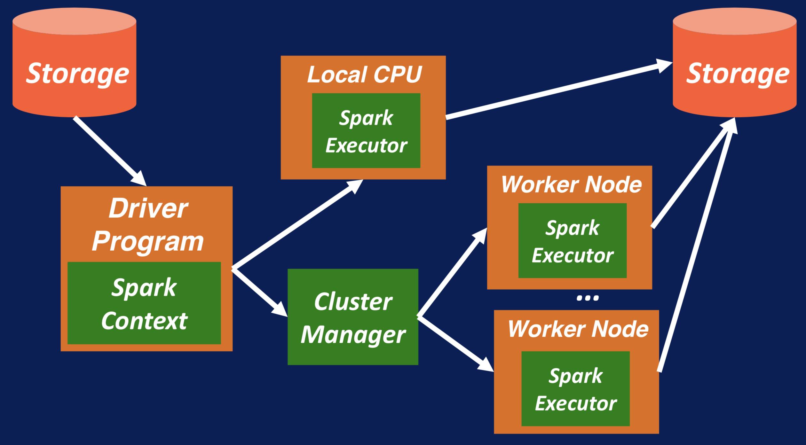

*Driver* program creates the *Spark context*.  This is the entry point to you application.  The driver converts all the data to *RDDs*, from which everything after utilizes.  

All the *transformations* and *actions* on these RDDs take place locally, or in the *Worker Nodes* managed by the *Cluster Manager*.

Each transformation results in a new updated version of the RDD. The RDDs at the end get converted and saved in a persistent storage like HDFS or your local drive.

**Creating_RDDs**
Examples:
`lines = sc.textfile("hdfs:/user/cloudera/words.txt")`
`lines = sc.parallelize(["big", "data"])`
`numbers = sc.parallelize(range(10), 3)`
  - The `parallelize` function will create 3 partitions of the RDD to be distributed.
  - Spark will decide hoe to assign the partitions to our executors and worker nodes.

`numbers.collect()`
  - The distributed RDDs can in the end be gathered into a single partition on the driver using the `collect` transformation.

**Processing RDDs**
Two types of operations in Spark processing: *Transformations* and *Actions*

All partitions written in RDD, go through the same transformation in the worker node, executors when a transformation is applied to an RDD.

Spark uses lazy evaluation for transformations. That means they will not be immediately executed, but instead wait for an action to be performed.

The transformations get computed when an action is executed.

Although the RDDs are in memory, and they are not persistent, we can use the cash function to make them persistent cash.

**WordCount**
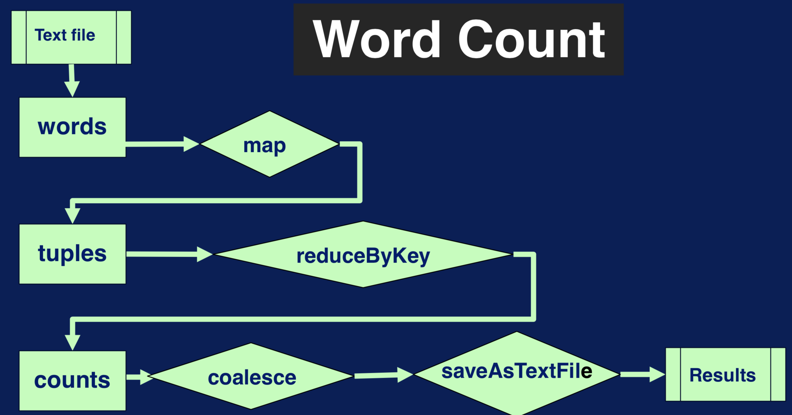

In the Word Count example, we mapped the words RDD to generate tuples. We then applied reduceByKey to tuples to generate counts.

Finally, saveAsTextFile is an action that kickstarts the computation and writes to disk.

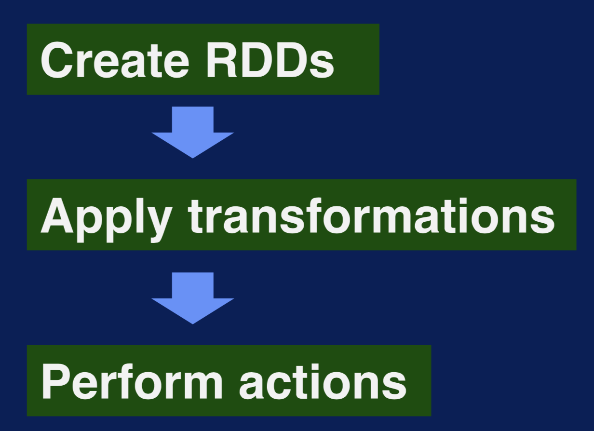

To summarize, in a typical Spark program we create *RDDs* from external storage or local collections like lists. Then we apply *transformations* to these RDDs, like *filter*, *map*, and *reduceByKey*. These transformations get lazily evaluated until an *action* is performed. Actions are performed both for local and parallel computation to generate results.

### Transformations
[Slides](lecture_slides/transformations.pdf)


### Actions
[Slides](lecture_slides/actions.pdf)

## Main_Modules_in_the_Spark_Ecosystem

### Spark_SQL

### Spark_Streaming

### Spark_MLLib

### Spark_GraphX

## Hands_On_Spark_Data_Processing
