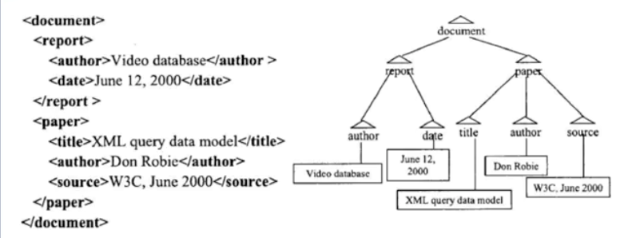
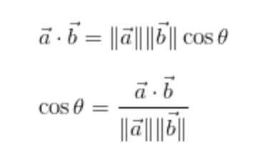

Relatively# Big_Data_Modeling_and_Management_Systems

The goal of data modeling is to formally explore the nature of data, so that you can figure out what kind of storage you need, and what kind of processing you can do on it.

The goal of data management is to figure out what kind of infrastructure support you would need for the data.

## TOC

- [Why_Big_Data_Modeling_and_Management](#why_big_data_modeling_and_management)
- [Real_Big_Data_Management_Applicaitons](#real_big_data_management_applicaitons)
- [What_is_a_Data_Model](#what_is_a_data_model)
- [Different_Kinds_of_Data_Models](#different_kinds_of_data_models)
- [Data_Models_vs_Data_Formats](#data_models_vs_data_formats)
- [Working_with_Streaming_Data](#working_with_streaming_data)
- [Hands_On_Handling_Data_Streams](#hands_on_handling_data_streams)
- [Why_Data_Management](#why_data_management)
- [From_DBMS_to_BDMS](#from_dbms_to_bdms)

## Why_Big_Data_Modeling_and_Management

### Summary_of_Intro_to_Big_Data
[Slides](lecture_slides/summary_of_intro_to_big_data.pdf)

### Big_Data_Management_Must_Ask_Questions

- How do we ingest the data?
- Where and how do we store it?
- How can we ensure data quality?
- What operations do we perform on the data?
- How can these operations be efficient?
- How do we scale up data volume, velocity, variety, and access?
- How to keep data secure?

### Data_Ingestion

Ingestion means the process of getting the data into the data system that we are building or using.

Questions you might want to ask when you automate data ingestion:
- How many data sources?
- How large are the data items?
- Will the number of data sources grow?
- Rate of data ingestion?
- What to do with bad data?
- What to do when data is too little or too much?

### Data_Storage

Storage Infrastructure
- How much data to store?
- How fast to we need to read/write?

### Data_Quality

Why worry about data quality?
- Better quality mean better analytics and decision making.
- Quality assurance means needed for regulatory compliance
- Quality leads to better engagement and integration with external entities.

Approaches to meeting the data quality requirements in the industry:
- Data profiling and data quality measurement
- Parsing and standardization
- Generalized cleansing
- Matching
- Monitoring
- Issue resolution and workflow
- Enrichment

### Data_Operations

In general, there are two broad divisions of operations:
1. Operations on a singular object.
2. Operations on collections of data objects.
  - Operations that select a part of a collection
  - Operations that combine two collections
  - Operations that compute a function on a collection

Efficiency of Data operations
  - Measured by time and space
  - should use parallelism

### Data_Scalability_and_Security

**Achieving Scalability**
- Scaling up and scaling out

**Vertical Scaling (Scale-up)**: Adding more processors and RAM, buying a more expensive and robust server.
- Many operations perform better with more memory and cores
- Maintenance can be difficult and expensive

**Horizontal Scaling (Scaling-out)**: Adding more, possibly less powerful, machines that interconnect over a network.
- Parallel operations will possible be slower
- Easier in practice to add more machines

Most big data management systems are taking the scale out route utilizing cluster computing.

**Keeping Data Secure**
- Data Security - a must for sensitive data
- Increase the number of machines leads to more security risks
- Data in transit must be secure
- Encryption and decryption increase security but make data operations expensive.

[Slides](lecture_slides/big_data_management.pdf)

[Reading on Storage Systems](https://vanillavideo.com/blog/2014/started-storage-understanding-san-nas-das)

## Real_Big_Data_Management_Applications

### ConEd Energy Data Management Challenges
[Slides](lecture_slides/coned.pdf)

ConEd adds 4.7 million smart meters around NYC.  The system collects 10.4 million data points per 15 minutes.

Smart Meter Analytics
- Consumption patters
  - Histogram of hourly usage
- Thermal sensitivity
  - Effect of outdoor temperature
- Consumption prediction
  - Daily and weekly usage profile
  - Economic implications
- Customer Grouping
  - Similarity grouping
  - Energy saving campaigns for customer groups

The Big Data Issue
- Not only big but fast
- Life-Cycle deadline
- Estimating the need for parallel and distributed computing

### Flight Data Management
[Slides](lecture_slides/flightstats.pdf)

### Instructions_for_Downloading_Datasets

1. Start Cloudera VM. Most of the Hands On exercises in this course use the Cloudera Virtual Machine, so we will download the datasets onto the VM. Start the VM in VirtualBox and perform the remaining steps in the VM.
2. Open web browser. Open a web browser by clicking on the web browser icon in the top toolbar.
  - In the web browser, enter the following for the URL: `http://github.com/words-sdsc/coursera`
3. Download datasets.
  - Click on `big-data-2.zip`:
  - Click on the Download button:
  - In the dialog, select Save File:
  - Click OK, and the file big-data-2.zip file will be downloaded to the Downloads directory.
4. Uncompress datasets. Open a terminal shell by clicking on the terminal shell icon in the top toolbar.
  - In the terminal, run: `cd Downloads` then `unzip -o big-data-2.zip`
5. Install tools. Finally, change directories to big-data-2 (`cd big-data-2`) and run `./setup.sh` to install tools and libraries.

## What_is_a_Data_Model
[Slides](lecture_slides/intro_to_data_models.pdf)

### Intro_to_Data_Models

Three Components of a Data Model:
1. Structure
2. Operations
3. Constraints

Structured vs. Unstructured Data

Four Basic Data Operations:
1. Selection
2. Projection
3. Union
4. Join

Types of Data Constraints
- Type
- Value
- Structural

### Data_Model_Structures

A repeatable of data organization.

### Data_Model_Operations

Operations specified the methods to manipulate the data.

Four Basic Data Operations:
1. Subsetting (AKA Selection or Filtering)
  - Example: Given a collection of data and a condition, find a subset from the collection so that each element in the subset satisfies the condition.
2. Substructure Extraction (AKA Projections or Feature Selection)
  - Given a data collection with some structure, extract form each data item a part of the structure as specified by a condition.
3. Union (AKA Set Union)
  - Given two (or more) data collections, create a new one with elements of the two input collections.
  - Duplicate elimination between rows in datasets.
4. Join
  - Given two (or more) data collections, create a new one with elements of the two input collections.
  - Duplicate elimination by combining data form duplicates to complete all fields from matching collections.  

### Data_Model_Constraints

A logical test resulting in True or False. (Seems similar to masking in Numpy)

Types of Data Constraints:
- Value
  - x >= y, x > 0, etc.
- Uniqueness
  - Field must have unique or only one value
- Cardinality
  - limitation based on count of values in a field
- Type
  - Restrict type of data in a field (String, Integer, etc.)
- Domain
  - Possible set of values that are allowed for an attribute.
  - Month (1, ... , 12) or ('Jan', ... , 'Dec')
- Structural
  - Puts restrictions on the structure of the data rather than the data values themselves.

### Hands_On

#### Intro_to_CSV_Data

By the end of this activity, you will be able to:
- Identify the key features in CSV data
- Import CSV data to a spreadsheet and plot values

1. Open a terminal shell. Open a terminal shell by clicking on the square black box on the top left of the screen.
  - Run `cd Downloads/big-data-2/csv` to change into the directory containing the csv file. (This was downloaded in Week 1 [Link](https://www.coursera.org/learn/big-data-management/supplement/YVDPj/instructions-for-downloading-hands-on-datasets))
2. Look at CSV file. The CSV file contains census data for the United States. Run `ls` to see the name of the CSV file.
  - Run `more census.csv` to look at the contents of the CSV file.
  - The first line of the file is the head and the remaining lines are the data. Each entry in the file is separated by a comma.
  - Hit the spacebar to scroll down, and `q` to quit more.
3. Open spreadsheet application. Run `oocalc census.csv` to start the spreadsheet application.
4. Import CSV to spreadsheet. Let's import the CSV file to the spreadsheet by clicking on File:
  - Next, click Open:
  - Next, click Downloads in the Places pane:
  - Next, double-click big-data-2 in the file pane:
  - Next, double-click csv:
  - Next, double-click census.csv:
  - In the Text Import dialog, click OK.
  - The CSV data is now loaded into the spreadsheet.
5. See size of CSV. Scroll to the bottom of the spreadsheet to see the size of the CSV file.
  - There are 3194 rows. If the CSV file had millions or more rows, then we could not import it into a spreadsheet. In this case, we would need a Big Data system such as Hadoop to analyze the data.
  - Scroll back to the top.
6. Create chart. Let's create a chart of the estimated population of the state of Alabama. Row 2 contains the data for Alabama. Select cells in row 2 and columns J through O to get the estimated population for 2010 through 2015.
  - Click on the chart button.
  - Click Finish to display the chart.
  - The chart should be displayed in the spreadsheet.

## Different_Kinds_of_Data_Models

### What_is_a_Relational_Data_Model
[Slides](lecture_slides/relational_data_models.pdf)

The relational data model is one of the simplest and most frequently used data models today, and forms the basis of many other traditional database management systems, like MySQL, Oracle, Teradata, etc.

Structural Components of a relational data model
  - the Primary data structure for a relational model is the table
  - Actually represents a *set* of *tuples* (AKA rows)
    - set -> tuples are distinct

Data model 'Schema'
  - Details allowed data type and constraints for field that each record must satisfy.
  - Since primary key has to be unique there can be no duplicates

Purpose of primary and foreign keys:
  - act as unique identifiers to perform operations between collections or tables.
  - A foreign key refers to the primary key of another table (parent table).

Operations:
- Natural Join
  - Joins are one of the most expensive operations (time and space consuming)

### What_is_a_Semistructured_Data_Model
[Slides](lecture_slides/semistructured_data_models.pdf)

Formats: Extensible Markup Language (XML), Java Script Object Notation (JSON)

Most semistructured data models are tree-structured. Modeling a document as a tree has significant advantages.  A tree is a well known data structure that allows *navigational access* to data.

Tree-structured navigation operations:
- Imagine we are at the node Paper
  - getParent -> document
  - getChildren -> title, author, source
  - getSibling -> report
- "Video Database"
  - Root-to-Node path -> document/report/author/"video database"
- Queries need tree navigation
  - Author of "XML query data model"

### Hands_On

#### Exploring_the_Relational_Data_Model_of_CSV

[Instructions](lecture_slides/relational_data_model_with_csv.pdf)

#### Exploring_the_Semistructured_Data_Model_of_JSON_data

[Instructions](lecture_slides/semistructured_data_model_with_json.pdf)

#### Exploring_the_Array_Data_Model_of_an_Image

[Instructions](lecture_slides/array_data_of_an_image.pdf)

#### Exploring_Sensor_Data

[Instructions](lecture_slides/sensor_data.pdf)

### Vector_Space_Model
[Slides](lecture_slides/vector_data_models.pdf)

Widely used for large datasets of text (document) and images.

Vector model

Similarity function and similarity search

Document Vector
- Term Frequency (TF)
  - count of word occurrence in document
- Inverse Document Frequency (IDF)
  - log2(# of Docs / word occurrence count in doc)
  - Gives unique words higher value as they can be used to distinguish between documents better than words that are ubiquitous across all documents.
  - Log base 2 is arbitrary but used in convention.  As long as the base is consistent across an analysis it will still work as the relative score will be the same for all words.
  - IDF is a penalty in essence for super common words.
- Combined to TF-IDF Matrix = TF * IDF
- Stop words are words that appear so frequently that their presence is meaningless so are just removed.
- One row in TF-IDF matrix shows the relative importance of each word in that doc in respect to the entire corpus.
- Document length is the pythagorean theorem for all document dimensions (features or words in this case).
  - length(d) = sqrt(sum(i**2+...+k**2))

Similarity Functions:
Similarity function between vectors is a measurement of how far they are apart.

Cosine Similarity
  - Measures the angle between two vectors.
  - if the vectors are identical then the angle between them is 0
  - if the vectors are opposite then the angle is 1 (1*pi radians = 180 degrees).
  - Since it ignores magnitude it tends to ignore the length of documents. So a 2,000 word doc and a 200 word doc could be very similar despite their different lengths.  

[Cosine Similarity Blog](http://blog.christianperone.com/2013/09/machine-learning-cosine-similarity-for-vector-space-models-part-iii/)

Similarity Search:

Image Search:

### Graph_Data_Model
[Slides](lecture_slides/graph_data_models.pdf)

Most common example is a social network.  

Data and Connectivity
A DAG is represented by 2 tables:
1. Vertex (Node) table
  - Gives IDs to nodes and lists their properties
2. Edge table
  - start and end node of edges along with property of the edge

"Optimal Path" Operations
- Find the shortest path between two nodes
- Fins an optimal round-trip path that must include some specific nodes.
- Find best possible path in a network given two or more optimization criteria. I.e. Find the "best compromise" path between two nodes.
  - Pareto-optimality
  - Ex. Best path avoiding highways and tolls

Neighborhoods
Communities
- A subgraph of a graph that has many more edges within the subgraph compared to edges to nodes outside the subgraph.
- Operations
  - Dense subgraph finding
  - Optimizations of clusteredness

Connectivity Operations
- Connectedness
  - Every node is reachable from each node in the undirected version of the graph

### Other_Data_Models
[Slides](lecture_slides/other_data_models.pdf)

Array of vectors:
- images are a great example. Each pixel will have a (R,G,B) vector as a value.  

Operations on Array of Vectors:
- Dimension
- Size
- element (cell) value
- value of the kth element of a cell
- length
- distance

### Hands_On

#### Exploring_the_Vector_Data_Models_with_Lucene

[Instructions](lecture_slides/vector_data_model_with_lucene.pdf)

#### Exploring_the_Graph_Data_Model_with_Gephi

[Instructions](lecture_slides/graph_data_model_with_gephi.pdf)

## Data_Models_vs_Data_Formats
[Slides](lecture_slides/data_model_vs_data_format.pdf)

## Working_with_Streaming_Data

### What_is_a_Data_Stream
[Slides](lecture_slides/what_is_a_data_stream.pdf)

Key characteristics of a data stream

Requirements of streaming data systems

Data streams used in life

Streaming data processing applications
- process data as it is created

Social Media
- Sales trends
- Sales distributions
- Social media analysis

Industrial or farming machinery
- monitoring of potential system failures

A stream is defined as a possibly unbounded sequence of data items or records. That may or may not be related to, or correlated with each other. Each data is generally timestamped and in some cases geo-tagged. Streaming data sometimes get referred to as event data as each data item is treated as an individual event in a synchronized sequence.

Managing and processing data in motion is a typical capability of streaming data systems.

Streaming data systems
- manage one record or small set form a time window at a time
- Perform relatively simple *independent* calculations
- Operate in near-real-time (sometimes in memory)
- Non-interactive
  - Send no feedback to source

Dynamic Steering
- dynamically changing the next steps or direction of an application through a continuous computational process using streaming.

As a summary, dynamic near-real-time streaming data management, processing, and steering is an important part of today's big data applications.

### Why_is_Streaming_Data_different
[Slides](lecture_slides/why_streaming_data_is_different.pdf)

**Data-in-Motion vs Data-at-Rest**

Data-at-Rest
- Mostly static data from one or more sources
- Collected prior to analysis

Data-in-Motion
- Analyzed as it is generated
  - Ex. Sensor data from self-driving car
- Stream processing

**Streaming vs Batch data processing**

Data Processing Algorithms

Static / Batch processing
- The run time and memory usage of most algorithms that process static data, is usually dependent on the data size, and this size can easily be calculated from files or databases.

Streaming processing
- Streaming data processing is the size of the data is unbounded and this changes the types of algorithms that can be used.
- Algorithms that require iterating or looping over the whole data set are not possible since with stream data, you never get to the end.

Streaming Data Management and Processing
- Compute one data element or a small window of data elements at a time.
- Relatively fast and simple computations, since computations need to be completed in real-time.
- In most systems the management and processing system subscribe to the data source but do not provide feedback or interactions to the source.

Batch Processing
- Analytical steps have access to often all the data and can take time to complete complex tasks.

Hybrid (Lambda) Systems
- Most companies use a hybrid (lambda) architecture for processing streaming and batch jobs at the same time.
- Streaming data is kept until available in batch systems.
- A *stream storage* layer is used to enable fast trees of streams and ensure data ordering and consistency.
- A *processing layer* for data is used to retrieve data from the storage layer to analyze it and most probably little bit to a batch data stream and notify the streaming storage that the data set does no longer need to be in streaming storage.

**Management and processing challenges for streaming data**

2 main challenges to avoid data loss:
1. Streaming data changes over time
  - Size and frequency
2. Changes can be periodic or sporadic
  - Periodic: Social media can be more active on weekends or evenings
  - Sporadic: Major events

To summarize, streaming data must be handled differently than static data. Unlike static data, where you can determine the size, streaming data is continually generated, and you can not process it all at once. Streaming data can unpredictably change in both size and frequency. This can be due to human behavior. Finally, algorithms for processing streaming data must be relatively fast and simple. Since you don't know when the next data arrives.

### Understanding_Data_Lakes
[Slides](lecture_slides/understanding_data_lakes.pdf)

With big data streaming from different sources in varying formats, models, and speeds it is no surprise that we need to be able to ingest this data into a fast and scalable storage system that is flexible enough to serve many current and future analytical processes.

This is when traditional data warehouses with strict data models and data formats don't fit the big data challenges for streaming and batch applications.

**Data Lakes**

The concept of a data lake was created in response of these data big storage and processing challenges.

Data lakes enable batch processing of streaming data.

A **data lake** is a part of a big data infrastructure where many streams can flow into and get stored for processing in their original form. We can think of it as a massive storage repository with huge processing power and ability to handle a very large number of concurrence, data management and analytical tasks.

In 2010, the Pentaho Corporation's CTO James Dixon defined a data link as follows:
"If you think of a datamart as a store of bottled water, cleansed and packaged and structured for easy consumption, the data lake is a large body of water in a more natural state. The contents of the data lake stream in from a source to fill the lake, and various users of the lake can come to examine it, dive in, or take samples."

How a data Lake Works:
1. Data loaded from source
2. Stored in its native format (as raw data) until needed
3. Applications can freely read it and add structure to it (schema-on-read)

**Difference between "schema-on-write" and "schema-on-read"**

"Schema-on-Read" - Applications add structure to raw data as it is read for analysis.

"Schema-on-Write" - In a traditional data warehouse, the data is loaded into the warehouse after transforming it into a well defined and structured format.

Data Lake vs. Data Warehouse
Data Warehouse
- Stores data in a hierarchical file system with a well-defined structure.
Data Lake
- Stores data as flat files with a unique identifier. This often gets referred to as object storage in big data systems.
- Each data is stored as a binary large object (BLOB), is assigned a unique identifier and tagged with metadata tags which the data can be searched on.

To summarize, a data lake is
- A storage architecture for big data collection and processing.
- Enables collection of all data suitable for analysis today and potentially in the future.
- Regardless of the data source, structure, and format it supports storage of data and transforms it only when it is needed.
- They support all parts of the user base to benefit from this architecture, including business, storage, analytics and computing experts.
- An infrastructure component within a big data architecture that can evolve over time based on application-specific needs.

## Hands_On_Handling_Data_Streams

### Exploring_Streaming_Sensor_Data
[Instructions](lecture_slides/streaming_sensor_data.pdf)

### Exploring_Streaming_Twitter_Data
[Instructions](lecture_slides/twitter_app_instructions.pdf)

[Instructions](lecture_slides/streaming_twitter_data_instructions.pdf)

## Why_Data_Management

### DBMS-based_and_non-DBMS-based_Approached_to_Big_Data
[Slides](lecture_slides/dbms_and_non_dbms_big_data.pdf)

## From_DBMS_to_BDMS

### From_DBMS_to_BDMS
[Slides](lecture_slides/from_dbms_to_bdms.pdf)
